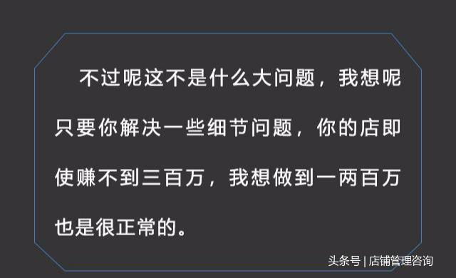

我们都知道，一个店开起来，你的产品再好，你的服务再到位，如果说没有人气的话，那你说怎么去销售产品？

那么我们可以通过引流特权产品和利益刺激，获得跟目标客户无阻碍沟通和接触的机会，如果说你没有沟通和接触的机会，你连销售产品的机会都没有，那么我们如何来策划自己的“引流特权产品”呢？通过这些年我们做的策划案例，我今天把主题给提炼了出来，再给大家整理和分享一下：

1、前端引流特权产品

2、基础引流特权产品

3、种子引流特权产品

4、排队引流特权产品

今天呢，咱们先不讲如何去设计“引流业权产品”，咱们来分享几种攻心的销售话术。

举个例子：

> 我们去拓展这个实体店，操作的时候呢，很多店铺老板他现在年收入利润大概是三十万，所以我们怎么去激发他的欲望让他跟我们合作呢？

场景一、陈总，有句话我不知道该不该跟你讲，那他就说但讲无妨张老师。这个时候我们就说：

（如下图所示）

（如下图所示）

通常这样一讲的时候，这个老板的眼睛就开始放光，他就会大脑里面想象到他年赚两百万赚三百万的样子，这之后呢就激发了他的欲望。

（如下图所示）

咱们现在来分析一下我们刚才说的话术：

（如下图所示）

大家可以看一下，这里我并没有说只有跟我合作才如何如何，我只是说有东西阻碍了你的发展，你只要解决了这些问题，你就会有更好的业绩，所以，我这种说法呢，就没有王婆卖瓜自卖自夸的嫌疑，但是却成功激发了这个老板的欲望，接下来的事情往往就是这个老板迫不及待的说，那张老师我们开始怎么样合作呢？

这一招非常的管用，希望你好好的练习。

接下来咱们再分享一下：“让顾客感觉下次非来不可的一句话”

其实不管说什么话，让客户非来不可都是有一定难度的，但是有一种行为却可以让客户感觉到非来不可，这种行为就是惊喜。

关注我的头条号，每天学习最新商业知识，现在通过私信功能发送“咨询”两个字，即可免费领取《门店100种创意促销方案》和《老客户自动转介绍的23种实战技巧》各一份

（如下图所示）

（如下图所示）

什么是惊喜？就是客户预料之外的东西。有一家店呢就曾经用过这种方法，结果把这家店做的回头客非常多，他的方法很简单，就是客户吃完饭以后要走或者要结账的时候呢，他就会根据每天进店顾客的比例给一些客户惊喜类的礼品，比如说，今天你去结账了，那走到吧台上结完账，刚要走的时候，他突然叫住你说：

唉，这位先生稍等一下。

那你就会奇怪了，什么事？因为你已经付完钱了，他就会跟你说：

今天你是来到我们店里的第58位顾客，所以我们要送你一份价值58元的礼品，祝你跟你的朋友今天能够开心愉快。

希望今天讲的两种攻心话术对各位有所帮助。

店铺送模式不是不要钱，而是一种吃亏、利他的思维方式，把这种思维方式运营到企业的经营活动中去，以达成更多领域的合作，延长利润链条，赚客户看不到的钱，从而完成利润目标。