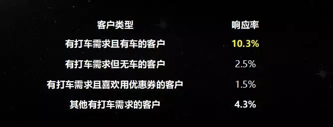
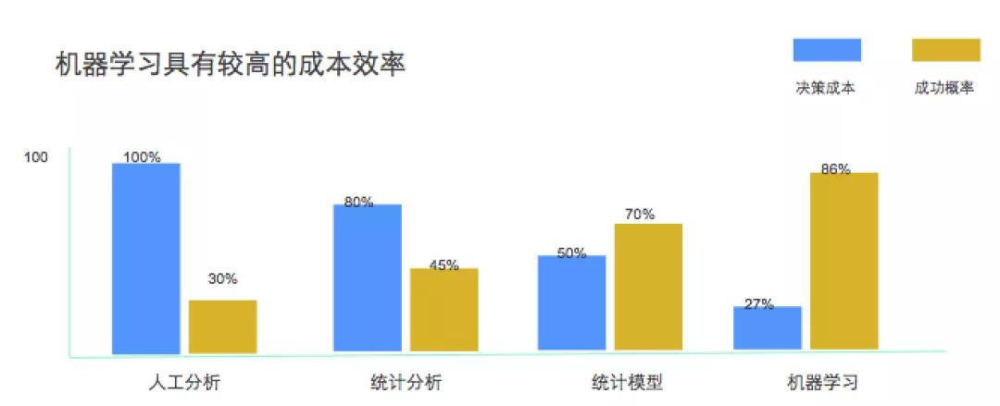

# 亚马逊怎样靠数据赚钱？这里有一份最全数据掘金指南

[混沌学园](https://36kr.com/user/669723995)*·*2018-10-27 15:08

关注

揭秘大数据的商业化。

编者按：本文来自微信公众号[“混沌大学”（ID:hundun-university）](https://mp.weixin.qq.com/s?__biz=MzUyMDQ5NzI5Mg==&mid=2247499740&idx=1&sn=f292c6b18c76300761e9c528a2eafb93&chksm=f9ebce3fce9c4729ee0d84cbe34de66c41fce25a82bea3910bfcc7896befb4f892fa45d59df5&mpshare=1&scene=1&srcid=&key=4e23d68939801d5cb1eccf0f180e88998a95db5e0f8bd04a23029ca74070a8e55d168c6bb49cd438b22e563c21ff6dd3030436ffcca113053e8e89fc586b966243ba839871a88f335e50c00fe13e5280&ascene=0&uin=MjkxODk0MTE2Mw%3D%3D&devicetype=iMac+MacBookAir7%2C1+OSX+OSX+10.10.5+build(14F2511)&version=11020012&lang=zh_CN&pass_ticket=jjzyxIXt60Qbz6Nwk3V0awnJU%2FCENx1TtpFa39OoDrkDRob49cFWt5E6KtDeNpRv),作者鲍忠铁；36氪经授权转载。

授课老师｜鲍忠铁（TalkingData首席布道师）

### 数据思维，更敏锐的商业洞察力

商业思维最重要的一件事是什么？决策。

在过去，有经验的决策，也有数据的决策。而在当下这个变化特别快的年代，数据思维正在变的越来越重要。

无论是在大企业还是小企业，甚至是在我们的日常生活里，数据思维的应用场景，随处可见，举个例子——

案例：假如你是水果摊儿老板。一般来说，学校周边的水果摊儿会有很多，如果假设你在学校周边也要开一个水果摊，怎么才能存活下来呢？这其实非常考验你的数据思维能力。

**老客经营**

首先，对于水果摊儿老板来说，最重要的一件事是什么？老客经营。为什么？因为学校周边的水果摊，流动客户的比例特别低，绝大多数客户其实都是你的老客户，如果他有一次买水果的体验不好，下一次他就不会再去了。

所以，如果有一个客户在你这里买了20块钱的水果，下一次，他来跟你抱怨，说水果不好，你该怎么做？聪明的经营者会说20块钱我退给您，这次再挑，好了之后再付费。

表面上看，你损失了20块钱，但你要知道，水果的复购率，基本上一个星期至少买2次，你可能这次损失了20块钱，但在未来的两、三个星期，你一定会赚回来。

反之，如果不么做，那么这个客户可能就丢掉了。

**库存管理**

其次，你要进什么样的水果呢？

你要根据第一天的销量来判断第二天的进货，还有第二天的仓储，而且还要考虑水果的生命周期。

举个例子，苹果的口感可以持续一个星期，那苹果就可以多进一点，但香蕉的生命周期只有3天，即便热卖，也要少进点。

**关联销售**

再次，你要知道运用关联销售，来提高客户价值。因为很多客户来买水果时，会搭配着买好几样，你要把易搭配的水果放一起，方便他挑。

另外，你也可以用贵的水果去引流中档的水果，为什么呢？举个例子，你本来卖的水果，8块钱一斤，客户可能会觉得很贵；但如果你在旁边放60块钱一斤的车厘子，客户可能就会觉得，8块钱还是便宜的，甚至，如果你放了2块钱的水果，那么他可能就买2块钱的水果了。

**产品复购**

再补充说一个我买菜的经历。我有一次去菜市场买鱼头，老板卖给我是12块钱一斤，但我旁边过来一个骑自行车的人，看上去收入不太高，买鱼头8块钱一斤。

问题来了，卖鱼老板不怕流失我这样的客户吗？不怕。

因为我可能2个月才会去一次菜市场，但是旁边那个骑车的人，可能天天都要买个鱼头，如果流失了这样的客户，才是真正的损失。

启示：

小企业经营最大的问题是什么？成本高，竞争高，怎么才能生存呢？

最重要的一点就是要时时刻刻地想着自己的商业模式，时时刻刻地想着我怎么样扩大我的客户规模，怎么样在单个客户上赚更多的钱，怎么让客户复购率提升，重复购买……或者去看一下竞争对手怎么做的，至少我在某些方面不落后于竞争对手。

总之，学会应用数据思维，可以让你的商业洞察力更敏锐。 

### 决策效果更稳定，数据思维VS经验思维

数据思维比经验思维更好？不。更准确的说法应该是，数据思维会让决策的效果更稳定。

而我们基于经验思维做的决策，如果拉长时间去看，你会发现，整个的状态是波浪式的，有的时候成功概率很高，有的时候就会很低。 

案例：

有车用户与没车用户，哪类群体更爱打车？

当年，深圳有一家领先的股份制银行，希望信用卡绑在UBER上，以提高支付率。于是，就遇到了这样一个客户群体区分的问题：

有车用户与没车用户，哪类用户把UBER绑到信用卡的概率会更高？或者换句话说，你觉得哪类群体更爱打车？ 

可能大部分人的第一想法会是没车用户，他没有车才需要打车嘛，这就是经验思维，你说他错了吗？其实也没错。

可数据营销实验发现，绑卡率最高的是有打车需求并且是有车的客户，而不是无车客户，这才是更准确的事实。

为什么？因为有车的客户，他已经习惯开车，一旦没车，他其实不习惯坐公交，也不习惯坐地铁，而是更愿意打车。

确定了转化率比较高的客户群体之后，这个企业开始给这些客户发50块钱的打车券，条件是要把信用卡绑到UBER上，结果转化率达到了10% ，最后只花了1000万的营销费用。

同样的情形，如果这个企业的优惠券发给了只有1.5%转化率的客户群体，整体的营销成本可能会高出7、8倍。 

### 打通“三重门”，实现全渠道营销

简单说，企业所有的数据，可以归类为“三重门”，打个比方，交互门就好比一个围墙，围墙里面的小花园就是交易门，围墙外面的大花园就是公开市场门。详细如下：

①交易门：企业内部的客户数据、交易数据；

②交互门：企业与客户的交互行为数据，比如客户下载了你的App，没有购买商品，但是产生了点击行为。

③公开市场门：企业外部数据。

在互联网的商业世界里，打通所有数据，已基本成为常态。我们来看一个案例。

案例：

百度怎么会知道我在超市买了刮胡刀？

我一个同事在深圳出差，去超市买了一个刮胡刀，用微信支付的。回到酒店，当他打开电脑百度页面，竟然在广告栏出现了有关刮胡刀一系列衍生品品牌的推荐。这是怎么回事儿呢？

其实这背后有一条完整的数据链条：

当他用微信支付买了一个刮胡刀的时候，微信支付就会给他的设备打一个标签，说这个设备在某个时间点，买了一个刮胡刀，然后将这个标签放回到库里。

又因为腾讯和京东有个京腾计划，所以这个标签数据也共享到了京东的库里。而百度又是京东的广告资源，所以当客户登录之后，百度就能把相应的广告推荐给客户。

但还有一个问题没解决，我用手机支付的，为什么PC电脑会知道我买了一个刮胡刀呢？谁能把手机和电脑认为是同一个人？

Wifi。 

因为这两个设备经常连通一个Wifi。通过Wifi，百度、京东、腾讯，就会把它认为是同一个客户的设备。所以当这个客户出现在百度的池子里时，广告自然而然就推给他了。

如果你有兴趣，也可以再实验下，在淘宝或是京东点一个商品，很喜欢，点了很多次，但没有购买，或者购买了，都可以。然后你再打开今日头条、网易等这些信息流广告媒体，你可能就会发现同类商品的推荐。

因为所有的数据都通过设备ID打通了。

启示：

作为大企业，一定要学会打通数据，然后利用这些数据去服务所有客户的生命周期和全渠道。

但是目前，传统行业还处在一个数据孤岛的状态，甚至很多数据，也仅是业务的副产业，而不是资产，没有利用数据科学去运营，这一点，尤其值得大家特别重视。

### 数据科学，最大化数据资产价值

决策的好坏由两个因素决定：决策的准确度与决策的成本。

谷歌的一项决策分析显示，面对海量数据，人的决策落后于机器决策，所以你会发现，互联网企业里面大量的营销、搜索引擎、决策等，其实都是用数据科学去做的。

数据科学的应用，可以最大化数据资产价值，亚马逊就是最好的例子。

案例：亚马逊电商赚钱的秘密

在创立亚马逊之前，贝索斯曾在华尔街量化投资之父戴维·肖的公司工作过，当时就是大量用数据进行量化投资。

后来，贝索斯发现证券交易的原理也可以应用到电商领域，于是就开了家网上书店。

这个原理是怎样的呢？

证券交易，买和卖，两个交易同时进行时，中间的渠道、代理商、或是证券公司就会收到交易手续费。换句话说，两个同时进行的交易，只要他们都进行结算，就肯定有利润；而且，真正的价值不是在于存货，而是在于数据。

同理，当书商想5块钱卖书，而买书人想6块钱买书的时候，中间就会有1块钱渠道的费率。就是说，为了同样一个标的，只要这两个交易出现价格差异，就会产生中间的业务收入，并且前提一定是同时在交易。 

最重要的是，贝索斯发现整个电商交易真正价值不在于货物，而在于通过交易产生的数据，以及累积的客户。

那么，亚马逊电商怎么赚钱，并逐步占领市场优势？主要有以下三个方面：

**①推荐引擎**

其实，很多客户在浏览或者购买商品时，有一个特点，无序。他们不知道要买什么，因为SKU太多了，有2万多个。

于是，亚马逊就发明了推荐引擎，现在，有40%以上的商品都是通过推荐引擎推荐给客户，然后客户购买。这就大大缩短了客户做决策的时间，也提升了客户购买的转化率。（备注：业界最高标准，推荐引擎的商品转化率在8%左右。）

**②每5分钟扫描商品的价格**

在亚马逊，还有这样一种情形，老客户看到的商品价格，要比新客户贵，比如同样一个2000块钱的DVD，老客户看到的价格要比新客户贵20美金。 

为什么要这样呢？按照经验，老客户不是该更优惠吗？不，亚马逊改变了这一商业逻辑。

亚马逊会每5分钟去扫描所有竞争对手，包括易贝、沃尔玛、百思买等在内的商品价格，然后据此调整自身商品的价格，以确保最便宜，可能低5美金，也可能是5美分。 

这样的价格机制，最大化地留住了新客户，但老客户不会流失吗？

不会。

因为亚马逊是每5分钟就扫描一次商品，也就是说，即便老客户看到的商品可能比新客户要高，但当他去外面的网站去看一圈，最后还是会发现亚马逊的价格最低，所以老客户是不会流失的。 

慢慢地让新客户逐渐成为老客户，然后慢慢地在老客户上赚更多的钱，这就是亚马逊电商赚钱的秘密。

**③调节物流和仓储的成本**

还有一种情况，同样的一台GE冰箱，或者同样的一个商品，会在自己的电商网站上卖一个价格，然后再在亚马逊卖一个价格。 

如果亚马逊发现同样的一台GE冰箱，在GE的网站上卖2000美金，在亚马逊上卖2100美金，会怎么办呢？

亚马逊会适当调高GE冰箱的物流成本，以牵制竞争对手的价格，因为所有品牌产品的物流基本都是用亚马逊的。

以上就是亚马逊电商获得很高市场竞争优势的一些手段，是很耐人寻味的。 

### **小结**

过去，我们会看到，企业经常是依赖外界，靠大量的投资、大量的营销费用、大量的外脑，以及大量的资源整合来推动自身的发展，但是现在，企业的数据运营与数据资产变现，更强调的是自己内生的力量，依赖自己的运营能力和自己的人才去完成这些事情。

所以，每个创始人都该有一些数据思维能力，专注地在自己的小花园里，累积数据资产，发掘新的商业机会。