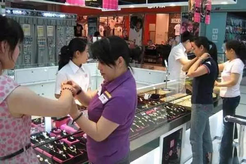

# 做好这5点，客户就会喜欢你，轻松赚钱！ 

2017-10-18 19:07

**好感度提高，就有了一个好的开始；而好的开始，是成功的一半。**

**在生活里，曾经让你产生好感的大概是哪些人？**

**一种是颜值高的人，美女帅哥，无人不爱。**

**一种是聊得来的人，他们往往让我们有一种相见恨晚、巧遇知己的感觉。**

一种是特别的人，他们有鲜明的性格标志，或是幽默、或是豪爽、或是乐观、或是穿着独特，让人过目不忘。

一种是有实力的人，有实力意味着他们拥有大量资源，这种资源或许是财富、或许是经验、或许是信息、金钱和人脉。

一种是让我们感觉舒服的人，你说不清为什么，但他们就是拥有让你舒服的本事，让你想要接近他。

综上所述，当我们具备以上特征，或者当我们能够塑造出来具有以上因素的“场”的时候，客户就更容易“爱”上我们。那如何让客户对自己产生好感？下面就分享这五条实用性技巧：

**一、升级你的颜值**

首先，你要去除掉身上所有可能引发客户讨厌的因素：比如不守时、身上有异味、穿白色袜子、穿过于暴露或者紧身的衣服、头皮屑洒满肩膀、言语粗俗……

其次，你无法改变自己的相貌，却可以改变自己的态度、表情和衣着打扮：比如，时刻面带微笑，并真诚自然；主动握手并传递自己的热情；增加自己的幽默感；选一身适合自己风格并得体的衣服，色彩不要太花哨；设计一个清爽干练的发型；站姿、坐姿和走姿端庄自然。

外表是我们的第一张名片，直接影响了客户对我们的第一印象。

**二、当好客户的知己**

1、主动热情：热情犹如阳光，会快速融化我们和顾客之间的陌生感，营造出一种好的氛围。这就要求我们，一方面，见到客户以后要主动、热情打招呼，同时语调要爽朗、厚重，不能有气无力。

2、巧用称呼：实际销售过程中，至少有50%以上的拜访发生在非正式场合，这就意味着我们对客户的称呼不能总是那么官方和正式，否则容易让客户感觉疏远，比如可以尝试一些非正式的称呼，比如：刘哥、张姐、兄弟、哥们……运用得当的话，会让客户感觉舒服和亲切，从而拉近彼此的距离。

3、善选话题：话题选择上，初期切入时，可以选择一些热点话题；中期深入时，要选择一些客户关心或喜欢的话题；后期收尾时，可以找到一些双方共同在意的话题，比如：产品本身或者是曾经相似的经历，从而找到更多的共鸣。

4、移情聆听：移情不是同情，而是从情绪和理智上双向理解顾客并接纳顾客，移情的基本步骤是：首先，抛去成见，把自己放在客户的角度上；其次，通过复述和确认，理解顾客的思维和感受，在充分理解的基础上，表达自己的观点和情绪。

**三、打造属于自己的个性标志**

1、设计自己的标志性动作

独一无二的标志动作会增加你本身的记忆点和魅力，比如丘吉尔的V字型手势、NBA球星艾弗森的侧耳倾听、张学友的兰花指都让人印象深刻。在设计标志性动作的时候要注意：第一，动作本身要具有正面意义，同时贴合自身性格，比如，你不能说你的标志性动作是对人竖中指，那简直是在找打；第二，动作要简洁易展示，比如，你不能说你的标志性动作是打完一整套咏春拳，那样的话，估计等你打完拳，顾客都睡着了。只要符合以上特点，想要设计什么动作就要看你自己的喜好了。

2、佩戴标志性饰品

标志性饰品是什么？是曾荫权的蝴蝶结领带！是叶茂中从未摘过的帽子！是王家卫一直戴着的墨镜！是让人无法忘记的鲜明记忆点！我认识的一个业务员，他给自己设计的标志性饰品，是经常戴一条红色领带，以至于到后期，尽管一些客户都不知道他的全名，但都会说：“那个带红色领带的小李。”小李成功打造了属于自己的独一无二的客户记忆点。

**四、巧妙呈现实力**

1、巧讲客户：人是社会动物，因而都具有从众性。所以，适当讲一些自己做过的一些比较成功的客户，会在很大程度上刺激客户的兴趣，当然，你所选择的成功客户必须符合以下特点：第一，有一定的知名度，你不能选一个客户根本没听过的企业来讲，否则的话，客户基本无感；第二，和客户的关联度高，比如。是客户的同行，是客户的供应商，和客户在同一个工业区，这无疑是在暗示客户，你看，跟你相似的他们都选择了我们的产品，要不你也来试试。

2、巧讲资质：包括公司资质和个人资质。俗话讲的好：王婆卖瓜，自卖自夸，讲出了自我营销的重要性。但自卖自夸难免招人嫌，所以要借助第三方的口来替自己做宣传，比如，借其他客户之口，比如你说：最近在跟一个客户聊天的时候，他说你们公司作为行业前三的公司……借媒体之口，比如你说：最近媒体上报道我们公司作为中国驰名商标……借经历暗示，比如：我在公司工作四年，服务过大大小小158个客户，一直秉承……

**五、构建相似性**

有些人能够始终让我们舒服，是因为他们始终能够和我们保持在同一频道，同频的气场，能够让彼此之间建立起足够多的亲和感和相似性，从而感觉舒服。那么，如何构建与客户之间的相似性？核心技巧就是：模仿。

1、模仿客户的肢体语言

主要肢体语言包括：坐姿、手势、头的动作和面部表情。比如：如果客户的坐姿较为随意，我们就可以在建立初步信任的基础上，坐的随意一些；如果客户喜欢用简洁有力的手势辅助表达观点，我们在表达的时候，就可以借助简洁有力的手势来辅助表达，以此来契合客户。

2、模仿客户的语调语气

从语调上模仿客户，可以快速增加客户的安全感，让客户感觉你已经完全接受了他，从而达到双方在情绪上的共鸣，快速建立信任关系。比如，你见一个说话语速较慢的客户，你就要改掉自己连珠炮似的语速，放慢自己的语速，和对方保持在同一频道，就会让客户感觉舒服而放松。

3、模仿客户的口头禅

口头禅是客户内心较为在意的价值信念的集中体现。模仿客户口头禅，无疑是在暗示客户，我接受你所表达的核心价值信念，我和你是同类。

通过以上五条魔法的使用，我们可以创造出一个充满吸引力和安全感的“场”，让顾客感到舒服和放松，从而让顾客更容易对我们产生好感，以此为业务的下一步推进做好铺垫。