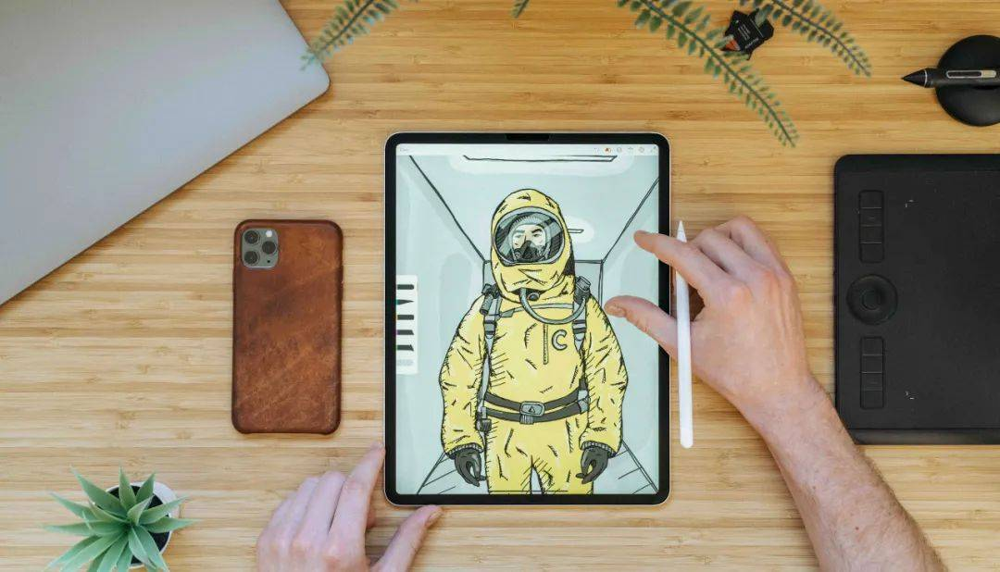

# [如何点燃客户欲望？分享6个诱发客户欲望的人性营销手段！](https://www.aiyingli.com/281364.html#)

#### 你又傲娇了哦

 关注

来源：宿言本言（ suyanpr） 125493 2021-01-20

今天我们继续来聊“AIDTAS模型”，这个模型在营销实战中是非常实用的。包含了从吸引消费者注意力，到激发消费者兴趣，再到点燃消费者欲望，构建信任，购买行为，以及分享传播，一整套的消费者购买决策过程。

之前两期我们深入聊了一下AIDTAS模型的前两个阶段“吸引客户注意”和“激发客户兴趣”，并分享了如何利用“人性营销”手段使AIDTAS模型前两个阶段变得更加丝滑。

今天我们继续来分享第三个阶段，“点燃欲望”，只有激发了客户的欲望，才能打开客户的钱包，我们依然用6个人性营销手段来讲述如何“点燃”客户的欲望。

## **一、稀缺效应**

所谓稀缺效应，是指当一件东西数量越少，得到的可能性越低时，人们就会觉得它越珍贵，内心也越想得到它。

说到稀缺效应，就不得不说17世纪的郁金香事件。当时郁金香从土耳其被引入西欧，因量少价高，被上层阶级视为财富与荣耀的象征，投机商看中其中的商机，开始囤积郁金香球茎，并推动价格上涨。当时荷兰的一株稀有品种郁金香可以卖到4600弗罗林，相当于2046公斤奶酪的价格！

利用稀缺效应激发客户购买欲望，可以用到以下3种方法：

**1、制造稀缺性**

要想让客户感受到你的稀缺，首先你要给产品制造稀缺性，制造稀缺的方法有：限时、限量、限条件三种。限时限量我们都已经很清楚了，我们在生活中常常能遇到，比如“活动仅剩12小时”，比如“限量款篮球鞋，全世界仅300双”。

所谓“限条件”，是指某项产品或服务只针对一小部分人开放，客户必须具备特定条件才有购买资格或使用资格。比如你在B站想发弹幕，需要先答100道题才可以。当你具备了发弹幕的资格，你会无比骄傲。比如知乎早期时候是邀请注册的，如果你被邀请注册知乎，你会感到很荣幸。

**2、制造紧迫感**

相对于得到，人们对失去的感知更为强烈。所以光稀缺还不够，还要给客户带来“紧迫感”。比如这两个广告文案“原价3900元，特价1900元，立省2000元，错过就要多花2000元”、“活动赠品有限，先到先得，错过将失去价值298元的赠品且再等1年”。

**3、强调唯一性**

我们经常会看到很多商家搞活动，活动多了，我们就会有一种“反正商家会经常搞活动，等下次活动吧”。要想打消消费者的这个“等下次”的想法，我们就需要向客户传递“机会只有一次”的信息。

比如我们需要告诉客户我们的产品原材料有限，所以只能生产这些，错过就没有了。比如我们可以告诉客户产品生产的工艺难度很大，这批货只有这么多，下次不一定什么时候有了。这就像某手机品牌，总会告诉客户，由于供应链与生产的原因，产品数量有限，大家要买就需要抢购。

## **二、场景化效应**

所谓“场景化效应”，就是在不同的场所中，受到不同的氛围、气场的影响，人们的行为也会随之发生变化。比如那些卖保健品的会销，通过背景音乐、故事讲解、客户见证以及抢着购买的托儿，最终形成强大的销售氛围，让人不由自主的去买单。

其实“营销”就是营造一种易于销售的氛围，用氛围去无形间影响客户的购买。每年的双11就是制造了一个大家都在“买买买”的火爆场面，通过场景化的力量，激发客户的购买欲望。

利用场景化效应塑造“买买买”的氛围，需要用到以下3个方法：

**1、场景布局**

在营销中，我们需要用心布局，通过布置产品使用场景、节日促销场景等方式，用场景形成强大的气场，激发客户的购买欲望。

比如马上就要过年了，宿言在逛超市的时候发现超市里已经开始布满“红色”，到处都是中国结、红色小礼服的收银员、红色的年货海报以及欢乐的过年专用音乐（恭喜恭喜恭喜你呀~恭喜恭喜恭喜你~）。当你听着这魔性的音乐，看着到处的红色，就有一种过年的氛围，在这种欢乐的氛围中，产生了购物的冲动，多买了好多年货。

**2、营造氛围**

场景布局是视觉冲击，营造氛围是从心理层面影响客户的购买行为。我们依然举一个超市的例子（没办法，宿言太爱逛超市了），比如超市过年期间做了一个抽奖活动，不断通过语音播报**中了电动自行车一辆，**中了1000元现金红包，这些提示语极有煽动性，消费者会不由自主的产生购买欲。再比如我们玩游戏时，有些游戏会在屏幕最上方不断的提示“某某灵光一闪，抽中了某SSR英雄”。这些都是营造氛围的实际应用。

**3、造节营销**

这些年各种硬造出来的节日不算少，从双11到双12再到618，购物的节日越来越多。大企业玩造节玩得起来，中小企业会有些难度，所以对于中小企业，可以用设定特定时间，提供促销与优惠。比如每周四为会员日，全场8折优惠。通过特定的会员日向客户大脑植入优惠信号，促进客户购买。

## **三、配套效应**

所谓“配套效应”就是当你获得一件新的物品后，你就会自觉或不自觉地不断配置与其相匹配的物品，以达到心理平衡的现象。比如当你有了鸟笼，你就会想要买一只鸟，所以配套效应也叫“鸟笼效应”。宿言之前的文章《[宿言：拆解9个人性营销邪术案例（第二期）](http://mp.weixin.qq.com/s?__biz=MzA3NTUyNzM3Mg==&mid=2649785563&idx=1&sn=74ee06321ae1bd13b6fc145842a15c29&chksm=876b0178b01c886ec04d4c9c151f6c6a4b853f99eeba5224f3cc4a88571990503a713e62f2b8&scene=21#wechat_redirect)》中已讲过“配套效应”，这次我们来深入讲一下在营销中，如何运用鸟笼效应。

**1、免费赠送+配套消费**

有了鸟笼，客户才会想去购买鸟。所以要想让客户产生欲望，首先要让客户拥有一个“鸟笼”。我们可以用免费赠送或低价销售“鸟笼”的方式，让客户先拥有一个“鸟笼”，通过这个“鸟笼”催生客户的配套消费。

比如某剃须刀，经常做免费赠送刀架的活动，当你得到刀架，你就会进入商家为你设计的“鸟笼”，会不由自主的去买它的剃须刀片。比如某电子烟，烟杆非常便宜，当你拥有了它的烟杆，你就会不由自主的去购买烟弹。

**2、多次下笼，增加复购**

下笼是为了让客户购买配套产品，那么想让客户一直购买产品，就需要在客户每次消费之后，都给他下一个“鸟笼”。

比如你开了一家餐厅，客户结账时你送他一个小笔记本，笔记本第一页分成7个颜色的小卡片。7个颜色对应着星期一至星期日每天特价优惠的一道菜。凭这个卡片即可享受9.9元换购。这个卡片，就是鸟笼。

在电商上，我们每次购买一个产品后都会获得一个抽奖机会或直接送一个优惠券。这个优惠券就是鸟笼，让你总有一种“不用就可惜了”的感觉。

**3、关联产品，更换鸟笼**

当客户购买一双皮鞋的时候，那么他在配套效应的影响下，接着会购买西服、领带、衬衫等产品。客户每一次购买之后，无形间就进入了一个新的“鸟笼”，希望接着买配套的产品。此时他们的消费欲望是最强烈的，我们可以轻松引导他们购买相关联的产品。

比如我们在电商上买东西，经常会发现购买一个产品之后，会有一个提醒“有**名购买了此商品的人也购买了**款产品”，你发现推荐的那个产品也不错，于是就接着购买了好几款产品。

## **四、攀比效应**

正所谓“没有比较，就没有伤害”，人类天生就爱攀比。生活中处处充满了比较，在消费领域，“攀比心理”更是屡见不鲜。许多的消费欲望，都是攀比出来的。比如你看到大街上很多人都在用苹果11，于是你也果断的购买了苹果11，真的是因为苹果11好吗？可能很多人都不知道苹果11好在哪里，只是攀比心作祟罢了。

在营销中，可以运用以下3种方法，激活消费者的攀比心，促进客户购买欲望：

**1、设计攀比对象**

想要让客户产生攀比心理，就需要一个与其对比的关联对象。这个关联对象一定要选对，比如马爸爸买了一架飞机，你会产生攀比心理吗？不会。你只会想：“真有钱”。但如果和你同级别的同事买了一辆20万的车呢？你可能会想：“我也买一辆！”。

还记得某保健酒品牌做的电视广告吗？一位老人拿着酒对另一位老人说：“这是我女儿给我买的，要喝让你儿子买去”。这句话激起了无数中老年观众的虚荣心。当自己的家长有了这个酒，家长的朋友就会和自己的儿女说：“你看看人家的孩子，给他爸买那个酒特别好”。

当你制造一个“别人家”的参照物，别人家的老公、别人家的儿女、别人家的车、别人家的装修。这些被制造出来的对象就会激起客户的攀比心理，激起他们的购买欲。

**2、打造身份标配**

要想让一个人购买你的产品，最好先给他一个购买产品的身份。只要他认可了这个身份，就自然会认同你的产品。宝马汽车营销总监曾说过一句话：“我们所有的工作，就是让年轻人觉得，成功之后的第一件事，就是买辆宝马”。宝马在自己与成功人士之间画了等号。

生活中这种为客户套身份的例子不胜枚举，比如你去超市买菜，有普通的菜和精品菜，售货员说精品菜一般是高端人士购买的，你心想“老子就是高端人士”，于是买了两盒。比如你去酒吧喝酒，服务生说某款酒一般是企业领导点的比较多，你心想：“领导喝我就不能喝？”于是点了一瓶。

**3、设计排名机制**

众所周知，只要有“排名”的地方，就一定有炮火。因为排名机制能激发攀比心理，使客户不自觉的进行比较。排名机制是刺激攀比心理的利器。

比如朋友圈火了好几年的晒娃投票，谁不想让自己家的娃得第一呢？比如某游戏的排位赛，谁不想当王者呢？比如电商的年账单，谁不晒一下自己花了多少钱呢？你会发现，晒账单的，一般都是花了很多很多钱的人，这就是攀比心在作祟。

## **五、棘轮效应**

所谓“棘轮效应”就是“由俭入奢易，由奢入俭难”。就是说人的消费习惯形成之后，具有不可逆性，即易于向上调整，而难于向下调整。尤其是短时间内消费是不可逆的，因为习惯效应较大。

举个例子，在没有电商之前，人们都是去商场买衣服、买家电、买日用品的，但是有了电商之后，很多商品都选择了网购。同样，当你习惯了去一家装修精美、环境优雅、服务周到的饭店之后，你还会愿意去环境脏乱，店员爱答不理的餐馆吗？

所以要让客户体验更好，让客户更舒适、更懒惰，客户会因为人性中的享乐、懒惰，不由自主的掏钱给你。要想满足人性中的享乐与懒惰，需要以下2种方法：

**1、免费试用，先“爽”再付**

想让客户陷入“享受、舒适”的“棘轮效应”中，就需要用“免费试用”的方式，让客户走出第一步，先体验到产品的价值。例如前几年比较火的老年汗蒸仪，打出“到店可免费试用”的广告，一时间无数老年人每天都去，去的时间长了就会觉得自己家有一台更方便，于是开始购买。值得一提的是，很多老年人在商家店内免费试用时，因为有亏欠心理，大多都会多多少少买些其他小产品，无形中促进了店家销售额。

**2、优化体验，继续“爽”**

客户购买产品或服务时，会遇到各种麻烦与不方便。我们需要把客户当成“小学生”，把客户购买和使用产品的各个细节都考虑到。做到不让客户想、不让客户等、不让客户烦。体验方面，我依然建议学习“海底捞”。

## **六****、超限效应**

所谓“超限效应”是指刺激过多、过强或作用时间太久，从而引起客户不耐烦或逆反的一种心理现象。简单来说就是不要像“唐僧”一样推销你的产品。

比如服装店的导购员，如果一直对你问东问西并且总让你试穿你不喜欢，但是很贵的衣服，你是不是会烦躁呢？比如理发店的托尼老师一直推荐你办卡、染发、烫发，你是不是会很不耐烦呢？比如同学拉你进了校友群，结果里面天天发广告，你会不会很生气呢？

正所谓“过犹不及”，在营销中如果你总是发硬广告，那么客户不但不会购买你的产品，还会起到反作用。想要有效推广、点燃客户欲望还不引起客户反感，需要用到以下2个方法：

**1、在客户视角思考**

上面几个例子里客户为什么会烦躁？因为品牌方一直在喋喋不休地讲一些和客户无关的内容。营销中很重要的一点是“**客户想听什么以及什么信息对客户来说是有用的**”。

举个例子，比如你是卖汽车的，你品牌的汽车核心卖点是“省油”。当面对一个带着孩子的女客户时，如果你一直和客户强调你的车很省油，客户很可能是不能理解的，如果你反复强调此车每公里省多少钱，可能客户会越来越反感。但如果你说：“这款车我老婆就在开，她用一年来省下的油钱，给孩子报了2个课外辅导班”，则很容易激发客户兴趣与购买欲望。

**2、进入客户的场景**

我们参加不同的场合，需要穿不同的衣服。同样，客户在不同的场景下，想要接收的信息也会不同。我们不能乱推、强推，这样只会干扰到客户。在每一次推广之前，我们要分清客户处于什么样的场景下，在这样的场景下，我们要推送什么样的信息才会与这个场景相匹配。

比如打车软件一般推送优惠券的时间都是下班时间，因为这个时候客户正好需要，相反如果是上班时间，客户则认为是垃圾推送，不但不会使用，还很可能关闭软件通知。比如你经营一家烤串店，并拥有自己的客户社群，如果你每天都是上午推送店内活动，则会引起客户反感，原因很简单，客户基本不会在这个时间段吃烤串。

**写在最后：**

我们最后来总结一下，如果想点燃客户的欲望，你需要用到6个人性营销手段，分别是稀缺效应、场景化效应、配套效应、攀比效应、棘轮效应及超限效应。

用稀缺效应来赋予产品稀缺性及增加价值，用场景化效应来制造购买氛围，用配套效应让客户得到产品A后还想得到产品B，用攀比效应激活客户攀比心，用棘轮效应让客户爽起来，用超限效应传递客户喜欢的推广信息。