12月 2, 2021

1 Min Read

### CONTENTS

- [TL;DR](https://userpilot.com/blog/zh-hans/如何通过客户扩展来创造收入-战略/#TL;DR)
- [什么是客户拓展？](https://userpilot.com/blog/zh-hans/如何通过客户扩展来创造收入-战略/#什么是客户拓展？)
- [什么是客户扩展战略？](https://userpilot.com/blog/zh-hans/如何通过客户扩展来创造收入-战略/#什么是客户扩展战略？)
- [SaaS中的客户扩展类型有哪些？](https://userpilot.com/blog/zh-hans/如何通过客户扩展来创造收入-战略/#SaaS中的客户扩展类型有哪些？)
- [扩大客户的向上销售和交叉销售的技巧](https://userpilot.com/blog/zh-hans/如何通过客户扩展来创造收入-战略/#扩大客户的向上销售和交叉销售的技巧)
- [为什么客户扩展在SaaS中如此重要？](https://userpilot.com/blog/zh-hans/如何通过客户扩展来创造收入-战略/#为什么客户扩展在SaaS中如此重要？)
- [如何利用客户拓展策略发展你的SaaS](https://userpilot.com/blog/zh-hans/如何通过客户扩展来创造收入-战略/#如何利用客户拓展策略发展你的SaaS)
- [用来推动应用内上下文客户扩展的最佳工具](https://userpilot.com/blog/zh-hans/如何通过客户扩展来创造收入-战略/#用来推动应用内上下文客户扩展的最佳工具)
- [总结](https://userpilot.com/blog/zh-hans/如何通过客户扩展来创造收入-战略/#总结)

如果你可以提高收入，而不必在获取新用户方面投入一笔小钱，会怎么样？ 充分利用你的现有用户，同时提高满意度，是[客户扩展](https://userpilot.com/solutions/account-expansion)战略的核心价值所在。

请继续阅读，了解交叉销售、向上销售和其他顶级战术，这些战术可以帮助你在SaaS关系的两端获得最大的价值!

## TL;DR

- 客户拓展为现有客户创造更多价值，并因此带来更多收入。
- 客户扩展战略可以包括向上销售、推广附加产品或宣传很少使用的功能等元素。
- 上升销售和交叉销售都能提高CLV，但手段不同。
- 营销你的附加组件是至关重要的，因为它们不能够产生独立的收入。
- 过早地进行追加销售很可能不成功，并可能在新用户的口中留下不好的味道。
- 再营销比获取客户更便宜，与新的潜在用户相比，现有用户更有可能购买。
- 在适当的时候展示功能可以加速你的SaaS平台的增长。
- 像Userpilot这样的工具可以使你的客户拓展战略更加灵活，因为它具有零代码功能和先进的用户细分。

## 什么是客户拓展？

客户拓展是为客户创造更多价值的做法，因此，从你已经拥有的用户中产生额外的收入。 除了是最具成本效益的营销方法之一外，它还对用户和你的收入都有好处。

## 什么是客户扩展战略？

客户拓展战略是你用来实现两端目标的游戏手册。 这可能需要让用户探索他们很少使用的功能，向他们推销高级计划，或推广附加组件。

## SaaS中的客户扩展类型有哪些？

三种主要的客户扩展类型是：

- 追加销售
- 交叉销售
- 附加组件

每种方法都有自己的优点和缺点，所以让我们更深入地研究这个客户扩张的世界。

### 通过追加销售扩大客户

上升销售是一种流行的销售技巧，通过升级到比他们最初购买的产品或服务水平更高的优质产品或服务，让客户花费更多。

在SaaS的背景下，这将围绕用户在哪个计划上，以及他们是否在免费试用。

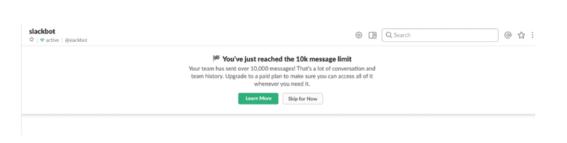

Slack upsell popup。

### 通过交叉销售扩大客户

交叉销售与向上销售不同，因为你不是销售更高端的产品，而是提供相关的产品或服务。 这些产品通常以独立的形式建立，但适合与你现有用户相匹配的角色。

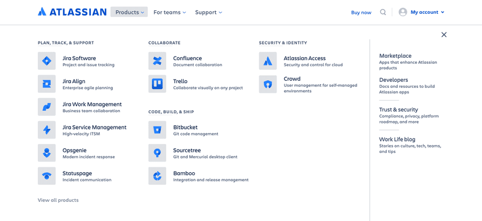

Atlassian界面强调交叉销售。

### 通过附加组件扩展客户

附加产品与交叉销售的不同之处在于，它们只在用户已经拥有基本产品的情况下才起作用。 鉴于它们不能作为独立的产品发挥作用，你必须有效地营销它们，以便用户采用这些附加产品。

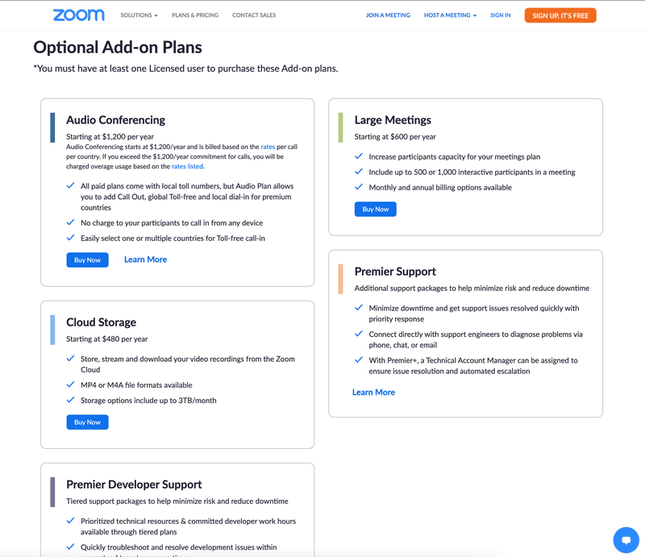

缩放插件。

## 扩大客户的向上销售和交叉销售的技巧

虽然向上销售可能不是一门精确的科学，但如果你将其应用于你的客户扩展战略，有一些最佳做法可以显著提高你的结果。

### #1 – 了解你的受众

[用户角色](https://userpilot.com/blog/user-persona-examples-saas/)是确定目标受众的第一步，但这一过程不应该就此结束。 看一下人口和心理数据，以更深入地了解你的用户群。

如果你知道他们是如何思考的，他们来自哪里，以及是什么驱动他们每天前进，那么吸引现有的用户将更加容易。 最终，了解他们的目标和挑战将使你的追加销售/交叉销售更加直观。

### #2 – 不要过早地进行追加销售

过早的追加销售对于还没有充分认识到你的产品价值的用户来说，看起来像是抢钱。 在你要求客户在计划升级或相关产品上花更多钱之前，等待客户达到他们旅程中的 “[AHA时刻](https://userpilot.com/blog/the-aha-moment-for-product-onboarding-activation/)“。

### #3 – 使用 “问题指南针”

让用户的问题像指南针一样引导你，帮助你决定哪种产品可以作为解决方案进行追加销售/交叉销售。 从用户的角度看这些挑战，将有助于使客户扩展战略与他们[自己的旅程](https://userpilot.com/blog/user-journey-map/)相一致。

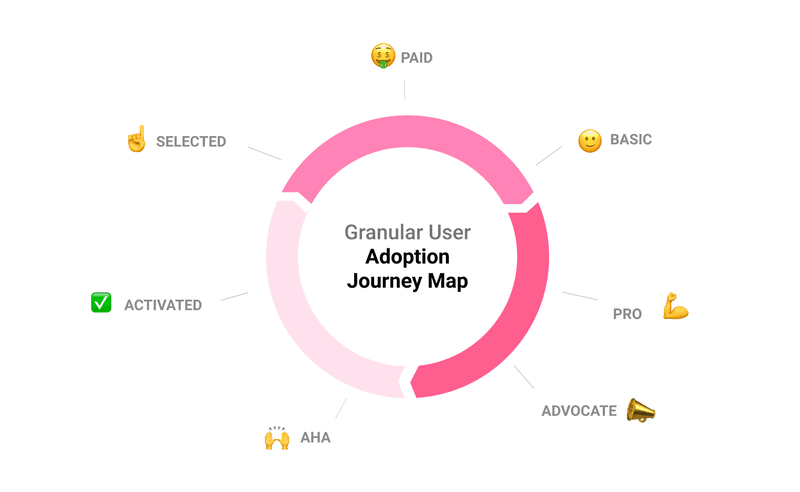

用户旅程图

### #4 – 积极倾听

你永远不知道什么时候会有一个追加销售的机会，所以要时刻准备着。 无论是简短的电话还是电子邮件交流，暗示高级功能如何能帮助他们更快达到目标。

### #5 – 保留的心态

如果你正在遭受高[用户流失率](https://userpilot.medium.com/5-key-user-retention-metrics-for-saas-how-to-measure-and-improve-them-cac4708946f4)的困扰，那么除了收入增长之外，向上销售/交叉销售可能实际上能够帮助保留用户。 首先尝试通过[NPS调查](https://userpilot.com/blog/nps-metric/)和[流失率调查](https://userpilot.com/blog/churn-surveys-saas/)来确定人们离开的原因，然后提出解决这些问题的计划或相关产品。

## 为什么客户扩展在SaaS中如此重要？

获取客户可能是非常昂贵的，特别是在SaaS领域。 这就是为什么通过客户扩展来创造收入是如此重要的部分原因。

新客户产生的收入可以分为以下几类 ***昂贵的收入*** 而你从现有客户产生的收入被称为*
**扩张收入**
*.

这里是你需要关注的指标：扩张MRR率

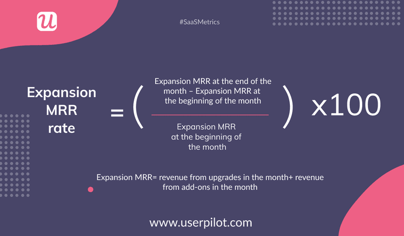

扩大月度经常性收入(MRR)

在[Matrix Partners](https://matrixpartners.com/)和[Pacific Crest Securities](http://www.pacific-crest.com/)的[年度SaaS调查](https://www.forentrepreneurs.com/2015-saas-survey-part-1/)中，发现在获取新用户时，产生价值1美元的年度合同价值（ACV）的平均成本为1.18美元。

为了产生同样的1美元的年收入，只需要投资0.28美元用于向上销售。 从本质上讲，你可以用不到四分之一的成本看到同等的收入提升，使你的活动**盈利能力提高4倍**。

从另一个角度来看，需要一年多的时间才能收回获取新客户的成本，而你可以在一个季度内实现向上销售成本的平衡。

一句话：向现有客户销售比获取新客户更容易。 向现有客户成功销售的几率约为[60%-70%](https://www.amazon.com/dp/B0031AI0VC/)。

当你把这与向新的潜在客户销售的5%-20%的成功率相比较时，很明显，你目前的用户群是一个远比任何位于未知领域的市场更有利可图。

客户扩展也可以通过帮助用户通过他们可能不经常使用的其他功能实现价值来增加续订的可能性。 考虑到续约是最便宜的收入形式，CAC为0.13美元，以这种方式增加留存率是非常有利可图的。

最后，至关重要的是，你要保持[关键的用户保留指标](https://userpilot.medium.com/5-key-user-retention-metrics-for-saas-how-to-measure-and-improve-them-cac4708946f4)，以便你有足够的现有用户，使扩张战略发挥作用。 毕竟，如果你所有的新用户都过早地离开，就没有人可以再营销了。

## 如何利用客户拓展策略发展你的SaaS

你不能只依靠你的销售团队或客户成功来联系用户并要求他们升级。 这可能会变成完全无益的，甚至可能是侵入性的，而且你最终可能会错过相当多的追加销售机会。

在SaaS中，重要的是在适当的时候（也就是与用户最相关的时候）进行上下文沟通，展示升级或附加组件的好处。[自动化](https://userpilot.com/blog/marketing-authttps://userpilot.com/blog/marketing-automation-strategy/omation-strategy/)是客户拓展的一个主要部分–尤其是对SaaS公司而言。

通过利用自动化和[产品分析](https://userpilot.com/blog/product-analytics/)，你将能够确定展示应用内营销的理想机会，迫使客户升级。 让我们来看看几个有效的客户拓展策略。

### 通过向用户展示他们所错过的东西来推动客户扩张

害怕错过–或称FOMO–是最有说服力的机制之一，可以让用户升级。 有时，用户只需要看到他们错过了什么，就能实现这一飞跃。

Miro是在不放弃全部功能的情况下挑逗用户的一个好例子：

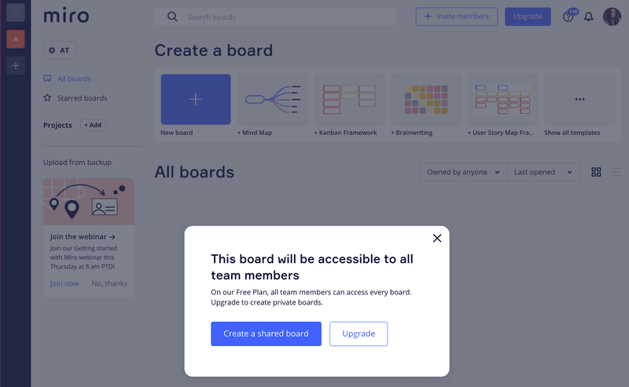

Miro说服用户升级到高级计划，默认情况下，所有板块都是公开的，并将私人板块作为一项高级功能来推广。

如果你使用的是免费账户，那么Miro将让你创建最多三个板块。 然而，每当您创建一个新的板块时，您会看到一个提醒，即这些板块是公开的。 这暗示了一个事实，即升级对那些需要私人董事会的人来说是有利的。

### 利用情境式旅程接触点自动化来拓展客户

你何时要求你的客户升级，几乎与你如何要求他们一样重要。 Loom是一家将这一原则应用于其[应用内信息传递](https://userpilot.com/blog/in-app-messaging/)的公司[。](https://userpilot.com/blog/in-app-messaging/)在视频录制完成后，他们提示用户测试一个高级功能，用一个引人注目的[微视频](https://userpilot.com/blog/microvideos-guide/)删除嗯、嗯和其他填充词。

考虑到大多数录音都会包含很多这样的填充词，Loom已经成功地找到了推广其工具的最佳时机–正是用户听到填充词并希望它不存在的时候。

在一天结束的时候，背景是一切!

Loom通过让用户在最需要的时候测试高级工具，使他们升级到高级计划。

### 通过消除升级摩擦来推动客户扩张

根据[福格行为模型](https://behaviormodel.org/)–我们在《[从试用到付费转化率》一文](https://userpilot.com/blog/5-tactics-to-increase-paid-conversion-rate/)中仔细研究了该模型–一个人需要三样东西才能发生一个行为：

- 激励
- 能力
- 提示

所有这三个要素都需要同时汇合。

这就意味着，如果用户有想跃跃欲试的时候，但却遇到了太多的摩擦，你可能会错过升级的机会。 互通公司通过让升级按钮在用户最可能需要的时候随时可用，成功地解决了这种摩擦。

当他们的用户想要添加一个不包括在他们计划中的元素时，会弹出一个工具提示，解释高级计划的价值，同时还有一个 “现在升级 “的按钮。

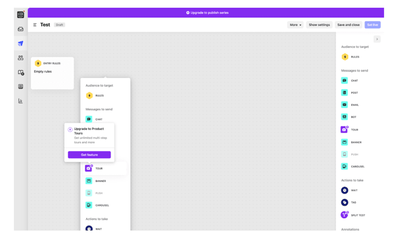

对讲机的升级提示解释了价值，并保持低摩擦。

### 通过高级功能试验推动客户扩展

在有些情况下，展示升级带来的价值的最直接方式是提供试用。 这让用户在付费解锁某项功能之前有机会进行测试。

例如，Asana从不隐藏保留给高级账户的功能。 相反，他们把它们作为一个钩子，让更多的免费用户参加高级试用，从而看到高升级率。

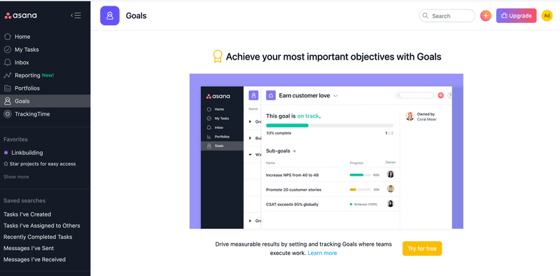

Asana提供高级功能试用。

### 配置你的计划以推动客户扩张

在试图推动客户扩张时，根据用户的需求定制SaaS定价是一个极其强大的策略。 Miro再次成为这方面的一个很好的例子，因为它成功地将其功能分散到四个计划中，以优化客户扩展。

免费计划对团队没有成员限制，因为更多的免费用户意味着每个月末有更多的升级数字。 付费计划被分成三个价格档次，以便用户只需为他们想要的功能付费。

这使得Miro易于使用，价格合理，并为其用户群的向上流动做好准备。

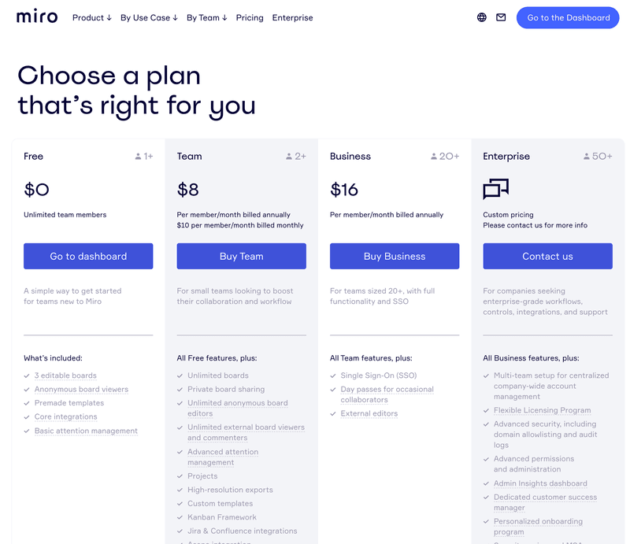

Miro的分层定价系统使其平台对各种规模的公司都适用。

## 用来推动应用内上下文客户扩展的最佳工具

虽然使用自定义代码来创建[工具提示](http:// https//userpilot.com/blog/how-to-create-tooltips/)和[应用内模式](http:// https//userpilot.com/blog/in-app-messaging/)总是一种选择，但它的缺点是需要开发人员。 你需要他们来进行最初的创建，任何信息的修改，以及分割测试。

这使得它不仅昂贵而且相当耗时。

为了使你的应用内信息传递更加敏捷和直接，你可以使用应用内产品增长工具来建立/测试用户沟通，[通过账户扩张来推动增长](https://userpilot.com/solutions/account-expansion)。

Userpilot让你利用每一个机会，在你现有的用户群中进行追加销售并促使计划升级。 它通过利用上下文的产品体验和根据用户行为显示不同的模块来实现这一目标。

Userpilot的高级[细分](https://userpilot.com/blog/customer-segmentation/)功能确保你总是在**正确的时间**向**正确的用户**展示**正确的信息**。

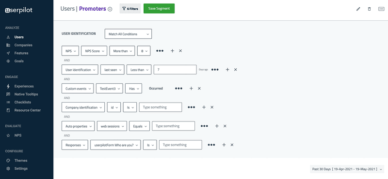

Userpilot让你利用其先进的细分功能，在理想的时刻触发体验。

你可以像Intercom那样创建[工具提示](https://userpilot.com/blog/how-to-create-tooltips/)，像Asana和Mailchimp那样创建模版，并对不同的方法[进行分割测试](https://userpilot.com/blog/product-experiment-how-to/)以优化结果。

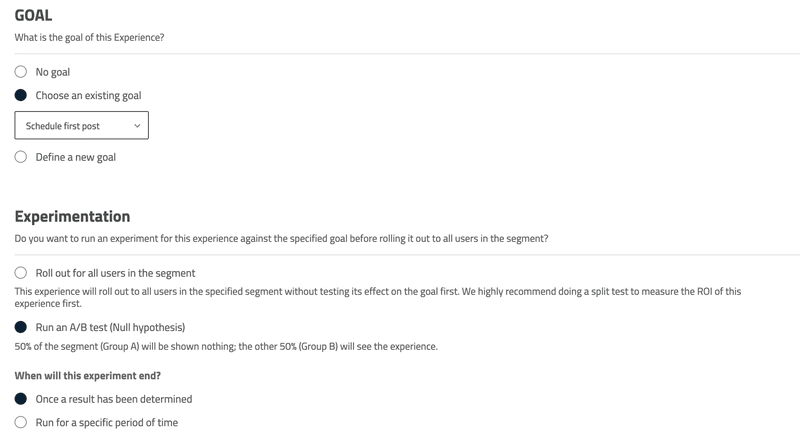

利用Userpilot对应用内体验进行A/B测试，以优化客户账户的扩展。

想通过上下文和适时的应用内体验开始推动客户扩张？[注册参加Userpilot演示](https://userpilot.com/userpilot-demo)，今天就开始吧

## 总结

营销作家Tim Riesterer曾批评公司只将10%-20%的销售预算用于客户拓展，而每年70%-80%的收入来自续约+追加销售。

寻找新用户没有错，但重要的是不要忘记可能就在我们眼皮底下的未开发的财富。 这篇文章的关键收获应该是一个常青的事实，即总是有更多的价值可以获得–在SaaS关系的双方。