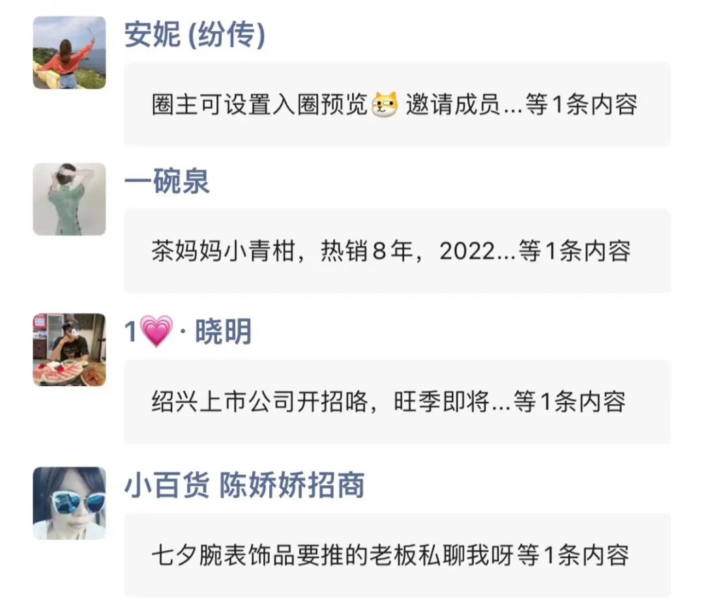
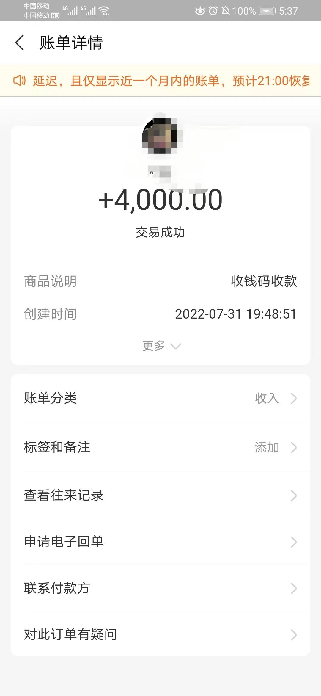
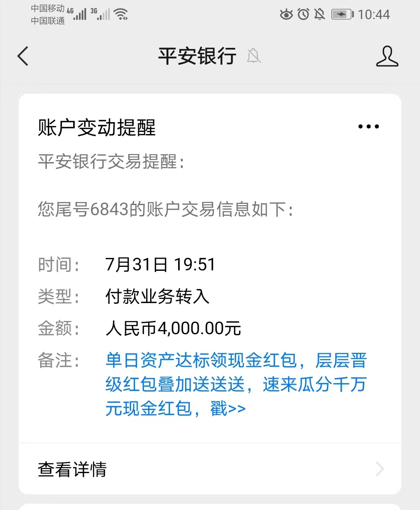
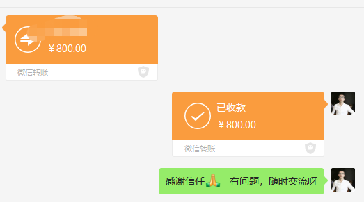

## 私聊成交只需6步，提升50%转化率（私域玩家如何通过私聊赚钱）

2022-11-30 10:27:10 

标签： [社群运营](https://www.135editor.com/biji.html?tag_id=2750)

微信生态内平台的触达率：私聊&gt; 社群 &gt;朋友圈&gt;公众号。也就是说，私聊对用户的触达率是最高的。 给好友发信息，会显示在对方的消息，有红点，非常大概率会打开看内容。有太多的私域玩家，靠私聊销售赚钱，实现年入百万、千万。

你是否有意识到朋友圈的打开率在下降，除了发生活动态或者自拍照片，其他内容的点赞互动率非常低。

一方面，朋友圈充斥着大量的广告，各位微商、淘客广告，朋友圈成了部分人的货架，越来越少人喜欢看广告。

我有个微信号，大部分好友是微商，只要打开朋友圈，都是各种产品，真是不太喜欢，打开朋友圈的次数越来越少。

你是否也有这样的体验？

另一方面， 微信官方的限制，自动折叠短时间内发布的多条营销广告内容，只显示一段文字，其他的点进去才能看到。

​    

​    

除了朋友圈的打开率在下降，还有公众号的打开率也越来越低。

做公众号运营的伙伴应该清楚，目前公众号平均打开率不到5%，也就是说，你有1万个粉丝，原有粉丝的打开人数不足500。

还有社群的关注度也低，只有短期快闪群或者是强关系利益社群、少部分高价值的社群有较高的关注度，  大部分社群的关注度都很低。

微信生态内平台的触达率：**私聊> 社群 >朋友圈>公众号**

也就是说，私聊对用户的触达率是最高的。 给好友发信息，会显示在对方的消息，有红点，非常大概率会打开看内容。

有太多的私域玩家，靠私聊销售赚钱，实现年入百万、千万。

比如：

1  某茶叶6人团队，靠私聊成交，一年销售额3000万

2 某营养品微商， 每天坚持私聊20位好友，一年收入200万+

我自己也一直在做私聊成交，收款几千，几万。

​    

​    

​    

接下来分享干货，此分享主要分为3个部分：

1、 6个步骤，让你轻松学会私聊成交

2、 私聊跟进的5大技巧，提升50%转化率

3、 成交的常见抗拒点如何解答

## ** **

## **第一个部分 ：6个步骤，让你轻松学会私聊成交**

说到私聊成交，有些人有心理卡点，比如

1、不敢私聊，害怕对方不回复，被拒绝。

在销售中，拒绝是销售的开始。做私聊成交不能有玻璃心， 对方不回复，或者拒绝都是很正常的。 

2、敢私聊，但是不知道如何破冰开场。

如何破冰开场，对方才会有回复。

3、不知道怎么聊，正确的步骤是什么？

以上这些都是比较常见的卡点，接下来就分享私聊成交6步骤的第一步。

**第一步 开场破冰**

为什么要开场破冰？这就像找对象谈恋爱一样，需要有个过程，

某位男生在路上遇到个漂亮女生，追上去说：“我缺个老婆，今晚你可以到我床上来吗？”

女生的第一反应，流氓，你有病吧，滚开

正确的方式是，先要打个招呼，加上微信，多聊天交流，从陌生人到朋友，再暧昧，到恋人，最后结婚。

做私聊成交也需要开场破冰，而不是直接发广告，让对方买。

开场破冰还有一个目的是，引导客户回复，让客户产生第一印象，打开话题，切入需求。

具体如何做？ 可以从这几个方面切入话题

1 朋友圈互动，点赞或评论。打招呼之前，先看对方朋友圈，点赞3条朋友圈，和走心评论。这样对方能及时看到朋友圈提醒，会打开看，先铺垫。然后再去打招呼，私聊。

2 送礼物开场。 要像礼物一样出现在别人的生命，没有人会拒绝礼物。当然了，前提条件是对方有需要的礼物。 

通过对方的朋友圈或者之前的备注信息，了解对方是做什么的，再送针对性的礼物

3 提前铺垫。根据之前的聊天记录，承上启下。

比如：之前聊到XX，现在现状怎么样了呢？

4 赞美。人人都喜欢赞美，被人夸。赞美要具体，有细节，而且是对方在意的优点。 通过用户的朋友圈或微信，昵称等信息，找到赞美的切入点。

5 找共同点

“love ” 除了喜欢、爱的意思，还有一种意思是相像、类似。也就是说，每个人喜欢和自己像的人，同频的人。比如你们有共同的兴趣爱好，是同一个家乡的等共同点，都可以用于开场。

开场破冰，一定要简单，而且是对方愿意容易回答的问题。不管是长期未互动，或者是刚添加上的好友，都需要开场破冰，做激活，让对方了解你是做什么的。

**第二步 需求调研**

通过前面的开场破冰，接下来就是要了解对方的需求， 现状是怎么样的，遇到了什么问题。

只有了解需求，才能确定是否对产品感兴趣，有购买的需求。

参考模板： 询问用户现状+ 问题需求+描述美好的未来

举例：我是卖私域训练营的， 客户是母婴店老板。

1 询问用户现状。 目前正在做什么，在哪方面是怎么样的。

参考话术：老板，你做实体店生意怎么样？ 有没有在做线上引流获客，比如有没有加客户的微信？

2 问题需求。当下存在的问题和需求。

参考话术：受到疫情影响，很多实体店生意都太好做，客流量减少了，如果不做线上获客，把客户加到微信，只靠门店的自然流量，是会越来越难的。   

你是否有线上获客引流的想法？

3 描述美好的未来。分享相关的成功案例。

参考话术： 有一个合作客户，和你一样是开母婴店的，一直靠线下的自然客流，在疫情时期，生意直线下滑，每月的营业额连房租都不够。后来，下定决心转型线上引流，通过抖音获客， 引流到店，到店后加微信，做福利群、会员群，每月的业绩是疫情前的2倍。

所以说，实体店转型线上是必然趋势，顾客都在线上，只有让顾客在手机看到我们的广告，才有到店的概率。

需求调研的关键是要提前准备好相关的问题，提炼出用了产品之后可获得的结果。针对不同的客户，要有不同的问题和案例。

客户只关心跟自己相关的事情。

### **第三步 痛点挖掘**

###  

### 了解需求痛点之后，需要放大痛点。相当于是往伤口撒盐，只有让客户更痛，才会采取行动。 人人只为痛苦或快乐改变，但是痛苦的力量比快乐大。 人是只解决大问题，不愿意解决小问题。

要让用户清楚自己的痛点，如果不改变会更加痛。

参考模板：遇到了什么问题，持续了多久，对工作或生活有什么影响。

现在遇到了什么问题，如果问题有多个，最想解决的问题是哪个。 这个问题持续了多久，产生了什么影响。

参考话术：关于实体店方面，你最大的问题是什么？比如：缺客户，不会转化，没有复购，客户不转介绍等， 你选哪一个。

客户说，缺客户，每天进店人数很少，才10几个。

参考话术：这样呀，这样的现状多久了，如果继续这样下去，会有什么结果呀。

痛点挖掘的主要目的是：要让用户清楚自己的痛点，而且要放大痛点，如果不改变会更加痛，后果严重。

需要注意： 不能过度夸张，容易引起反感。

**第四步 产品介绍
**

当伤口被撒盐后，一定会更加痛，急需解药，缓解疼痛。 做私聊成交也是如此，只有痛点挖掘，被放大后，用户才会想要解决，对你的产品或解决方案感兴趣。

在用户没有需求，痛点不够大时候，千万不要介绍产品。就算你直接介绍产品，对方会很反感抗拒，拒绝的概率大，或者说考虑一下。

产品介绍的参考模板：产品好处+ 客户见证+差异化优势

产品的好处，包括有哪些功能作用，对客户有什么用。

 客户见证，就是往期客户使用后的反馈、效果、好评等，客户喜欢看用过的人评价。

类似，我们买东西、点外卖为什么会习惯看评价。

差异化的优势，跟同行对比有什么优势，核心的优势是什么？

产品介绍这个步骤，需要提前准备好相关的素材，要控制好发送的节奏，不能长篇大论， 发送多条信息，不然用户会很反感的。

### **第五步 解决异议**

介绍完产品，很少有客户说马上要买下单的，一般都会有各种问题、异议、抗拒点，毕竟客户是希望了解清楚，解决心中的疑虑，才有可能下单成交。

如何解决异议，有哪些步骤？

常用的模板是：理解客户+分析异议+ 不断的给案例见证。

理解客户，也就是认同客户，有共鸣。

比如：很多客户都有你这样的想法，很正常，非常理解你

分析异议。分析客户为什么会有这样的异议，针对性的解决。 

举例：我最近副业卖私域工具，有客户说，价格贵

参考话术：很多客户都会觉得贵，非常理解你。好东西才贵的，这款工具最核心的优势是安全稳定，不封号，而且可以自定义验证语、自动备注、自动回复等功能，售后有保证。

跟其他卖几十元的工具不一样，售后无保障，而且容易封号。如果是买便宜的工具，导致微信被封，你愿意吗

接着，发案例见证，客户反馈，好评图，不断的刺激客户的欲望。人是有从众心理，看到这么多人买，反馈还不错，应该不差，买单。

解决异议的主要目的： 进一步增加用户的信任，解决用户对产品的疑惑和顾虑。

要注意：给用户发的案例或效果反馈图，一定要和用户痛点强相关的。

**第六步 促进下单**

解决完异议，疑虑。客户也不一定会买，还需要促单。大部分人是需要别人替他做决定，在不熟悉的领域，是很希望能够有人引导他。

参考模板：占便宜（折扣、特价、抵用券、礼品）+紧迫感（数量有限，时间有限，赠品有限）+0风险承诺（不满意全额退款）

这些都比较好 理解，做运营、销售、营销的老板都知道怎么操作。

以上3点不一定要全部用，用一点或二点都行，比如紧迫感+0风险承诺。

除了0风险承诺，还有负风险承诺。比如：卖9800元的私域操手课程，可以获得一套私域操盘手课程+ 一本纸质书《私域操盘手宝典书》+半年陪跑咨询+一次30分钟的诊断咨询。 付款后，3天内不满意，可全额退款，纸质书免费送给你。

给任何好处都需要有理由，客户要的不说便宜，而是占便宜，占便宜的感觉。

刺激购买的常见话术：

你还有什么疑问吗？

没有的话，付款金额是xx元，是支付宝还是微信？

付款成功之后，截图发我。

以上，就是私聊成交六步法：**开场破冰，需求调研，痛点挖掘，产品介绍，解决异议，促进下单。 还需要经常刻意练习，按照步骤，一步一步操作。**

***\*第二部分：私聊跟进的3大技巧，提升50%转化率\****

讲完了私聊成交的步骤，但是事实上，还需要做跟进，无跟进，成交率低。有数据调查显示：

1%的销售是在第一次沟通后完成；

3%的销售是在第一次跟进后完成；

5%的销售是在第二次跟进后完成；

10%的销售是在第三次跟进后完成；

80% 的销售是在第4至11次次跟进后完成。

有大部分人是只有第一次沟通，如果不成交，后面没有跟进，这是极大的浪费。

但是，不是每个客户都需要跟进的，什么样的客户是值得跟进？ 认同产品和有购买需求，有购买力。

满足这3个条件的客户，才需要去跟进，否则就没必要跟进。

私聊跟进的5个技巧， 提升转化率：

1 如何让对方原意回复你。

在跟进过程中，是不是经常遇到这样的情况，不管你发什么信息，对方都不回复，不了解对方的想法。 

有一个核心是，跟进内容要与用户的痛点和需求，有强关联，提供对方想要的价值。 而且要体现真诚，  真诚比专业更重要。

可以通过对方的朋友圈切入，找到一个合适的话题。

比如： 看你朋友圈说，正在招人，有招到吗？ 我有推荐

2 小号法，了解对方的需求。

如果，不管你说什么，怎么做都不能了解到对方的疑虑，怎么办？分享一个小秘密， 这个方法是我以前做直销学到的。

用一个小号假装是和客户类似的人，去加客户的微信。了解对方，为什么没有买的原因？

举例：你是卖医美整形的

参考话术： 姐妹，我的鼻子太矮了，不太好看，想去做鼻子，你知道哪里比较靠谱的吗？ 

用户：我最近在了解XX机构，好像还不错，XXXX

小号：嗯嗯， 你打算去做吗？

用户：还没有，还有有些疑虑

小号：这样呀，是什么疑虑呢？分享下，我参考参考

用户: XXXX

3  标签分组，重点跟进。

分享一个小技巧，把强需求，有意向购买，还在考虑的用户建立一个标签，比如【重点跟进】。每天发朋友圈，仅针对这个表情的用户可见。发用户的购买截图、反馈收获好评等。还可以设置优惠价格，共XX个名额，已经XX人付款，仅剩下XX个名额。

4  不同客户类型的跟进技巧：

第一类：有兴趣购买的客户。 重点是快速跟进，逼单。比如打电话，在电话中直接成交，让对方转账。

第二类：考虑、犹豫的客户。 了解客户考虑什么，解决问题点，持续跟进。如果问不出来在疑虑什么，可参考上面的小号法。了解疑惑后，再针对性解决。

第三类：最近不买的客户。 维持关系，了解客户什么时候买。在当天一定要及时跟进，只要客户是信守承诺的，一般会成交。

5 通过语音电话跟进

有些客户需要打电话做跟进，声音比文字更有力量，如果是声音比较好听，更能获得好感，提升信任度。所以，文字不能成交的话，建议发语音或者打语音通话 

***\*第三部分：常见抗拒点如何解答\****

以卖美妆护肤品为例，常见抗拒点如何解答：

1 价格贵，能不能便宜点

核心策略：当客户关心价格时，销售人员要引导为价值，把贵不贵变为值不值。或者是用价格拆分法，拆分到每天需要花多少钱。不要与顾客争论价格，要与顾客讨论价值；

参考话术： 姐，其实我和您一样都希望用最少的钱买到最好的产品，但是便宜的往往是最贵的，可能会带来不好的体验。这款面膜非常适合你的油性皮肤，268元有10片面膜，每张才26.8元，可以让你持续好几天充满弹性光滑的肌肤。

2  现在不买，考虑一下

核心策略：客户还有疑虑，没有得到解决。

参考话术：没关系，什么时候买都行，早买早受益，最重要的是产品是否能帮助到你。既然想要考虑，就说明你是认可产品对你有帮助的，对吧

请问是还有什么疑虑，您说出来，看下我能不能帮你解决。

3  有需要的时候 再联系你

核心策略：客户这样回答明显是在忽悠，这个时候我们要了解客户真正的抗拒点和需求，然后再见招拆招。

参考话术：非常感谢您对我的支持，曾经我有个客户，也说要的话联系我，几年过去了，到现在都还没有联系我，我们也聊了这么长时间了，真心希望你我都坦诚相待，您能不能告诉我您不下单的真正原因呢， 您在考虑什么呢，还有哪个地方我没有讲到位吗？

时间有限，只列举3个常见的问题的解答方式。不管是什么抗拒点，都可以用这种模板来解答。

解决抗拒点的三步法：认同赞美，反问，确认。

认同的话术参考：

1、我很认同你的观点

2、我很理解，你都是为我好

3、我完全理解你的心情

4、我知道你说这么多都是为我们好

5、这是一个很好的问题

6、客户抗拒点往往不是一个，回复说 “ 这也是一个很好的问题 ”

7、这个问题您提的非常好，以前其他人提过，也提到了一个很好的答案，我相信您也能得到一个好的答案。

如何反问，注意几点

1、问简单容易回答的问题，从简单的问题开始问，让客户的思路能够跟得上。

2、用二选一的方式问，设定一个封闭式答案。

3、不断的问客户 “ 是 ” 的问题，形成一种心理效应，不断的确认。

4、问锁定的问题，针对客户的陈述，找到关键词，再次发问。

例如 : 我以前也学过这样的课程，可是学完感觉不能落地。

关键词 “ 感觉 ”。

你可以这样说 “ 您感觉之前的课程哪方面不能实际落地呢？能举例说明一下吗？”

再确认，就是确认客户的问题，再解释。

例如：你是不是觉得这个问题是最重要的？ 如果帮你解决完这个问题，是会购买吗？

最后，分享5条私聊成交心法：

1 成交一切为了爱， 成交就是成就。

成交你，是因为爱你，想要帮助你，成就你，彼此都更好。能帮助你解决问题，我顺便赚点钱。

2 成交从拒绝开始。做销售成交，拒绝是非常正常的。没关系，下一个。中国人口多，张三不买，李四买。要把接受别人拒绝作为一种职业生活方式.

3 相信相信的力量。这是对产品的信任和自信的体现。如果你自己都对产品都没有信心的话，如何才能让客户信任，下单？ 不仅要相信产品，还要相信自己，相信对方会成交。

4 成交必备价值观——利他。  你把客户放在心上，了解了客户想要什么，想满足什么需求，再针对性地推荐产品/服务给客户，处处为客户考虑，客户才会为你的付出而买单。

5  信赖感大于实力。做私聊成交有97%的时间在建立信赖感，3%在成交。信任是成交的基础，只要信任到位，与客户的关系好，不需要任何技巧。如果是对方需要的产品，直接发产品，报价，收钱。

***\*总结\****

第一，私聊成交六步法：开场破冰，需求调研，痛点挖掘，产品介绍，解决异议，促进下单。 还需要经常刻意练习，按照步骤，一步一步操作。

第二， 私聊跟进的3大技巧：1. 让对方愿意回复你。2 借力小号，了解需求。3 标签分组，重点跟进

第三， 常见问题的一些解答，需要大量的刻意练习，打磨出适合自己的话术。

第四， 5条成交心法，让私聊成交更有成就感和意义感。

最后，本次分享到此结束，希望对你有启发。