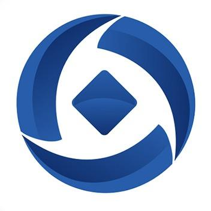

# 销售人员如何获取正确的赚钱途径？都在这儿了

[借力APP](https://www.zhihu.com/org/jie-li-app)

已关注

1 人赞同了该文章

大家常说，除了那些高技术工种，想要快速赚钱就要选择做销售，来钱快，赚钱多，基本没有什么高门槛，适合普通人。

但是初入这个行业，很多人都低估了销售的辛苦与努力，总以为动动嘴皮子，就能谈下客户，促成交易，所以很多人永远只是刚刚入门，总不得法领，赚不到大钱。

那么到底如何做，才能快速入门销售这个岗位并取得更高业绩，赚取高收入呢？这是很多做销售人士一直在探讨的话题。

一般人会看很多关于销售方面的书籍，但是没有实际的实践，往往也只能纸上谈兵，略懂皮毛，真正的技巧都是实践中总结出来的。

怎样与客户沟通，怎样说服客户，怎样更快速成单，这些都是销售的终极目标，掌握一套真正的销售思维，加以提炼成适合自己的思维方式，就会发现，原来做销售成单赚钱就是这么赚钱。

1. 客户思维

很多销售人员对自己的定位都是“推销者”，意在将自己的产品推销出去让客户进行购买，于是形成了买方与卖方的对立面，因此在销售的过程中就会形成一种双方之间的价格博弈，使销售的过程阻力变大。

所以，每一位销售人员要适当改变自己的定位，培养“客户思维”，切实站在客户的角度说服客户，落实销售这一行为，更能获得客户的理解与接受。

成为客户的“参谋者”，帮客户选择、购买产品，弱化客户的心理防线，将自己作为一名客户，思考想要得到什么样的服务、什么样的沟通方式、什么样的产品功能，依照此思路，围绕客户角度设计销售话术，销售就会成功一半。

2. 价值思维

作为一名合格的销售，要了解自己产品的价值，往往产品的价值越高，价格越低，客户买单的速度就会越快。

为什么在销售的过程中，客户往往喜欢对比同类型产品的价格，从而决定购买方向？

因为他们想要花最少的钱买到价值最高的产品，所以在销售的过程中，一定要强调自己产品的价值，弱化其价格方面的弱势。

人的需求有很多种，价格是一方面，对于产品，他们也想要它的功能性、安全性等都能高人一筹，这些都是产品的价值所在，能满足客户的需求越多，价值也就越高，抓住他们的核心需求，成交就会变得简单。

3. 技能思维

技能思维是指销售人员要自发的提升自己的销售技巧，学习好的销售技能，不断打磨提升销售经验。

客户的需求是在不断变化的，所以销售人员的销售重点与销售话术也要随着客户需求不断变化，用长远的眼光看待销售，及时复盘并总结经验，整理出客户每个阶段的需求与问题，用最专业的话术去解决这一销售难题。

在销售结束之后，总结客户要求并及时反思，将自己的话术精简，使整个销售流程不断优化，这样才能打磨自己，获得提升，超越其他销售人员。

4. 诚信思维

做生意要讲究诚信，才能够长久，做销售也是，要对自己说出的每一句话负责。

客户之所以愿意购买产品主要是因为价值与诚信，没有诚信就不会成交，这是本质，销售的过程就是不断获取客户信任的过程，提供专业的购买建议，微笑对待每一位客户，拉近顾客距离，这是销售人员体现自己诚信的方法。

5. 积累思维

销售最关键的一点就是人脉，一位合格的顶尖销售，都会将自己所服务的每一位客户变成自己的人脉，并且不断维护。

无论在某段时间有没有达成交易，都能够获取客户信任并与其成为朋友，所谓放长线钓大鱼，即便客户当时不需要也不代表以后不需要，每一位到店的顾客都是不可多得的人脉，也许以后他们就会给我们带来一些意料之外的惊喜。

拥有正确的销售思维，才能培养适合自己的销售技巧，并将其运用到日常工作中，在业绩上胜人一筹。

发布于 2021-02-24 14:45

销售经验

销售

销售技巧