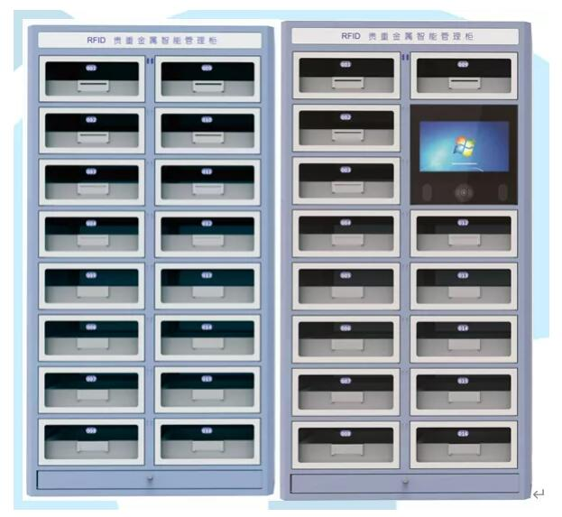

## RFID智能柜都有哪些类型？

发布日期：2021/9/1 10:29:48发布人： 来源：

曾经火热的无人零售，带火了RFID智能柜的发展。随着无人零售的降温，RFID智能柜的应用也走向更接地气的场景中，出现了不同类型、不同功能的新型RFID智能柜。如：工器具管理柜；智能图书、档案、文件柜；危化品、试剂管理柜；毒麻医药品柜；医疗耗材柜；贵金属智能管理柜；钥匙智能管理柜等。

**工器具管理柜**

通过无源RFID标签对工具进行唯一标识，工具领用或者归还时，通过APP软件进行权限的管理并开门，记录使用责任人，关门后，柜体实现自动盘点，记录领用工具的数量及种类。

应用领域：广泛应用于电力、轨道交通、航空、维修厂、矿站等的工器具管理。如：用于轨道交通的维修工具、测量仪器、仪表等器具的管理；电力的令克棒、测量仪器、安全帽及防护手套等器具的管理等。

**工器具管理柜类型：**

**智能图书、档案、文件柜**

**24小时图书柜**

24小时书柜，可用于图书馆、商超门店、社区文化馆等场景下图书借阅、归还等操作。支持多标签读取，可选配人脸识别，一二维码扫描、身份证、读者证等电子取阅使用，大大方便了读者的借阅、归还使用。设备支持网口通信，并可拓展WiFi、4G等多种通讯方式。 

**24小时预借取书柜**

可用于图书馆、商超门店、社区文化馆等场景下图书借阅、归还等操作。主要用于图书预借使用，馆内人员将图书放置柜门中并关门，读者可刷读者证、身份证等进行预借取书，数据可实时通过网络在后台进行记录。

**智能档案柜**

适用于商务大厦、集团公司、企业单位、国家档案馆等需要储存文件资料，进行单据流转的场所。 采用高频RFID射频技术，实现档案借阅、归还等操作的精准化管理。

智能档案柜，符合协议标准ISO15693，ISO18000-3协议，外型简洁大气，质量稳定、性能可靠，支持固件升级、快速盘点，可选配人脸识别，一二维码扫描、身份证、读者证等电子取阅使用，大大方便了读者的借阅、归还使用。设备支持网口通信，并可拓展WiFi、4G等多种通讯方式。

**RFID智能文件柜**

RFID智能文件柜应用RFID自动识别技术、可实现对档案文件的实时盘点、智能存取、单元格口定位指示、实时查找、语言播报以及异常提示等功能。

柜内单元格可独立对粘贴有RFID标签的档案进行扫描、统计，以及集成单元格柜内灯控照明，定位单元格指示灯等优点，为工作人员对档案文件的盘点、定位查找等提高了对档案文件的管理效率。

**危化品、试剂管理柜**

**RFID试剂柜**

整柜采用为双层1.2mm防火钢板构造，内层隔板为钢化玻璃材质，防腐蚀性更强。柜体结合了RFID技术及条码技术，便捷、高效、操作简单，实现了刷卡、人脸识别、双锁控制等方式打开柜门，实现了对试剂的出库、入库等记录管理。

符合ISO18000-6C（EPC C1G2）协议，外型简洁美观，质量稳定、性能可靠，支持多标签读取，采用网口等多种接口进行数据传输，是一款高性能、操作方便的专用RFID试剂柜。

**RFID危化品管理柜**

整柜采用双层1.2mm优质冷轧钢板，增加强度，防火性能更好。内层隔板为钢化玻璃材质，防腐蚀性更强，具有防爆性能。柜体结合了RFID技术及条码技术，便捷、高效、操作简单，实现了刷卡等方式打开柜门，实现了对特殊试剂的出库、入库等记录管理。

符合ISO18000-6C（EPC C1G2）协议，外型简洁美观，质量稳定、性能可靠，支持多标签读取，采用网口等多种接口进行数据传输，是一款高性能、操作方便的智能柜体。

应用场景：广泛应用于工厂、学校、实验室等单位的危化品管理。

**医疗耗材柜**

超高频RFID医疗耗材柜，基于RFID技术自动感知耗材柜内库存，实现耗材领用自动记录，便捷、高效。一药一码，通过使用超高频RFID标签，为每一个耗材标识唯一身份ID，从耗材的系统录入开始，绑定标签的唯一值。当使用时，护士使用指静脉、刷卡等方式打开柜门，直接领取关门即可自动记录使用的耗材种类、规格、数量等信息，对应推送结算信息到患者处结算。

产品特点

➣ 采用超高频RFID技术，实现对医用高值耗材的快速盘点，自动识别进出。

➣ 可通过主柜对副柜进行控制、级联，实现层架/导管架的搭配组合。

➣ 实时动态显示耗材库存、使用和缺货信息，实现耗材申领、采购、补充的精益化管理。

➣ 手术后结算数据可对接HIS系统计费，避免疏漏。

➣ 通过软件可实现近效期预警，过效期拦截，批号追踪管理。

➣ 报表查询完美替代科室留存人工记录，耗材供补报损等信息实现电子化追溯。

应用场景：

广泛应用于医院高值耗材的管理，适用于手术室、介入室等，也可放置于专用耗材室。

**手术服装智能管理柜**

手术服装智能发衣管理柜，集成了手术人员刷卡或指静脉功能，进行智能身份识别，根据手术人员信息选择合适尺寸的衣物自动传送至发衣口，方便手术人员领用。设备集成21.5寸触摸操作屏，良好的人际操作界面，方便进行信息确认。当各尺码衣服库存数量低于设定值时，通过信息远程提醒工作人员及时添加衣物的类别和数量。智能发衣柜对优化手术室更衣流程,缩短医务人员术前更衣时间,改善手术室环境,节约人力成本,提高服务效率具有积极的作用。

手术服装智能回收管理柜，是一款通过RFID超高频识别技术实现医护人员服装自助回收，并对回收的服装通过唯一RFID编号进行比对，减少遗漏与丢失率，从回收点开始，一直到处理中心处理结束，实现了医护人员服装全生命周期的信息溯源，提升了工作的准确率及回收效率。

**毒麻医药品柜**

毒麻药柜是药品管控智能管理整体解决方案中的重要组成部分，主要应用于手术室、ICU、肿瘤病房、小型药房等科室内的毒麻精等管控药品管理。该设备可以通过指纹根据操作者不同设置不同的操作权限；设备取药及加药均实现系统自动计数，无需人工再录入任何数据，完全排除人为因素对药品相关信息的影响；全程视频录像，确保药品及操作可追溯。

毒麻药柜可与医院HIS系统、手麻系统等进行无缝对接。通过工作站，实现对取药、加药信息的自动采集、并生成发药/补药报表、打印处方，对各类数据进行统计和分析，确保毒麻精等管控类药品的规范使用，提升医院毒麻精等药品的使用和管理效率。

**贵金属智能管理柜**

RFID贵金属智能管理柜，采用8层16格对银行贵金属、抵押品等进行盘点和定位管理。柜体可盘点超过1200件物品，盘点时间小于60s，极大的提升了对贵金属管理的效率。

采用APP控制开门，柜门可自动弹出，方便拿取，整柜屏蔽效果好，不会出现单元格之间的串读。柜体配备应急开锁装置，方便特殊情况下开关柜门，柜门采用电子锁控装置，支持网络远程开锁，开关状态实时监控并生成开关门记录。

**钥匙智能管理柜**

钥匙档案管理柜是一种通过高频卡与读写器之间双向通信实现钥匙自助借还设备。其外观高雅大方，运行性能可靠，操作界面简单，系统易于升级，是一款高性能、易操作、自助型的网络自助借还设备。支持15693、14443A\14443B等众多网络协议，适用密集型阅读模式，可选配高频阅读器、指纹识别仪等多种其他类型的阅读器，配置高性能工控主机和触摸显示屏。

应用场景

广泛应用于工厂、公车单位的钥匙、4S店、手机等取还管理，要求无雨水及扬尘的环境下。（特殊室外场景，可做防水处理）