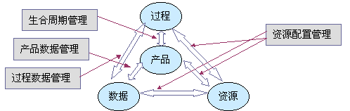

**产品数据管理（Product Data Management）**

目录[[隐藏](javascript:toggleToc())][1 什么是产品数据管理（PDM）](https://wiki.mbalib.com/wiki/产品数据管理#.E4.BB.80.E4.B9.88.E6.98.AF.E4.BA.A7.E5.93.81.E6.95.B0.E6.8D.AE.E7.AE.A1.E7.90.86.EF.BC.88PDM.EF.BC.89)[2 PDM之源初探](https://wiki.mbalib.com/wiki/产品数据管理#PDM.E4.B9.8B.E6.BA.90.E5.88.9D.E6.8E.A2)[3 PDM产生的背景](https://wiki.mbalib.com/wiki/产品数据管理#PDM.E4.BA.A7.E7.94.9F.E7.9A.84.E8.83.8C.E6.99.AF)[4 PDM的产生](https://wiki.mbalib.com/wiki/产品数据管理#PDM.E7.9A.84.E4.BA.A7.E7.94.9F)[5 PDM的发展](https://wiki.mbalib.com/wiki/产品数据管理#PDM.E7.9A.84.E5.8F.91.E5.B1.95)[6 PDM与企业信息管理](https://wiki.mbalib.com/wiki/产品数据管理#PDM.E4.B8.8E.E4.BC.81.E4.B8.9A.E4.BF.A1.E6.81.AF.E7.AE.A1.E7.90.86)[7 PDM功能分析](https://wiki.mbalib.com/wiki/产品数据管理#PDM.E5.8A.9F.E8.83.BD.E5.88.86.E6.9E.90)[8 PDM技术分析](https://wiki.mbalib.com/wiki/产品数据管理#PDM.E6.8A.80.E6.9C.AF.E5.88.86.E6.9E.90)[9 PDM之应用层次](https://wiki.mbalib.com/wiki/产品数据管理#PDM.E4.B9.8B.E5.BA.94.E7.94.A8.E5.B1.82.E6.AC.A1)[10 为什么实行PDM[1\]](https://wiki.mbalib.com/wiki/产品数据管理#.E4.B8.BA.E4.BB.80.E4.B9.88.E5.AE.9E.E8.A1.8CPDM.07UNIQ6d635bfa86faad2-nowiki-0000000C-QINU1.07UNIQ6d635bfa86faad2-nowiki-0000000D-QINU)[11 CAD/CAM用户需知道的PDM基本知识[2\]](https://wiki.mbalib.com/wiki/产品数据管理#CAD.2FCAM.E7.94.A8.E6.88.B7.E9.9C.80.E7.9F.A5.E9.81.93.E7.9A.84PDM.E5.9F.BA.E6.9C.AC.E7.9F.A5.E8.AF.86.07UNIQ6d635bfa86faad2-nowiki-0000000E-QINU2.07UNIQ6d635bfa86faad2-nowiki-0000000F-QINU)[12 PDM的好处[3\]](https://wiki.mbalib.com/wiki/产品数据管理#PDM.E7.9A.84.E5.A5.BD.E5.A4.84.07UNIQ6d635bfa86faad2-nowiki-00000010-QINU3.07UNIQ6d635bfa86faad2-nowiki-00000011-QINU)[13 是否需要PDM系统的决定[4\]](https://wiki.mbalib.com/wiki/产品数据管理#.E6.98.AF.E5.90.A6.E9.9C.80.E8.A6.81PDM.E7.B3.BB.E7.BB.9F.E7.9A.84.E5.86.B3.E5.AE.9A.07UNIQ6d635bfa86faad2-nowiki-00000012-QINU4.07UNIQ6d635bfa86faad2-nowiki-00000013-QINU)[14 PDM购买须知[5\]](https://wiki.mbalib.com/wiki/产品数据管理#PDM.E8.B4.AD.E4.B9.B0.E9.A1.BB.E7.9F.A5.07UNIQ6d635bfa86faad2-nowiki-00000014-QINU5.07UNIQ6d635bfa86faad2-nowiki-00000015-QINU)[15 产品数据管理系统功能分析[6\]](https://wiki.mbalib.com/wiki/产品数据管理#.E4.BA.A7.E5.93.81.E6.95.B0.E6.8D.AE.E7.AE.A1.E7.90.86.E7.B3.BB.E7.BB.9F.E5.8A.9F.E8.83.BD.E5.88.86.E6.9E.90.07UNIQ6d635bfa86faad2-nowiki-00000016-QINU6.07UNIQ6d635bfa86faad2-nowiki-00000017-QINU)[16 产品数据管理系统功能与应用分析[7\]](https://wiki.mbalib.com/wiki/产品数据管理#.E4.BA.A7.E5.93.81.E6.95.B0.E6.8D.AE.E7.AE.A1.E7.90.86.E7.B3.BB.E7.BB.9F.E5.8A.9F.E8.83.BD.E4.B8.8E.E5.BA.94.E7.94.A8.E5.88.86.E6.9E.90.07UNIQ6d635bfa86faad2-nowiki-00000018-QINU7.07UNIQ6d635bfa86faad2-nowiki-00000019-QINU)[17 PDM在企业范围内的作用[8\]](https://wiki.mbalib.com/wiki/产品数据管理#PDM.E5.9C.A8.E4.BC.81.E4.B8.9A.E8.8C.83.E5.9B.B4.E5.86.85.E7.9A.84.E4.BD.9C.E7.94.A8.07UNIQ6d635bfa86faad2-nowiki-0000001A-QINU8.07UNIQ6d635bfa86faad2-nowiki-0000001B-QINU)[18 PDM与企业信息集成[9\]](https://wiki.mbalib.com/wiki/产品数据管理#PDM.E4.B8.8E.E4.BC.81.E4.B8.9A.E4.BF.A1.E6.81.AF.E9.9B.86.E6.88.90.07UNIQ6d635bfa86faad2-nowiki-0000001C-QINU9.07UNIQ6d635bfa86faad2-nowiki-0000001D-QINU)[19 PDM的管理功能[10\]](https://wiki.mbalib.com/wiki/产品数据管理#PDM.E7.9A.84.E7.AE.A1.E7.90.86.E5.8A.9F.E8.83.BD.07UNIQ6d635bfa86faad2-nowiki-0000001E-QINU10.07UNIQ6d635bfa86faad2-nowiki-0000001F-QINU)[20 PDM的实施[11\]](https://wiki.mbalib.com/wiki/产品数据管理#PDM.E7.9A.84.E5.AE.9E.E6.96.BD.07UNIQ6d635bfa86faad2-nowiki-00000020-QINU11.07UNIQ6d635bfa86faad2-nowiki-00000021-QINU)[21 PDM实施方法](https://wiki.mbalib.com/wiki/产品数据管理#PDM.E5.AE.9E.E6.96.BD.E6.96.B9.E6.B3.95)[22 参考文献](https://wiki.mbalib.com/wiki/产品数据管理#.E5.8F.82.E8.80.83.E6.96.87.E7.8C.AE)

[[编辑](https://wiki.mbalib.com/w/index.php?title=产品数据管理&action=edit&section=1)]

## 什么是产品数据管理（PDM）

　　PDM是以软件为基础的技术，它将所有与[产品](https://wiki.mbalib.com/wiki/产品)相关的[信息](https://wiki.mbalib.com/wiki/信息)和所有与产品有关的过程集成到一起。产品有关的信息包括任何属于产品的[数据](https://wiki.mbalib.com/wiki/数据)，如[CAD](https://wiki.mbalib.com/wiki/CAD)/[CAM](https://wiki.mbalib.com/wiki/CAM)/[CAE](https://wiki.mbalib.com/wiki/CAE)的文件、[材料清单](https://wiki.mbalib.com/wiki/材料清单)([BOM](https://wiki.mbalib.com/wiki/BOM))，[产品配置](https://wiki.mbalib.com/wiki/产品配置)、事务文件、产品定单、电子表格、[生产成本](https://wiki.mbalib.com/wiki/生产成本)、[供应商](https://wiki.mbalib.com/wiki/供应商)状态等等。产品有关的过程包括任何有关的[加工](https://wiki.mbalib.com/wiki/加工)工序、加工指南和有关于批准、使用权、安全、[工作标准](https://wiki.mbalib.com/wiki/工作标准)和方法、[工作流程](https://wiki.mbalib.com/wiki/工作流程)、机构关系等所有过程处理的程序。PDM包括了[产品生命周期](https://wiki.mbalib.com/wiki/产品生命周期)的各个方面，使最新的数据能为全部有关用户，包括从工程师、NC 操作人员到财会人员和[销售人员](https://wiki.mbalib.com/wiki/销售人员)按要求方便地存取。与PDM常常相关的术语有：电子数据库、过程或[过程控制](https://wiki.mbalib.com/wiki/过程控制)、结构、配置管理/改变控制、接口和集成等。

[[编辑](https://wiki.mbalib.com/w/index.php?title=产品数据管理&action=edit&section=2)]

## PDM之源初探

　　**[知识经济](https://wiki.mbalib.com/wiki/知识经济)推动信息交流与管理**

　　人类社会离不开信息交流与[沟通](https://wiki.mbalib.com/wiki/沟通)。信息交流的方式与程度倍受社会环境、文化氛围以及经济基础的影响与制约。

　　未来学家[托夫勒](https://wiki.mbalib.com/wiki/托夫勒)曾指出：人类社会发展的[第三次浪潮](https://wiki.mbalib.com/wiki/第三次浪潮)中出现了“知识经济”这样一种新的[经济范畴](https://wiki.mbalib.com/wiki/经济范畴)。知识经济极大地推动了人类社会的发展，并促使社会产生了五大变化：

- [资本](https://wiki.mbalib.com/wiki/资本)性质的变化
- [生产](https://wiki.mbalib.com/wiki/生产)方式的变化
- 就业方式的变化
- 生产速度的变化
- 产品价格的变化

　　其中生产方式的变化意味着大规模集约化生产方式已不是最先进的生产方式。世界上已有很多新型[企业](https://wiki.mbalib.com/wiki/企业)以灵活多变的方式根据[客户](https://wiki.mbalib.com/wiki/客户)不同的[需求](https://wiki.mbalib.com/wiki/需求)而[组织](https://wiki.mbalib.com/wiki/组织)生产。这种生产方式的特点概括为“高速度，低[库存](https://wiki.mbalib.com/wiki/库存)”。它以科学的管理、有效的运作来随时接受订单、随时生产，并且无需为此增加[成本](https://wiki.mbalib.com/wiki/成本)。

　　生产速度的变化意味着将淘汰那些看似成本低廉、但是[生产周期](https://wiki.mbalib.com/wiki/生产周期)过长的产品和企业。在[第三次浪潮](https://wiki.mbalib.com/wiki/第三次浪潮)中，“快速达到既定目标”对企业显得越来越重要。时间的任何一瞬都比前一瞬更值钱， 因为现在的一瞬可以比以前做更多的事情。从这个意义上来说，高效、准时比低廉的劳动力更重要。对企业来说，“Time to Market”永远是第一位的。

　　以上这两方面的变化导致着人们观念的变化以及生产行为的变化，变化的显著特点是强调科学的管理。管理离不开信息，离不开[IT](https://wiki.mbalib.com/wiki/IT)技术。人们必须寻求一种有效的工具和手段、建立起高效实用的[信息管理](https://wiki.mbalib.com/wiki/信息管理)体系，来对产品数据和企业工作流程实施有效的管理。

　　**数据对管理的挑战**

　　1．数据的急剧膨胀

　　众所周知，任何工作皆离不开数据。所谓数据，泛指基于任意载体的有形和无形数据。本文这里的数据，则专指最终可以转换成计算机描述和存储的数据。

　　随着计算机及[信息产业](https://wiki.mbalib.com/wiki/信息产业)的飞速发展，形形色色的数据正在以令人难以想象的速度急剧膨胀，对今天的企业形成了巨大的压力&#0;&#0;数据种类繁多，数据检索困难，数据流向不明，数据缺乏安全性，数据无法共享等等，更为严重的情况是数据泛滥或曰“数据失控”。一个典型的实例是1994年以前[波音](https://wiki.mbalib.com/wiki/波音)的[生产经营状况](https://wiki.mbalib.com/wiki/生产经营状况)，尽管销售势头良好，[市场份额](https://wiki.mbalib.com/wiki/市场份额)巨大，但是使波音决策高层十分头疼的是：没有一个销售人员能对客户说明一架波音飞机的准确交货日期，也没有一个人能清楚地计算出一架飞机的实际生产成本。这是因为波音有大约800~1000个计算机子[系统](https://wiki.mbalib.com/wiki/系统)，大多数系统并不兼容，每架飞机最多可用到14套 BOM表。系统之间的数据[交换](https://wiki.mbalib.com/wiki/交换)要靠手工来完成。这种情况对企业来说是不堪忍受的。

　　一个典型的产品研发[流程](https://wiki.mbalib.com/wiki/流程)中，可能会有各种产品数据。它们生成并存在于产品研发的各个不同的阶段，以多种不同的形式被存放于不同的地方，而且数量巨大。产品种类越多，使用时间越长，则数据量越庞大，管理难度也越大。

　　2．数据的[标准化](https://wiki.mbalib.com/wiki/标准化)与共享性

　　如果我们刚刚提到的问题只是在一个应用软件中产生的，那么它还是相对简单的问题。如果我们所使用的[应用软件](https://wiki.mbalib.com/wiki/应用软件)不止一个，而是多个，则数据的复杂性尤显突出，特别是在数据交换方面。如果今日之典型数据应用模式是文件交换模式，那么，人们特别希望，未来之典型应用模式应该是以[数据标准化](https://wiki.mbalib.com/wiki/数据标准化)为基础的数据共享模式。

　　3．数据的时效性

　　在产品研发和[生产过程](https://wiki.mbalib.com/wiki/生产过程)中，数据的变化是必然的、经常性的。人们总是希望任何设计/工程任务的变更能够即时地反映到数据变更上来，而且人们需要及时得到最新的数据，希望就数据的变化进行实时的沟通，希望知道数据是否为当前可用数据。因此，[协同设计](https://wiki.mbalib.com/wiki/协同设计)环境是必不可少的。

　　4．产品定义管理

　　面对日趋复杂的[产品开发](https://wiki.mbalib.com/wiki/产品开发)任务，人们希望在基于计算机的产品研发过程中能够对产品的结构有一个清晰、形象的描述，能够了解[产品结构](https://wiki.mbalib.com/wiki/产品结构)和数据之间的物理及逻辑关系，能够管理产品和控制结构中每一个子项的版本。这样的[产品定义](https://wiki.mbalib.com/wiki/产品定义)应该特别符合人们对产品结构的一般认识规律，由[总体](https://wiki.mbalib.com/wiki/总体)到分支，由全局到局部，由产品到各个具体零件。

　　**[企业重组](https://wiki.mbalib.com/wiki/企业重组)**

　　1．[生产过程](https://wiki.mbalib.com/wiki/生产过程)重组

　　由于[市场竞争](https://wiki.mbalib.com/wiki/市场竞争)的加剧，从70年代以来，[新产品](https://wiki.mbalib.com/wiki/新产品)进入市场的时间周期越来越短，企业受到市场压力越来越大，从根本上缩短产品研发周期的呼声越来越高。90年代乃至下个世纪初的企业发展中，生产过程重组是不可逾越的发展阶段。

　　进入90年代，人们更关心于如何在“恰当”的时间获取“正确”的数据；更致力于如何消除企业的业务过程中那些不产生效益的活动与单元；更集中精力于如何减少那些由于错误数据而引发的不必要的重复劳动；更在意于如何[快速响应](https://wiki.mbalib.com/wiki/快速响应)所必需的工程更改；更寄希望于如何通过系统的方法来保证数据的完整性、产品的可追溯性和可审核性。这时，人们开始不满足于仅将计算机技术应用在某些过程单元上，而是开始研究如何尽量优化自己的整个企业过程，以提高企业的总体效益。

　　2．生产关系重组

　　从另一方面来说，当新的生产力(设备、软件等)引入企业后，必然会与原有[生产关系](https://wiki.mbalib.com/wiki/生产关系)([组织结构](https://wiki.mbalib.com/wiki/组织结构)、体制等)产生相互适应的矛盾，甚至引发冲突，因此企业内部的改革在所难免。改革涉及到企业体制的改革和技术、产品、生产过程、人员的重组。伴随着某些旧有部门的消失将会有新的部门产生。这本是一种正常现象，但对某些企业的[领导](https://wiki.mbalib.com/wiki/领导)来说，这恰恰是最不好解决的问题，因为这关系到人员的“待遇”变化。往往是这样一些非技术因素，产生了相当大的阻力，导致了PDM深入实施的困难。也正是这些困难，又促使人们来重新反思 PDM字面之外的更深层次含义。

　　综合以上论述不难看出，人们希望：

- 由实现产品数据共享，以最少的时间代价来获取有用的数据
- 实现企业重组，实现[企业目标](https://wiki.mbalib.com/wiki/企业目标)
- 加速新产品投放市场，改进[产品质量](https://wiki.mbalib.com/wiki/产品质量)，降低生产成本
- 与[国际标准](https://wiki.mbalib.com/wiki/国际标准)接轨，遵从国际或[行业标准](https://wiki.mbalib.com/wiki/行业标准)这便是 PDM技术产生的最直接的原因与动力。

[[编辑](https://wiki.mbalib.com/w/index.php?title=产品数据管理&action=edit&section=3)]

## PDM产生的背景

　　在20世纪的60、70年代，企业在其设计和生产过程中开始使用[CAD](https://wiki.mbalib.com/wiki/CAD)、[CAM](https://wiki.mbalib.com/wiki/CAM)等技术，新技术的应用在促进生产力发展的同时也带来了新的挑战。对于制造企业而言，虽然各单元的计算机辅助技术已经日益成熟，但都自成体系，彼此之间缺少有效的[信息共享](https://wiki.mbalib.com/wiki/信息共享)和利用，形成所谓的“[信息孤岛](https://wiki.mbalib.com/wiki/信息孤岛)”。在这种情况下，许多企业已经意识到：实现信息的有序管理将成为在未来的竞争中保持领先的关键因素。产品数据管理(Product Data Management 简称PDM)正是在这一背景下运行而生的一项新的[管理思想](https://wiki.mbalib.com/wiki/管理思想)和技术。PDM可以定义为以软件技术为基础，以产品为核心，实现对产品相关的数据、过程、[资源](https://wiki.mbalib.com/wiki/资源)一体化[集成管理](https://wiki.mbalib.com/wiki/集成管理)的技术。PDM明确[定位](https://wiki.mbalib.com/wiki/定位)为面向制造企业，以产品为管理的核心，以数据、过程和资源为[管理信息](https://wiki.mbalib.com/wiki/管理信息)的三大要素。PDM进行信息管理的两条主线是静态的产品结构和动态的[产品设计](https://wiki.mbalib.com/wiki/产品设计)流程，所有的[信息组织](https://wiki.mbalib.com/wiki/信息组织)和资源管理都是围绕产品设计展开的，这也是PDM系统有别于其他的[信息管理系统](https://wiki.mbalib.com/wiki/信息管理系统)，如[企业信息管理系统](https://wiki.mbalib.com/wiki/企业信息管理系统)([MIS](https://wiki.mbalib.com/wiki/MIS))、[制造资源计划](https://wiki.mbalib.com/wiki/制造资源计划)([MRPII](https://wiki.mbalib.com/wiki/MRPII))、[项目管理系统](https://wiki.mbalib.com/wiki/项目管理系统)([PM](https://wiki.mbalib.com/wiki/PM) )、[企业资源计划](https://wiki.mbalib.com/wiki/企业资源计划)([ERP](https://wiki.mbalib.com/wiki/ERP) )的关键所在。

　　PDM的产生和发展与社会大环境紧密相连，与企业自身息息相关。企业为适应市场而寻求发展、自我完善的强烈需求，是造就PDM市场繁荣[兴旺](https://wiki.mbalib.com/wiki/兴旺)的内在动力。

　　PDM，是依托IT技术实现企业最[优化管理](https://wiki.mbalib.com/wiki/优化管理)的有效方法，是科学的管理框架与企业现实问题相结合的产物，是计算机技术与[企业文化](https://wiki.mbalib.com/wiki/企业文化)相结合的一种产品。

　　PDM，一个有争议的话题，道出了人们对它的高期待与低理解。的确，对PDM的理解，决不应该简单套用理解CAD／CAM软件的模式，如：看演示、做考题、“试用”等。

　　PDM，其技术本身绝对是重要的，技术差的 PDM系统肯定难以推广普及，难以实施成功。但技术只是实现企业目标的基础。只谈技术的PDM是难以成功的。因为，PDM，并不仅仅只是“PDM”，它的更深层次的内涵是与企业文化的紧密结合、与生产关系的相适应、与企业目标的相匹配。许多相关问题(如：咨询、工程经验、实施方法学等等)值得人们去深入认识与探讨。

　　企业实施PDM的最终目标是达到企业级[信息集成](https://wiki.mbalib.com/wiki/信息集成)。

[[编辑](https://wiki.mbalib.com/w/index.php?title=产品数据管理&action=edit&section=4)]

## PDM的产生

　　在二十世纪的六七十年代，企业在其设计和生产过程中开始使用，CAD、CAM等技术新技术的应用在促进生产为发展的同时也带来的新的挑战。结于制造企业而言，虽然各单元的计算机辅助技术已经日益成熟，但各自动化单元自成体系，彼此之音缺少有效的[信息沟通](https://wiki.mbalib.com/wiki/信息沟通)与[协调](https://wiki.mbalib.com/wiki/协调)，这就是所谓的“信息孤岛”问题。在这种情况下，许多企业已经意识到：实现信息的有序管理将成为它们的未来的竞争中保持依靠地位的关键因素。　

　　产品数据管理（Product Data Management,PDM）正是在这一背景下产生的一项新的管理思想的技术。PDM可以定义为以软件技术为基础，以产品为核心，实现对产品相关的数据、过程、资源一体化集成管理技术。PDM明确定位为面向制造企业，以产品为管理的核心，以数据、过程和资源为管理信息的三大要素。PDM进行信息管理的两条主线是静态的产品结构和动态的产品设计流程，所有的信息组织和资源管理都是围绕产品设计展开的，这也是PDM系统有别于其它的信息管理系统，如管理信息系统（MIS）、物料管理系统（[MRP](https://wiki.mbalib.com/wiki/MRP)）、[项目管理系统](https://wiki.mbalib.com/wiki/项目管理系统)（[Project Management](https://wiki.mbalib.com/wiki/Project_Management)）的关键所在。PDM系统中数据：过程、资源和产品这前的关系如图1所示。

　　图1 产品、过程、数据和资源的关系图

　　作为上世纪末出的技术，PDM继承并发展了[CIM](https://wiki.mbalib.com/wiki/CIM)等技术的核心思想，在[系统工程](https://wiki.mbalib.com/wiki/系统工程)思想的指导下，用整体优化的观念对产品设计数据和设计过程进行描述。规范[产品生命周期管理](https://wiki.mbalib.com/wiki/产品生命周期管理)，保持产品数据的一致性和可跟踪性。PDM的核心思想是设计数据的有序、设计过程的优化和资源的共享。

　　经过近些年来的发展，PDM技术已经取得了长足进步，在机械、电子、航空/航天等领域获得了普遍的应用。PDM技术正逐渐成为支持企业过程重组（[BPR](https://wiki.mbalib.com/wiki/BPR)）、实施[并行工程](https://wiki.mbalib.com/wiki/并行工程)（CE）、CLMS工程和SIO9000质量认证等系统工程的使能技术。

[[编辑](https://wiki.mbalib.com/w/index.php?title=产品数据管理&action=edit&section=5)]

## PDM的发展

　　PDM技术的发展可以分为以下三个阶段，配合CAD工具的PDM系统、PDM 产品产生和PDM的标准化阶段。

　　1．配合CAD工具的PDM系统 早期的PDM产品诞生于二十世纪的八十年代初。在当时，CAD已经在企业中得到了广泛的应用，工程师们在享受CAD带来的好处的同时，但不得不将大量的时间浪费有查找设计所需信息上，对于电子数据的存储和获取新方法的需求变得越来越迫切了。针对这种需求，各CAD厂家配合自己CAD软件推出的第一代PDM 产品，这些产品的目标主要是解决大量电子数据的存储和管理问题，提供了维护“电子绘图仓库 ”的功能。

　　第一代PDM产品仅在一定程度上缓解了“信息孤岛”问题，仍然普遍存在系统功能较弱。集成能力和开放程度较低等问题。

　　2．专业PDM产品 通过对早期PDM产品功能的不断扩展，最终出现了专业化的PDM产品，如SDRC公司的Metaphase和[ESS](https://wiki.mbalib.com/wiki/ESS)的IMAN等就是第二代PDM产品的代表。

　　与第一代PDM产品相比，在第二代PDM产品中出现了许多新功能，如对[产品生命周期](https://wiki.mbalib.com/wiki/产品生命周期)内各种形式的产品数据的[管理能力](https://wiki.mbalib.com/wiki/管理能力)、对产品结构与配置和管理、对电子数据的发布和更改的控制以及基于[成组技术](https://wiki.mbalib.com/wiki/成组技术)的零件分类管理与查询等，同时软件的集成能力和开放程度也有较大的提高，少数优秀PDM产品可以真正实现企业级的信息集成和功能集成。

　　第二代PDM产品在取得巨大进步时，在[商业](https://wiki.mbalib.com/wiki/商业)上也获得了很大的成功。PDM开始成为一个[产业](https://wiki.mbalib.com/wiki/产业)，出现了许多专业开发、销售和实施PDM的公司。

　　3．PDM的标准化阶段 1997年2月，OMG组织公布了其PDM Enabier标准草案。作为PDM领域的第一个国际标准，本草案由许多PDM领域的[主导厂商](https://wiki.mbalib.com/wiki/主导厂商)参与制订，如[IBM](https://wiki.mbalib.com/wiki/IBM)、SDRC、PTC等，PDM Enabier的公布标志着PDM技术的标准化方面迈出了崭新的一步。

　　PDM Enabier基于CORBA技术就PDM的系统功能、PDM的逻辑模型和多在PDM系统间的互操作提出了一个标准。统一标准的制订为新一代标准化PDM产品的发展奠定了基础。

　　从EDM发展到PDM，再从初级的PDM发展到虚拟的可视化的PDM：PDM技术的发展历程如下：

　　PDM技术作为一门管理技术，管理着企业的全部[知识资产](https://wiki.mbalib.com/wiki/知识资产)。随着PDM技术的不断更新。为用户提供的功能越来越强大，同时又必须有效地保护原有的资源。一般来说，CAD系统的改变可以通过图形数据交换标准来保护原有资源。理论上PDM系统的改变可以通过STEP标准来保护原有的资源，可实际上由于PDM系统内巨大的数据量，往往这种转换是不可取的。因此，用户在选择PDM产品时要慎重，使用时要稳重，更新时要保重。

[[编辑](https://wiki.mbalib.com/w/index.php?title=产品数据管理&action=edit&section=6)]

## PDM与[企业信息管理](https://wiki.mbalib.com/wiki/企业信息管理)

　　**PDM究竟是什么?**

　　单从字面上理解，PDM是 Product Data Management(产品数据管理)的缩写，是指某一类软件的总称。CIMdata曾这样定义：“PDM是一种帮助工程师和其他人员管理产品数据和产品研发过程的工具。 PDM系统确保跟踪那些设计、制造所需的大量数据和信息，并由此支持和维护产品”。如果说得再细致一点：

　　从产品来看， PDM系统可帮助组织产品设计，完善产品结构修改，跟踪进展中的设计概念，及时方便地找出存档数据以及相关产品信息。

　　从过程来看， PDM系统可协调组织整个产品生命周期内诸如设计审查、批准、变更、[工作流](https://wiki.mbalib.com/wiki/工作流)优化以及产品发布等过程事件。 但是，这只是单纯从技术的角度给 PDM下了一个“准确”的定义。真正意义上的PDM远不止如此。如果一定要探寻 PDM究竟是什么，我们不妨这样来定义它：

　　PDM是依托IT技术实现企业最优化管理的有效方法，是科学的管理框架与企业现实问题相结合的产物，是计算机技术与企业文化相结合的一种产品。企业文化为企业自身所积累、表现出来的各方面特色之总和。

　　由此看来，所谓PDM，并不只是一个技术模型，也不是一堆时髦的技术辞藻的堆砌，更不是简单的编写程序。它必须是一种可以实现的技术，必须是一种可以在不同行业、不同企业中实现的技术，必须是一种与企业文化相结合的技术。因此，它与企业自身密切相关。考察当今PDM实施成功之企业，每个企业都有自己非常具体的奋斗目标和[项目](https://wiki.mbalib.com/wiki/项目)名称，从[福特](https://wiki.mbalib.com/wiki/福特)的“[Ford](https://wiki.mbalib.com/wiki/Ford) 2000”、波音的“DCAC/MRM”到日产的“业务过程革新”等，凡取得成就者，无一不是将PDM融汇于企业文化之中。因此，PDM的生命力，或换而言之，PDM之精髓，也正在于此。

　　**PDM与企业信息集成**

　　PDM在企业的信息集成过程中可以被看作是起到一个集成“框架(Framework)”的作用。各种应用程序诸如CAD/CAM/CAE、EDA、 [OA](https://wiki.mbalib.com/wiki/OA)、[CAPP](https://wiki.mbalib.com/wiki/CAPP)等将通过各种各“对象(Object)”而被集成进来，使得分布在企业各个地方、在各个应用中使用(运行)的所有产品数据得以高度集成、协调、共享，所有产品研发过程得以高度优化或重组。

　　**PDM与工业领域**

　　PDM涉及的领域很广，它可以管理各种与产品相关的信息，包括电子文档、数据文件以及数据库记录。适用的产品领域包括：

- 制造业--汽车、飞机、船舶、计算机、家电、移动电话等
- [工程项目](https://wiki.mbalib.com/wiki/工程项目)--建筑、桥梁、高速公路
- 工厂--钢铁厂、炼油厂、食品加工厂、制药厂、海洋平台等
- [基础设施](https://wiki.mbalib.com/wiki/基础设施)--机场、海港、铁路运营系统、后勤仓储
- 公用事业--发电／电力设置、无线通讯、水／煤／气供应、有线电视网
- [金融](https://wiki.mbalib.com/wiki/金融)--[银行](https://wiki.mbalib.com/wiki/银行)、[证券交易](https://wiki.mbalib.com/wiki/证券交易)及其它行业

　　值得指出的是：面对如此广泛的应用领域，目前尚无一种万能的PDM系统可以包罗万象地适用于它们。每个领域都有其自身的特点及需求，即使同一领域的单位，使用完全相同的PDM产品，也会遇到完全不同的实施问题。这正是实施PDM应充分考虑的问题。

　　**PDM与企业人**

　　PDM可触及现代企业的每个角落，每根神经。在企业内，只要是与产品数据打交道的人，都可以使用PDM。如果加以罗列的话，诸如总经理、厂长、总师、技术专家、[项目经理](https://wiki.mbalib.com/wiki/项目经理)、工程师、信息主管、设计人员、CAD／CAM／CAE使用者、系统管理员、会计资产评估人员、采购人员、市场／营销人员等，几乎业界每个企[事业单位](https://wiki.mbalib.com/wiki/事业单位)的每个部门都可以用到PDM，都可能从中受益，这是[企业管理](https://wiki.mbalib.com/wiki/企业管理)的需要。应该说PDM是21世纪企业的必由之路。我们有理由这样认为，现代企业人涉足 PDM，不是意愿问题，而只是时间问题。

　　**PDM与企业数据**

　　PDM实在为一种“管得很宽”的软件。凡是最终可以转换成计算机描述和存储的数据，如下所列，它都可以兼收并蓄，一概管之。

- 产品结构和配置
- 零件定义及设计数据
- CAD集合造型文件和绘图文件
- [工程分析](https://wiki.mbalib.com/wiki/工程分析)及验证数据
- 制造计划及规范
- NC编程文件
- 图象文件（照片、造型图、扫描图等）
- [产品说明书](https://wiki.mbalib.com/wiki/产品说明书)
- 软件产品(程序、库、函数等“零部件”)
- 各种电子[报表](https://wiki.mbalib.com/wiki/报表)、[成本核算](https://wiki.mbalib.com/wiki/成本核算)、产品注释等
- 项目规划书
- 多媒体音像产品
- 硬考贝文件
- 其它电子数据等

[[编辑](https://wiki.mbalib.com/w/index.php?title=产品数据管理&action=edit&section=7)]

## PDM功能分析

　　PDM技术的研究与应用在国外已经非常普遍。目前，全球范围[商品化](https://wiki.mbalib.com/wiki/商品化)的PDM软件有不下100种。这些PDM产品虽然有许多差异，但一般来说，大多具有以下一些主要功能：

　　1．电子资料库和[文档管理](https://wiki.mbalib.com/wiki/文档管理) 对于大多数企业说，需要使用许多不同的计算机系统（主机、工作站、PC机等）和不同的计算机软件来产生产品整个生命周期内所需的各种数据，而这些计算机系统和软件还有可能建立在不同的网络体系上。在这种情况下，如何确保这些数据总是最新的和正确的，并且使这此数据能在整个企业的范围内得到充分的共享，同时还要保证数据免遭有决的或有意的坡环。这些都是近切需要觖决的问题。　

　　PDM的电资料库和文档管理提供了对分布式异构数据的存储、检索和管理功能。在PDM中，数据的访问对用户来说是完全透明的，用户无需关心电子数据存放的具体样置，以及自己得到的是否是最新版本，这些工作均由PDM系统来完成。电子资料库的安全[机制](https://wiki.mbalib.com/wiki/机制)使管理员可以定义不同的角色并赋予这些角色不同的数据访问权限和范围，通过给用户分配相应的角色使数据只能被经过[授权](https://wiki.mbalib.com/wiki/授权)的用户获取或修改。同时，在PDM中电子数据的发布和变更必须经过事先定义的审批流程后过能生效，这样就使用户得到总是经过审批的正确信息。

　　某些PDM系统还具有对异流数据的管理能力，即PDM系统可以对传统的以非电子化形式存储和数据进行管理，虽然对这种文件和管理无法到对PDM内部数据管理的安全程度，但其它全程度至少也不低于传统的手工[管理方式](https://wiki.mbalib.com/wiki/管理方式)，同时这种管理方法还提供了更好的对非电子化数据进行查找和跟踪的能力。

　　2．产品结构与配置管理 产品结构与配置管理是PDM的核心功能之一，种用此功能可以实现对产品结构与配置信息和物料清单（Bill of Materials）的管理。而用户可以得用PDM提供的图形化的界面来对产品结构进行查看和编辑。

　　PDM系统中，零部件按照它们之间的装配关系被组织起来，用户可以将各产品定义数据与零部间关联起来，最终形成对产品结构的完整描述，传统BOM可以利用PDM自动生成。

　　PDM系统通过有效性和配置规则来对系统化产品进行管理。有效性分为两种：结构有效性和版本有效性。结构有效影响的是零部件在某个具体的装配关系中的数量，而版本有效性影响的是对零部件版本的选择，有效性控制有两种形式：时间有效性和序列数有效性。产品配置规则也分为两种：结构配置规则和可替换件配置规则。结构配置规则与结构有效性类拟，控制的都是零部件在某个具体的装配关系中的数量，结构配置规则与结构有效性可以组合使用，可替换件配置规则控制的是可替换件组中零件的选择。配置规则由结构有效性可以组合使用；可替换件配置规则控制的是可替换件组中零件的选择。配置规则是由事先定义的配置参数经过逻辑组合而成。用户可以通过选择各配置变量的取值和设定具体的时间及序列数来得到同一产品的不同配置。

　　在企业中，同一产品的产品结构形式在不同的部门（如设计部门、工艺部门和生产计划部门）并不相同，因此 PDM系统还提供了按产品视图来组织产品结构的功能。通过建立相应的产品视图，企业的不同部门可以按其需要的形式来对产品结构进行组织。而当产品结构发生更改时，可以通过网络化的产品结构视图来分析和控制更改对整个企业的影响。

　　3．生命周期（[工作流](https://wiki.mbalib.com/wiki/工作流)）管理 PDM 和生合周期管理模块管理着产品数据的动态定义过程，其中包括宏观过程（[产品生命周期](https://wiki.mbalib.com/wiki/产品生命周期)）和各种微过程（如图纸的审批流程）对产品生命周期的管理包括保留和跟踪产品从概念设计、产品开发、生产制造直到停止生产的整个过程中的所有历史记录，以及定义产品从一个状态换到另一个状态时必须经过的处理步骤。

　　管理员可以通过对产品数据的各基本处理步骤的组合来构造产品设计或更改流程，这些基本的处理步骤包括指定任务、审批和通知相关人员等。流程的构造是建立在对企业中各种业务流程的分析结果上的。

　　4．集成开发接口 各企业和情况千差万别，用户的要求也是多种多样的，没有哪一种PDM系统可以适应所有企业的情况，这就要求PDM系统必须具有强大的客户化和二次用这害工具包PDM实施人员或用户可以得用这类工具包来进行针对企业具体情况的定制工作。

[[编辑](https://wiki.mbalib.com/w/index.php?title=产品数据管理&action=edit&section=8)]

## PDM技术分析

　　1．PDM的系统构造方法 从总体上看，当前PDM产品大多采用分布式的客户机/服务器（client/server）结构，服务器端负责公共数据的存储、多用户的同步等功能，客户端主要负责与用户的交互、客户第有数据的管理等。

　　同时，PDM系统的内部构造是层次化的。PDM系统建立在操作系统、网络环境和分布式数据库的基础上。对象管理框架是PDM系统的核心模块，它的重要性一方面在于对象管理柜架集中管理了PDM系统中的全部信息实体，另一方面对象管理框架是整个PDM系统信息建模思想的具体体现。所有PDM涉及的实体，人员、数据、过程以及实体之间的关系最终是以对的形式由到象管理框架统一管理。对象管理框架为整个PDM系统管理的基石。建立在对象管理框架之上的是各种 PDM系统的功能框架，包括产品结构管理，产品配置管理、集成工具、[工作流管理](https://wiki.mbalib.com/wiki/工作流管理)等。

　　2．PDM系统的基本特征一开放与集成 作为[企业产品](https://wiki.mbalib.com/wiki/企业产品)管理的核心，PDM系统应当是一个开放性的系统，开放主要包括数据的开放、功能的开放和系统建模方法的开放，开放性主要表在可移植性、可扩展性、互操作性、可裁剪性等方面。

　　集成是PDM系统的基础功能。所谓集成是指PDM系统提供的一组机制，使之能够和其它集成是PDM系统的基础功能。所谓集成是指QPDM系统提供的一组机制，使之能够和其它软件工具和系统协调工作。从秒统之间的关系看集成可以分为三个层次：工具的集成、信息的集成和应用的集成。

　　3．企业信息建模方法一面向对象的方法 　　面向对象的思想是软件工程学发展的结果。从70年以来，人们从思想理论和[设计方法学](https://wiki.mbalib.com/wiki/设计方法学)等各个方面对的技术进行了广泛而深入的研究，取得了丰硕的成果。

　　面各对象的思想是以对象的观点表达信息以及信息之间的关系，对象代表数据和行为的封装，对象之间通过 消息传递信息。这种表达方式的优势在于：

　　* 抽象层次较高，比较接近人类观察和理解自然的方式，方便了人们的理解，也方便了理解的修订。

　　* 适用范围较广，基本为各个领域的人员所接收，极大加强了领域专家、计算机专家、最终用户之间的交流，减少了彼此之间的“方言”问题　

　　* 适用于软件系统开发的各个阶段，保证了软件系统在分析、设计、开发、测试等各个阶段的连续性、极大地降低了由于系统开发不同阶段的迁移导致的语义丢失和语义误解。同时为增量式迭代开发提供了良好的思想基础

　　目前，采用面向对象的分析和设计方法已经成为大型系统软件设计开发和实施的大势所趋。

　　4．数据库技术 传统的管理系统大多建立在关系数据库基础上。但是关系系较存在语义不丰富、建模手段不足等问题。为了解决这些问题。近年了有关面向对象数据库、演绎数据库、知识数据库的研究正在不断取得突破，这些发展都都将推动PDM的进步。

[[编辑](https://wiki.mbalib.com/w/index.php?title=产品数据管理&action=edit&section=9)]

## PDM之应用层次

　　PDM系统由于其功能性、系统独立性、规模性、开放性等区别而大致分为两类。一种是面向设计[团队](https://wiki.mbalib.com/wiki/团队)(项目组)，针对具体开发项目，主要以一两种应用软件为特定集成内容，使用规模在几台至百台左右，运行在局域网络环境中的PDM产品，我们称其为“项目组级 PDM”。

　　另一种PDM产品是高层次的“企业级PDM”系统。它具有我们前面讨论提到的所有功能，可按用户需求以任意规模组成多硬件平台、多网络环境、多数据库、多层分布式Server、多种应用软件一起集成的跨企业、跨地区的超大型PDM系统，为企业提供基于并行工程思想的完整解决方案。目前世界上只有极少数 PDM系统具备这样的能力。如SDRC的 Metaphase、 Inso的 SherpaWorks等。

　　企业实施PDM的最终目标是达到企业级应用，项目组级PDM的应用只是实现这一目标的初级阶段，“中档PDM”事实上是不存在的。那些游离在这两种层次之间的 PDM产品，目前很难去定位它们。有些产品在技术上宣称是企业级的，但实施结果却是项目组级的。有些产品堆砌了许多漂亮辞藻来宣传其与众不同，但是至今仍无一个成功用户。客观上说来，它们还有很长的开发道路要走，自身有待完善。

[[编辑](https://wiki.mbalib.com/w/index.php?title=产品数据管理&action=edit&section=10)]

## 为什么实行PDM[[1\]](https://wiki.mbalib.com/wiki/产品数据管理#_note-0)

　　任何企业组织在考虑实行PDM系统时应清楚地了解自己的目的是非常重要的。许多企业组织在PDM的[投资](https://wiki.mbalib.com/wiki/投资)上有各自不同的原因。虽然所有企业都试图用较短的时间和较低的成本设计更好质量更高的产品,但是每个实行PDM的企业都有各自的想法,其中一些主要的[动机](https://wiki.mbalib.com/wiki/动机)如下:

- 查找和共享分布环境的信息.实行并行或同时发生的工程业务.遵守规章,保证工作完成
- 符合和使用标准操作规程
- 符合美国国防部CALS系统
- 减少产品报废、重复工作和多余部件
- 工程设计和制造系统的集成
- 实行[全面质量管理](https://wiki.mbalib.com/wiki/全面质量管理)
- 加紧生产过程的追踪和报告
- 实行基于电子而不是纸张的生产过程
- 减少投放市场时间
- 减少工程设计修改次数和花费

　　用PDM的动机可能来自于企业那些提供和使用电子数据很重要的底层岗位。通过PDM改变企业组织结构和改进生产流程的动机一般来自于中上层管理部门。

[[编辑](https://wiki.mbalib.com/w/index.php?title=产品数据管理&action=edit&section=11)]

## CAD/CAM用户需知道的PDM基本知识[[2\]](https://wiki.mbalib.com/wiki/产品数据管理#_note-1)

　　**帮助您决定贵公司的PDM方向**

　　如果你是CAD/CAM用户,关于PDM,有下列三点你必需了解:你应知道,为什么它如此普及?它将会怎样对你产生直接影响?如何鉴别好的PDM?然后,你可用这些信息来确保贵公司选择正确的PDM供应商来满足业务需要和实施要求。

　　首先,为什么PDM如此热门?如果贵公司与大多数公司情况相似,那现在一定有多种不兼容的应用软件,每种应用软件的输出日益增加。例如,CAD/CAM /CAE在加速产品的设计,MRP在改进[准时生产](https://wiki.mbalib.com/wiki/准时生产)的[半成品](https://wiki.mbalib.com/wiki/半成品)库情况,等等。但每个系统几乎是互相孤立的。纸质文件驱动的过程继续应用于管理和协调着[数字技术](https://wiki.mbalib.com/wiki/数字技术)。缩减整个产品[上市](https://wiki.mbalib.com/wiki/上市)时间的问题还是没有得到解决。

　　PDM可代替纸质文件驱动模式,用基于技术的产品和基于过程的管理来指导产品的开发。PDM可处理在制造环境下的各种数字信息,且就象在一个系统中那样。请设想,CAD/CAM/CAE是一个车轮上很多辐条中的一根。其它辐条还包括有:MRP、订单帐目、[财务](https://wiki.mbalib.com/wiki/财务)、计划调度及[市场开发](https://wiki.mbalib.com/wiki/市场开发)等。每根辐条对车轮的稳定和速度都很重要。当辐条在轮毅和轮圈之间恰当地连接和集成时,轮子才能达到最大的转速。

　　其次,您应该了解新的PDM系统一旦安装,就必然要使用它--即使你认为对你来讲影响了你的生产率。

　　如果你对你公司的成功与否很关心,选用PDM系统在帮助管理部门作出明智决策,搞好企业方面有非常重要的意义,所以请选用与CAD/CAM/CAE有紧密集成关系的PDM系统,它有易于使用的图形介面,并有企业级功能。这将使你的工作更加方便,并从一开始就会更有成果。确保它要具有最先进的基于目标的结构,以便使系统能很快地提高和改进。

[[编辑](https://wiki.mbalib.com/w/index.php?title=产品数据管理&action=edit&section=12)]

## PDM的好处[[3\]](https://wiki.mbalib.com/wiki/产品数据管理#_note-2)

　　**非凡的优势　PDM的好处—投资可在整个企业中得到回报**

　　全面有效地执行PDM,因而取得了很多重要的成果。而所有对其很小一点的改进,就会象[滚雪球](https://wiki.mbalib.com/wiki/滚雪球)那样,在整个企业中产生巨大的影响,包括上市时间、生产成本和[竞争优势](https://wiki.mbalib.com/wiki/竞争优势)等。

　　有效地实施PDM,会收到意想不到的效果。它能成倍地增加新产品的[推销](https://wiki.mbalib.com/wiki/推销),大辐度地降低[产品成本](https://wiki.mbalib.com/wiki/产品成本),大大减少停机时间和[返工工时](https://wiki.mbalib.com/wiki/返工工时)......以及能快速适应工程变化,但不影响计划调度的作业过程。根据我们的经验和业界的一般反映,在这里简要列出一些正确实施PDM所获得的巨大好处:

- 大大缩短上市时间,一般来讲要快50%-200%。

- [总成本](https://wiki.mbalib.com/wiki/总成本)削减25%以上。

- 每个产品和每类产品的平均[盈利能力](https://wiki.mbalib.com/wiki/盈利能力)大大提高。

- 每[财政年度](https://wiki.mbalib.com/wiki/财政年度)可推销更多的产品。

- 能在几分钟内查询到现有产品的设计数据,而不象过去那样,要用几小时甚至几天。

- 成本估算和[顾客](https://wiki.mbalib.com/wiki/顾客)问题回答非常容易进行,而且精确度高。

- 产品的美学外观、质量和性能易于改进,以适应市场新的要求和市场范围迅速改变的可能性。

- 降低产品保修成本。

- 基于纸质的文件大大减少。

- 为达到顾客的要求而提出具体明确的建议,而且实际上常只需很短时间就可提出。

- 在全球任何远程地理位置之间,可一起协同工作,就好像同时工作。

- 工作效率极高,例如,处理技术问题,要与哪个网络或什么应用软件有关,这些都是透明的。

- 用户接口配置、系统信息、用户术语和新功能等均可追加,并用户化。这样进一步方便了使用并提高了[生产效率](https://wiki.mbalib.com/wiki/生产效率)。

- 可将第三方应用软件集成到一起,在你和你的供应商、你的用户之间,实现最大限度的通讯。

- 在应用软件之间,预定义数据转换接口,保证了数据的标准性。

- 大大改进每个雇员的输出,能使企业资源重新配置,以用于其它项目。

- 每个工程产品的结构得到了真正的控制,包括从批准到技术更改。

- 产品的技术更改不会在整个产品中形成[冲击波](https://wiki.mbalib.com/wiki/冲击波),这种改变会自动地反映到60M的配置中。

- 专门定义的相关关系,如装配件与B0M数据间的相关性,加速了设计的开发。

- 标准容易采纳、执行和控制。包括I309000,[CALS](https://wiki.mbalib.com/wiki/CALS),PDES,STEP,IGES和0S-HA等。

- [数据备份](https://wiki.mbalib.com/wiki/数据备份)和安全控制,使用权限和存档都易于进行,并在一个系统之下,从而保证了数据和过程的一致性。

- 从设计到制造过程的出错会成为偶然性,而不是成规律性。

- 人们在开发初期就能发挥重大作用,而不用等到最后阶段。

- 按照起伏的[项目计划](https://wiki.mbalib.com/wiki/项目计划),组织虚拟工作小组,可更方便地经营、使用资源。因为[工作组](https://wiki.mbalib.com/wiki/工作组)成员不需在物理上到一起工作。

- 协同工程使产品配置生成快10到100倍。

- 工作流和过程可以电子速度并行实施。对比之下,纸质文件要延国际邮路体系弯弯曲曲地顺序传送。

- 资源分配计划、[项目跟踪](https://wiki.mbalib.com/wiki/项目跟踪)和其它程序管理要求,可受到密切的监控。

- 可很方便地收看和审定光栅、矢量、视频图象。例如,经理和车间工人可在便宜的[终端](https://wiki.mbalib.com/wiki/终端)上或PC机上,查看图形和其它设计数据。

- 图纸的审查可以随时和并行地进行,而没有必要聚集到一起进行。这一系统还有拒签的功能。

- 所有技术文件,如设计指导原则、技术要求、安装说明、批准说明等都是以电子方式产生,并可同时共享。

- 企业范围内信息存取和使用控制软件,自动地通知哪些人可以使用,使得能实现理想的数据共享,并大大缩短周转时间。

- 很好的定义的过程,使多功能工作组能一起有效地协调地工作,其结果是协同工程。

[[编辑](https://wiki.mbalib.com/w/index.php?title=产品数据管理&action=edit&section=13)]

## 是否需要PDM系统的决定[[4\]](https://wiki.mbalib.com/wiki/产品数据管理#_note-3)

　　**如何决定你是否需要PDM系统 在管理钢丝上行走**

　　优秀的领导人应是英明的决策者,他远见卓识,充满信心。这样的人已学会了在管理钢丝上行走。这条细钢丝,将黑和自分开,成功和失败相隔。令人讨厌的是大多数的界线呈灰色阴影,为了要安全地沿此线走过去,就需要认真地分析和辨解。

　　为了帮助你判断是否需要进行工程重建和采用数据管理技术及其服务,现列出一系列问题,请你回答。问题按照成本、质量、上市时间、操作/技术和组织及[培训](https://wiki.mbalib.com/wiki/培训)进行分类。为数众多的回答"是",就表明你需要应用新的、改进的并行工程工具,可能是PDM。更直接了当地说,你对问题的回答,就象给你一种强烈的感觉, 内部和外部的力量,都在强烈地影响着你的竞争优势。

　　**成本**

- [竞争对手](https://wiki.mbalib.com/wiki/竞争对手)的制造成本是否低于你的?

- 是否可以更加充分地再次利用你的设计和制造数据,并可能大量地降低成本?

- 你是否可以大大地改进和有效地利用部门间的信息?*技术更改是否增加成本或减少你的[利润](https://wiki.mbalib.com/wiki/利润)?

- 你虽然充分重视减少生产过程中的无效操作,以降低成本,但没有效果,是吗?

- 在你公司的工程和制造工作中,在管理方面有明显的不足吗?

- 纸面工作是否阻塞作业过程并促使成本上升?你的微缩胶卷制作成本是否太高?

- 单位雇员投资回收率是否低于你的目标,或更糟的是低于业界水平?

- 有没有过多强调部门生产率,或过多强调业生产率的现象?

- 你有过剩的制造能力和过多的企业开支吗?

- 是你拖延着实施新的平行工程技术吗?

　　**质量**

- 要求不断改进产品质量的竞争压力在单位是否很严重?

- 你利用标准的动作是否太慢?例如进行I309000认证等

- 是否在获取有关标准文件方面有困难或不方便?

- 是否还需要制订很多制造规程或[管理制度](https://wiki.mbalib.com/wiki/管理制度),并进行授权和批准?

- 是否还用些不准确、不及时的信息来设计制造某些产品?

- 是否在产品的制造、采购、装机和交付过程中不适当地反映了客户的修改意见?

- 是否没有改进产品质量并提高[客户的满意度](https://wiki.mbalib.com/wiki/客户的满意度)?

- 你的工程师是用自己的方法办事还是用了最好的方法第一次的性能指标是否达到预想的那样?

- 返工数量是否高于业界平均水平值?

　　**上市时间**

- 竞争的压力是否迫使你要提前将产品推向市场?

- 低效的工程和制造作业,在任务要求很急时,是否使你失去成功的希望?

- 是否要花很多时间来修正信息?

- 是否花太多的时间用于重建已有的,但要用又找不到的信息?

- 你是否使供货商放慢速度?

- 供货商是否使你放慢速度?

- 在工程修改方面是否比竞争对手慢?

- 在产品交付的某些方面--如提出建议产品工程准备、制造、装配是否有阻碍整产品开发过程的现象?

- 对标准和用户的零件要求的反应是否比竞争对手慢?

- 要推迟引进新机床、技术是否因为有太多的事要做?

　　**操作/技术**

- 你的产品和产品系列复杂吗?是否属高技术?

- 你公司的产品大部分是由标准零件组成，还是要按订单制作和配置?

- 在你公司中配置管理重要吗?

- 你是否不能最大限度地利用每个产品和产品系列的共同属性?

- 你是否没有对手那样精通对下列系统的优化使用:CAD/CAM/CAE、PDM、文件管理、查看和审定图象、成组技术、CAPP、MRP、DNC、[车间管理](https://wiki.mbalib.com/wiki/车间管理)?

- 对前面提到的系统,你是否还未使用业界最好的方法?

- 你公司大量的工程和制造数据是否存在未联网的计算机系统中?

- 管理决策的要求是否没看受到工程和制造部门的支持?

- 你的先进的系统和技术是否还处于串行作业的水平?

- 工程作业是否在好几个地方进行?

- 你的竞争对手、供应商和用户的集成比你好吗？

- 你感到要改进你与供应商和用户在技术的集成或数据共享吗?

- 有时,是否有困难来处理加工过程中的信息？

- 有25%的数据要重新定义或向下传送处理吗？

- 你的工作流程处理不够精确,文件不好,很难找到或不切实际吗?

- 你的工作人员是否还未采用标准工作流程,或走捷径吗?

- 你公司对其它过程要重新改造吗？

　　**组织及培训**

- 你的信息技术安排不够合理或不太有效吗?

- 你单位的[组织机构](https://wiki.mbalib.com/wiki/组织机构)是否不合理而不利采用新的方法和工具?

- 是否你的部门实体固定在某一位置上？

- 你雇员的工作分工是否有极其严格的约性?

- 你雇员更多的是在部门工作,还是在多功能[综合工作组](https://wiki.mbalib.com/wiki/综合工作组)工作?

- 你的[信息系统](https://wiki.mbalib.com/wiki/信息系统)和网络的支持是否慢于要求？

- 政治生活是否经常妨碍新的过程、技术和培训的进行?

- 你的机构是否最大限度地重视全球性机遇?

- 你的工程和制造部门使用的是2-D或其过时的系统吗?是否他们在采用新的技术方面有困难?

- 你的雇员是否需要很好地培训,以便更好地利用现有的系统?

- 你单位对培训是否有不适当的[承诺](https://wiki.mbalib.com/wiki/承诺)?

- 你们公司的高层领导是否存在回避工程重建和先进技术,包括标准的实施等,如FDA、IS0、[CALS](https://wiki.mbalib.com/wiki/CALS)、DOD的现象吗?

- 你公司对其些过程要重新改造吗?

[[编辑](https://wiki.mbalib.com/w/index.php?title=产品数据管理&action=edit&section=14)]

## PDM购买须知[[5\]](https://wiki.mbalib.com/wiki/产品数据管理#_note-4)

　　无论你在购买汽车还是书藉,不要从表面来判断其内容,要知道你在买的到底是什么?大多数公司忽略这样的事实,即PDM的投资,软件只占30%,而[系统集成](https://wiki.mbalib.com/wiki/系统集成)和咨询服务的投入应占70%。这个数字可能会有波动,但现实地说,如用50%对50%,要能取得较好的结果是不常有的。这不象插入即可用、通电即起动的 CAD/CAM/CAE应用那样,PDM通常要求某种重要的过程改造。最大的和最重要的事是以封装(encapsulation)来集成。所有PDM系统都封装数据,这是当今PDM市场,包括在医疗卫生、法律、出版,软件开发、[运输](https://wiki.mbalib.com/wiki/运输)...等企业,对其大多数来讲这是有效的。但在制造业,仅仅封装还是不够的。它们还需要在PDM和CAD/CAM/CAE之间形成紧密的集成。

　　集成在意义上应比由一套规定支持的数据连接更深,尽管这套规定能控制应用软件和PDM间的文件。集成应提供文件中数据间的增值关系和相关关系。例如,某装配件中的一个部件能很方便地与产品结构或材料清单的内容(如用法、颜色、注释...等)建立相关的关系。与封装不同,集成要使应用软件和PDM系统之间建立有机的联系,并使数据在操作、定义关系、格式、独立性、存取和属性等方面智能化。

　　**其一为重叠**

　　你可投资于PDM方案,也可用电子文件管理系统(EDMS)。两者都使你从A点到B点,但它们的方法不一样。PDM是以产品为中心,而EDMS是以文件为中心。其核心功能,包括数据库、文件管理、工作流、[过程管理](https://wiki.mbalib.com/wiki/过程管理),各自不仅集成,而且它们几乎完全地重叠。说到底--不要买两个系统。你应仔细分析你的需求。

　　同样,PDM和MRP之间也有很多重叠。但用MRP系统来替代PDM是不行的,所以两者之间的集成是必需的。最近,EDS Unigraphics与[SAP](https://wiki.mbalib.com/wiki/SAP)在一个项目上结为合作伙伴。SAP是世界上最大的集成MRP和后勤软件的[独立软件供应商](https://wiki.mbalib.com/wiki/独立软件供应商),能提供MRP与IMAN之间的全套集成。

[[编辑](https://wiki.mbalib.com/w/index.php?title=产品数据管理&action=edit&section=15)]

## 产品数据管理系统功能分析[[6\]](https://wiki.mbalib.com/wiki/产品数据管理#_note-5)

　　产品数据管理系统(PDMS)是集成并管理与产品有关的信息、过程和人与组织的软件。PDM依据全局[信息共享](https://wiki.mbalib.com/wiki/信息共享)的观点,扩大了产品开发建模的含义,其范围己包括资源(含人力)配置、生产制造、计划调度、采购销售、市场开发等各方面,为不同地点、不同部门的人员营造了一个虚拟的协同[工作环境](https://wiki.mbalib.com/wiki/工作环境),使其可以在同一数字化的产品模型上一起工作。在这种虚拟环境中,PDM远比CAD和工程技术[群体](https://wiki.mbalib.com/wiki/群体)的文件管理器功能强大得多,它是所有信息的主要载体,而且在集成的产品开发过程中,可以对它们进行创建、管理和分发。

　　从PDMS的体系结构和企业的实施情况分析,其功能主要包括以下几个方面。

　　1.[产品项目](https://wiki.mbalib.com/wiki/产品项目)[管理模式](https://wiki.mbalib.com/wiki/管理模式)及体系结构项目管理的主要功能包括:

　　·项目的创建、修改、查询、审批、[统计](https://wiki.mbalib.com/wiki/统计)等功能。

　　·提供项目人员组织机构的定义和修改。

　　·在项目人员组织机构的基础上,实现人员角色指派及其对产品数据操作权限的规定。

　　2.企业级[工作流程管理](https://wiki.mbalib.com/wiki/工作流程管理)

　　(l)串行产品开发流程

　　(2)并行产品开发流程

　　(3)功能划分

　　工作流程管理涉及到Ronni Marshak的3R问题,即路由(Routes)、规则(Rules)和角色(Roles)。路由定义了对象及它的传送路径,其对象包括文档、形式、事件、部件和消息等。规则定义了信息如何路由和路由给谁,即工作流的下一步方向和如何处理异常情况。工作流中的工作任务定义了作业的独立功能,由操作用户提供。

　　[工作流程管理](https://wiki.mbalib.com/wiki/工作流程管理)的主要功能包括:

　　·工作流程编辑器 提供过程单元定义手段,并根据用户的指定将过程单元连接成需要的工作流程,规定了提交工作流程执行的设计对象,如部件、零件、文档等。

　　·工作流程管理器 接收工作流程编辑器提交的流程定义数据,建立有关人员的工作任务列表,并根据流程的走向记录每个任务列表的执行信息,支持工作流程的异常处理和过程重组。

　　·工作流程通信服务器 根据工作流程的进展情况,向有关人员提供电子审批与发放,并通过Email接口技术,进行用户通信和过程[信息传递](https://wiki.mbalib.com/wiki/信息传递)。

　　3.工程图档管理及设计检索

　　(l)产品数据库划分

　　(2)工程图档管理体系结构

　　(3)工程图档管理的主要功能

　　其中包括:

　　·图档信息定义与编辑模块为用户提供图档信息的配置功能,并根据用户定义的信息项完成图档基本信息的录入与编辑。

　　·图档入库与出库模块建立图档基本信息与图档文件的连接关系,实现图档文件的批量入库和交互入库,并将指定的图档文件从数据库中释放出来,传送到客户端进行操作。对于数据库中的图档文件,支持Check-in/Check-out功能,保证文件的完整性和一致性。

　　·图档浏览模块可以浏览和显示多种常见格式的文件,如DWG、DXF格式的图形文件,IGES标准格式的图形文件,BMP、TIF、pcx、TGA、 GIF格式的图像文件,TXT、D0C格式的文本文件,STEP文件及语音文档等,并提供缩放(Zoo)和平移(Pan)功能。

　　·图档批注模块为用户提供快速、方便的批注功能,支持使用各种用于批注的实体,包括复线、指引文字和云状线等。用户可以通过屏幕工具栏选取批注工具,可以选择批注图层名称、颜色和批注文件名。批注文件可存放在独立的文件中,充分保护原始文件,批注中允许Undo操作。

　　4.产品配置与[变更管理](https://wiki.mbalib.com/wiki/变更管理)

　　(1).产品结构树与文档对象的关系

　　(2).产品信息管理内容

　　(3).产品信息结构定义形式

　　(4).产品配置与变更管理体系结构

　　(5).产品配置与变更管理的主要功能

　　包括:

　　·产品结构定义与编辑模块提供了一种快速访问和修改B0M表的方法,用户可以定和修改自己的产品结构,并将产品结构存入数据库中。

　　·产品结构视图管理针对产品设计中的不同批次或同一批次的不同阶段(如设计、工艺、制造与组装等),生成产品结构信息的不同视图,以满足对同一产品不同B0M描述的需求。

　　·产品结构查询与浏览品零部件之间的层次关系。为用户提供多种条件查询与浏览,并用直观的图视方式显示产从产品开发到原型制造的过程中,产品的各种配置信息经历了多次的变化,结构的改变、信息的增加造成了产品信息具有各种版本。产品配置与变更管理对产品的各版本数据提供冻结、释放、复制等操作。

　　5．开放式企业编码体系

　　(1).编码规则

　　规则组是-组基本规则的集合,且共同属于一个产品或项目。

　　规则类是基本规则所属的种类。每一规则都隶属于某一个规则类,采用层次结构对规则加以分类,便于对规则库进行统一的管理。与规则组不同的是,一基本规则只能隶属于一个规则类。

　　基本规则是对某种技术文档或图纸进行编码规则的定义。一个基本编码规则由若干个字段组成。编码规则应尽量简单、规整、统一、有具体含义。每一个具体技术文档或图纸的编码最终都要由一个基本编码规则来确定。编码系统应保证编码的唯一性。

　　编码字段是由若干位组成的具有实际含义的最小编码层次。字段应具有实际含义,即字段能反映出技术文档的类型、用途、加工工艺等特点。字段的位数应固定。在本编码管理系统中,字段可分为3类,即独立固定字段、独立可变字段、受控固定字段、受控可变字段、[顺序码](https://wiki.mbalib.com/wiki/顺序码)字段。

　　(2).编码系统模块结构

　　6.网络和数据库的接口

　　(1).网络接口的组成结构

　　(2).数据库接口的组成结构

　　(3).应用系统集成机制

　　应用系统集成的主要功能有:

　　·应用请求代理层 接收应用对象使用语言、命令等形式发出的请求,并将系统的服务传递给应用对象,实现多个应用的协调工作。

　　·系统对象配置接口 可以使用户通过语言和交互方式[定制产品](https://wiki.mbalib.com/wiki/定制产品)数据管理对象和用户操作界面,为用户提供一种灵活的系统使用方法,以满足不同用户的需求。

　　·应用对象识别识别 应用对象的请求和数据,并根据识别结果作出相应处理。

　　·0LE接口 提供了一种简便的对应用对象请求服务种简便的对应用系统的封装方法,它通过文件数据和0LE技术为用户提供构造服务请求的接口。

　　·应用激活服务根据请求来定位对象,将请求传递给相应的对象,并将其激活。

[[编辑](https://wiki.mbalib.com/w/index.php?title=产品数据管理&action=edit&section=16)]

## 产品数据管理系统功能与应用分析[[7\]](https://wiki.mbalib.com/wiki/产品数据管理#_note-6)

　　随着市场竞争的日益激烈,不断开发出满足用户需求的新产品并占领市场己成为企业的生命线。为了能够缩短产品开发周期,提高质量,降低成本,企业在利用并行工程进行新产品研制的过程中,采用计算机辅助设计、[计算机辅助制造](https://wiki.mbalib.com/wiki/计算机辅助制造)、计算机辅助管理等新技术,为企业带来了大量的数据文件,并且企业的许多工作流程也与计算机紧密结合起来,如对各种新产品设计的审核可以完全在计算机上完成。随着时间的推移和企业对原有数据资源重复使用的要求,对产品数据和工作流程管理技术的需求变得越来越迫切。产品数据管理(PDM)是企业实施并行工程和CAD/CAE/CAM不可缺少的重要组成部分。

- 　　一、PDM功能分析

　　在企业中,大量与产品相关的数据往往分布在多部门,甚至是多区域中,而且这些数据的格式也是多样的,如文本文件、数据库、图纸文件等,对这些数据的查询、浏览、共享,以及结合工作流程来管理这些数据等,都是企业在进行信息集成时经常遇到的问题。实施并行工程所需要的“在正确的时间、把正确的数据、按正确的方式、传递给正确的人”对PDM提出了更高的要求。由于PDM涉及的内容十分广泛,技术也在不断发展之中,目前还难以给出准确的定义。根据专门从事 PDM和CIM相关技术咨询业务的CIMdata公司的报告,PDM是管理与产品相关的信息和过程的技术,即:

　　·与产品相关的所有信息 也就是描述产品的各种信息,包括部件信息、结构配置、文件、CAD数据文档、审批信息等。

　　·与产品相关的所有过程 也就是对这些过程的定义和管理,包括信息的审批和分配等。 PDM管理的主要对象是产品的“[元数据](https://wiki.mbalib.com/wiki/元数据)”,即有关产品信息的信息,其实现基础是[电子仓库](https://wiki.mbalib.com/wiki/电子仓库)(Electronic Data Vault)。电子仓库通常是建立在通用的数据库基础上的。对于一个完全的分布式电子仓库,其透明性可使用户无需考虑分布式环境下各种数据的实际物理存放位置,而快速、集中地处理整个企业的产品信息,并且使整个企业的各部门共享产品数据。基于电子仓库的PDM系统一般具有以下功能:

　　1.文档管理

　　PDM系统中的文档管理用以取代人工方式的[档案管理](https://wiki.mbalib.com/wiki/档案管理),使用户方便、快捷、安全地存取、维护及处理各种有关产品的文档,如从设计阶段产生的AutoCAD图纸的数据文件、3D实体造型的数据文件、CAE的分析报告,到制造阶段可能产生的变更单等,都是文档管理的对象。

　　(1).归档管理

　　归档管理是对文档进出电子仓库进行管理。它主要包括归档、提档(CheckOut,出库)以及对这些操作的安全性管理。归档包括入库(CheckIn) 及编辑(如复制、删除、文档的转库等)两部分。在进行归档处理时,由于在建模阶段对人员/角色所定义的权限不同,因此,承担不同任务的人员对电子仓库的操作权力也有所不同。通过归档管理还可实现文档的版本控制。在PDM系统中,文档的版本可分为版本号和序列号,每当文档从电子仓库中被提出,然后再存入时, 其序列号将自动改变,而当文档己被定型时,若将其从库中提出并做修改,则其版本号将自动发生变化。

　　(2).文档检索/导航

　　这是PDM系统为用户提供的快速查询手段之一。用户可通过图形界面等导航方式直接查找文档,也可通过指定某些属性等检索方式来快速查找。与人工检索相比,大大减轻了检索工作量,提高了查询速度,使工作效率提高了许多。PDM系统还提供了一种与产品结构直接相关的文档管理方式,使用户可直观、全面地了解产品及零部件的各种数据和文档。这种功能我们将在后面讨论。

　　(3).文档的处理

　　主要功能有:查看与批注、扫描与绘图及文件格式转换等。在PDM系统中,一般应支持对多种格式文件的浏览(可视),如PDES/STEP、IGES、 DXF、DWG、TEF、PostScript、HP/GL等文件格式,可支持对某些CAD系统原始文件的审阅,并可使用户在这些图形/图像文件上作批注,如以文字注释或以图形方式圈点等,甚至还支持第三方审阅。文档处理功能还可满足用户扫描与绘制文档的要求。

　　2.[结构化产品](https://wiki.mbalib.com/wiki/结构化产品)数据管理

　　(1).产品结构管理

　　产品结构管理功能可使用户建立产品结构树,或通过从PDM系统集成的应用系统中自动捕捉产品结构信息来建立产品结构,并根据产品结构树自动生成 B0M(物料清单)表,同时,通过建立产品结构与其它产品信息(如工程手册、设计文档、更改单等)对产品结构进行管理,主要包括对产品本身装配结构的管理和对其相关支持数据的管理,通过编辑、浏览、查询/导航、比较产品结构树等方式有效地管理产品结构。对产品结构树的查询/导航有两种方式,一种是以图形化界面展开关系方式,一种是对产品属性值(如产品号、名称等)的查询。对于图形界面方式,对配置环境的设定(如最近一次修改后的结构、正在设计中的己定型结构等),使用户可根据自己的需求,查看适当的结构树。此外,还可支持"用于何处"的查询,如果零件被用于那些在装配关系中,与产品零部件相关的支持数据, 包括设计手册、设计文档(图纸、数据文件)、变更单等,通过建立这些数据与产品零部件结构的关系,使产品结构的管理和文档的管理更加简洁直观。

　　(2).零件族管理

　　这是根据零件特征来管理零件的方式。这种方式涉及到对零件族的查询和维护。对零件族的查询可采用图形界面访问零件族体系的方式,也可通过给定一零件的特征值来查询。对零件族的维护操作包括将一零件放入某一零件族或将其从某零件族删除,以及修改零件族特征值等操作。

　　(3).产品配置管理

　　对产品的配置管理是PDM系统有别于工程文档管理(EDM)等系统最主要的一个方面。产品配置管理包括对各种B0M视图的管理、对基于有效性变化的产品配置的管理以及有关创建、定型、变更等过程的管理。

　　3.工作流程管理

　　工作流程管理是对己建立的工作流程进行运行、维护、[控制工作](https://wiki.mbalib.com/wiki/控制工作)状态以及对工作历史过程进行记载的管理方式,使产品数据与其相关的过程有机地结合起来。它使在一个产品全生命周期中参与“加工产品”的人员都可以在正确的时间、以正确的方式得到正确的任务,从而保证了企业内部工作有计划地进行,是规范企业管理的有力执行工具。产品数据(如任务书、上游设计文档等)可以提交给一定的工作流程,对这些数据项在各工作单元中的执行状态,PDM系统也将自动给予统计。典型的工作流程管理是对变更的管理,将变更的申请、审批和修改等一系列活动组建为一工作流程,使变更控制更加有效。

　　4.项目管理与[电子协作](https://wiki.mbalib.com/wiki/电子协作)功能

　　PDM系统中的项目管理与电子协作建立在产品数据集成环境之中。由于在一个平台上可实现与具体数据相结合和数据共享,因此,可实现真正的电子协作,提高项目管理的准确性。PDM系统中的项目管理通常是结合各种工作现状和产品数据等信息,进行合理的资源调度和项目规划,并可提供Email作为信息通信手段。

　　5.组织与资源管理在进行产品数据管理时,常常会涉及到人员和设备等资源问题,因此,对这方面进行建模也是对产品数据实施[有效管理](https://wiki.mbalib.com/wiki/有效管理)所需要的。在PDM系统中,将人员划分为一定的”组/团队”或单独的用户,并可根据各自分工的不同,赋予他们一定的角色,同时赋予各种人员在PDM系统中不同的操作权限。对资源的建模主要是将企业中与一定产品相关的设备、材料等以”元数据"的形式反映在PDM系统中。

　　6.PDM系统与应用软件的集成

　　在一个企业内,通常将使用多种应用软件,如从设计部门使用的CAD、CAM等软件,到办公系统的字处理软件、数据表格软件等,这些应用软件产生的数据大多是需要统一管理的。由于应用软件的种类及版本具有多样性,因此,一个PDM系统无法同时与各种应用系统进行互操作,所以,PDM系统需向用户提供可与应用软件进行集成的能力。目前,PDM系统与应用软件集成应做到将数据进行封装,使应用软件生成或输入的数据成为PDM系统”可识”数据,以便对其进行管理。此外,还应进行工具封装,最好能够实现软件之间的互操作。PDM系统对集成的支持首先表现在应具有最小集成,即集成CAD产品和MRP厄RP软件;其次在集成的深度和鲁棒性上,不但能在PDM系统中启动应用软件,而且对于完全的集成而言,还能在应用软件中直接进行PDM操作,如入库、提档操作,并能在两系统之间进行[数据交换](https://wiki.mbalib.com/wiki/数据交换)和消息传递;最后,也是最为重要的一点,就是PDM跟踪应用软件的能力,或者说是应用软件厂家对某种集成的在线支持。随着PDM技术和各种软件技术的不断发展,PDM系统与应用系统之间的集成也逐步向基于规则机和标准数据转换的方向发展,集成技术会越来越方便简洁。

- 　　二、PDM的实施

　　在一个企业中实施PDM,通常要涉及到技术和企业内组织关系等因素,因此,PDM的实施是一项比较复杂的任务,是一个需要分阶段、在合理的规划下逐步完善的过程。首先要构筑企业内部[协作](https://wiki.mbalib.com/wiki/协作)环境,即在PDM系统上建筑基本实施环境,然后进一步完善PDM系统。这一过程一般分4个阶段。

　　阶段1:企业过程重组 这是实施PDM系统的第一步,也是最重要的一步。通过对企业各过程及组织等方面的分析,对过程进行改进并建立过程模型。同时,根据[职能](https://wiki.mbalib.com/wiki/职能)对不同的人员赋予不同的权限。

　　阶段2;建立电子仓库 在这一阶段,主要是根据企业所涉及的各种数据类型和其用途合理配置电子仓库,建立企业数据共享的基本环境。

　　阶段3:建立工作流程程,优化企业的[工作规范](https://wiki.mbalib.com/wiki/工作规范)。基于企业的过程模型,在PDM系统中建立企业内部各种工作流。

　　阶段4:建立产品配置通过对企业产品及其相关数据的分析,在PDM系统中,建立产品数据结构树、零件库和产品配置项,并按[企业需求](https://wiki.mbalib.com/wiki/企业需求)实施一定的应用软件集成。

- 　　三 商业化PDM系统简介

　　根据SME协会出版物“Integrated Design &Manufacturing”(1997年4月)提供的最新资料,CIMdata公司1996年对全球范围内PDM市场进行了调查,在PDM系统方面的投资己从1993年的8.98亿[美元](https://wiki.mbalib.com/wiki/美元)增加到11亿美元。许多公司,如一些飞机制造公司都将PDM作为提高企业技术水平的一项技术。目前PDM产品有很多,下面笔者对接触到的几种主流产品予以简单介绍。

　　1.ComputerVision/Optegra

　　ComputerVision公司的PDM产品是0ptegra,该产品一直处于PDM市场的前列,其目标是企业的产品数据管理,同时支持并行工程方式的优化集成。0ptegra在统一的框架下由各功能模块分别打包封装而成,因此,用户可依据自己的实际功能需求,选用一定的功能模块或具有相似功能的其它模块替换。另外,此产品具有与AutoCAD、CATIA、Pro/E等CAD/CAM软件的集成接口。Optegra己在福特汽车、[劳斯莱斯集团](https://wiki.mbalib.com/wiki/劳斯莱斯集团)、韩国大字集团、法国[空中客车](https://wiki.mbalib.com/wiki/空中客车)飞机制造厂等获得了应用。

　　2.SDRC/Metaphase

　　Metaphase软件也是PDM产品中非常出色的一种。该软件涵盖了PDM系统的各大功能模块,并且提供了面向对象的集成开发工具,具有良好的集成能力。该产品的最新版本己采用了[Web](https://wiki.mbalib.com/wiki/Web)、联邦式软件结构、C0RBAGateway等先进技术,是支持并行工程最好的平台之一。Metaphase立足于成为[企业集成](https://wiki.mbalib.com/wiki/企业集成)框架。波音、福特、[微软](https://wiki.mbalib.com/wiki/微软)、[ABB](https://wiki.mbalib.com/wiki/ABB)、[Caterpillar](https://wiki.mbalib.com/wiki/Caterpillar)和[Sun Microsystem](https://wiki.mbalib.com/wiki/Sun_Microsystem)等公司都己定购了大量的Metaphase系统用于[新产品开发](https://wiki.mbalib.com/wiki/新产品开发)。

　　3.IBM/PM

　　[IBM公司](https://wiki.mbalib.com/wiki/IBM公司)的PDM产品[Product Manager](https://wiki.mbalib.com/wiki/Product_Manager)(PM)是一个极具竞争实力的PDM产品。它具有良好的[软件结构](https://wiki.mbalib.com/wiki/软件结构),其[数据仓库](https://wiki.mbalib.com/wiki/数据仓库)、工作流、配置管理和电子化协同工作环境部分都相当完善。该系统的微机版PM/PC已经在发行,它扩展了该PDM产品的使用范围。

　　4.Intergraph/PDME

　　Intergraph公司的PDM产品PDME(工厂数据[管理环境](https://wiki.mbalib.com/wiki/管理环境))基于该公司的AIM(资产与信息管理)软件,它可以管理工厂配置模型和设备及其相关文档,可进行过程管理,包括对[工程变更](https://wiki.mbalib.com/wiki/工程变更)和文档变更的请求、批准及历史记录等变更过程的管理。该产品也采用了Web和面向对象等技术。

　　5.Sherpa/PDMII

　　Sherpa公司从80年代中期就己在[工程数据管理](https://wiki.mbalib.com/wiki/工程数据管理)方面进行了研究。最近,该公司以“下一代PDM”之称发布了“PDMII”产品,并使PDM不仅仅作为一种工具箱,而是可以管理多种数据类型文件和产品的全生命周期,并可支持联合式企业或工作方式、公共数据模型、Web浏览器和C0RBA等技术的使用, 使该产品具有更好的可用性和开放性。它的[IPD](https://wiki.mbalib.com/wiki/IPD)([集成产品开发](https://wiki.mbalib.com/wiki/集成产品开发))可支持并行工程的实施。该产品提供了与Mentor、Pro/E等的集成器。

　　 6.Fomtek/EIMS,TDM

　　Fomtek公司的产品主要有:EIMS(企业信息管理系统)、产品结构浏览器、TDM(技术文档管理)等。该公司以其集成能力和项目管理能力见长。

　　7.EDS/IMAN

　　EDS Unigraphics的PDM产品为IMAN(信息管理器)。EDS公司的工程经验使它可以深刻理解企业用户的真正需求,因此,IMAN产品在市场上具有很强的竞争实力,尤其是对Unigraphics用户。该软件与Unigraphics软件紧密结合,并具有全面的集成能力。

　　8.Altris Software

　　Altris Software公司的PDM产品有Pro CM(产品配置管理)、RIPS(快速信息展示服务)等。该公司主要是向其它PDM厂商提供这些功能模块。

- 　　四 PDM系统的发展主流

　　PDM作为一种技术,其本身随着[CIMS](https://wiki.mbalib.com/wiki/CIMS)、并行工程、[敏捷制造](https://wiki.mbalib.com/wiki/敏捷制造)的发展而不断更新,功能也越来越完善。纵观各种PDM系统的体系和[市场需求](https://wiki.mbalib.com/wiki/市场需求),我们大致可以归纳出PDM的主流发展方向在以下几方面:

　　1.采用面向对象技术面向对象技术近几年来得到了较大的发展与应用,这项技术己成为90年代软件开发技术发展的主流。它提高了程序代码的重用性和开放性,使编程效率大大提高。其在PDM领域的应用,包括将面向对象数据库作为底层支持、面向对象的PDM系统结构、面向对象的产品数据定义,使PDM系统与其它系统的集成更具有开放性,从而提高PDM产品的集成能力。

　　2.采用Web便能技术基于像[Netscape](https://wiki.mbalib.com/wiki/Netscape)这样的Web浏览器是一种易被用户接受的通用用户界面。这种技术可以使多信息同时显示在屏幕上,这对数据查询功能与报告功能要求较高的PDM来说,使用Web技术,将使PDM技术与系统随着Internet和[Intranet](https://wiki.mbalib.com/wiki/Intranet)一起更加大众化。

　　3.采用联邦式机制

　　对于大型企业,特别是跨地域的企业,仅使用一套Client/Server式的PDM产品是很难将全企业的产品及过程信息管理起来的,因此,常常需要安装多套PDM,而多套PDM之间也是需要"互相拜访”的。采用联邦式机制就可以满足这种需求,该机制是提高产品数据管理能力的一种有力方式。这项技术已在 Metaphase2.3中得到实现。

　　4.框架化和企业化

　　目前越来越多的企业都希望有这样一种框架,它能使企业拥有的软件系统都集成于此框架中,实现产品数据与开发过程、乃至生产过程的集成与管理,支持企业的并行工程。PDM系统在覆盖企业产品数据和工作流程等方面具有得天独厚的优势,因此,许多PDM厂家为使其产品更好地满足企业要求,己经或正在使用 C0RBA标准和技术,以实现系统的企业化和框架化。

[[编辑](https://wiki.mbalib.com/w/index.php?title=产品数据管理&action=edit&section=17)]

## PDM在企业范围内的作用[[8\]](https://wiki.mbalib.com/wiki/产品数据管理#_note-7)

　　“对产品数据管理的看法应摆脱CAD的老框框,应将它理解和看作为整个企业产品开发的使能器。”

　　由于产品数据管理(PDM)起源于CAD文件管理,在当今市场有一种根本性的误解-一即认为PDM只局限于CAD及工程技术方面的应用,而不是用于整个企业。

　　任何情况不能离开事实,虽然PDM确实能处理那些问题,但仅仅是其众多功能中的一部分。现在,其真正的重要性在于:它以整个企业作为整体,能跨越整个工程技术群体,是促使产品快速开发和业务过程快速变化的使能器。另外,它还能在分布式企业模式的网络上,与其它应用系统建立直接联系的重要工具。

　　PDM以前的重点应用是在工程技术变动的管理方面一一如CAD和工程技术领域的图纸、文件的审查、批准等。但到今天,依据共同信息强调共享的观点,已扩大了产品开发建模的含意,其范围已包括[资源配置](https://wiki.mbalib.com/wiki/资源配置)、生产制造、计划调度、采购销售、市场开发等各方面,并且从整个制造企业作为整体来考虑一切问题。

　　现在很流行所谓“授权”,但你不能给每一人授权,你只能创造一种环境,使得人们可能自己给自己授权。

　　PDM就是这种环境的使能器。在此环境中,操作透明度很高,使得人们在必要的情况下,虽然互相远隔千里,但他们可形成[多功能团队](https://wiki.mbalib.com/wiki/多功能团队),可在一个虚拟的环境,在同一数字化的产品模型上一起工作。

　　在这种虚拟环境中,PDM必须远比CAD和工程技术群体的文件管理器的功能强大很多一一它应是所有信息的主要载体,而且在集成的产品开发过程中,可以对它们进行创建、管理和分发等。

　　虽然设计和工程技术部门倾向于以CAD为中心,但实际上,深入整个生产开发过程看一下,就会明白除产品设计和分析等工作外,还有很多其它重要的过程。

　　有各种管理方面的要求,有的来自FDA有的来自FAA。销售人员需知道,当他应客户要求在技术要求上作修改时,会带来怎样的价格和[交付周期](https://wiki.mbalib.com/wiki/交付周期)的影响;采购人员要评估价格和后勤方面的变化;生产制造要考虑生产效率;市场开发人员需要很快地得到关于各种变动对成本和上市时间上产生的影响方面的消息,以评供价格和额定技放的期限。

　　所有这些职能领域必须对有关的产品模型的信息尽可能早和尽可能多地共享,这样能使所有成员都尽量恰当和及时地做好自己的工作。这样的公司,才能制造出对路的产品,并迅速地推向市场,抓住机遇。

　　人们经常用过去陈旧的准则--如建立大型数据库,安全控制等来判断PDM。但现在这些已经是PDM进入市场所必须具备的最基本的功能。

　　当然,用户仍然需要对每个可提供的解决方案进行其特点的评估,但评估的重点不再是过去的那些特性和功能,而是其集成能力。

　　用户通常要评估:该软件是否能精确地提供整个产品开发过程所需的模型,其体系结构能否包容从其它应用系统和业务处理来的各种[信息流](https://wiki.mbalib.com/wiki/信息流),而这些信息有其自己的产品、过程和资源的特有模型。

　　如何把各个应用连在一起?如何使不同的功能要求与产品模型相关?在产品开发过程中,PDM系统能否对跨地域、多平台的作业提供服务。

　　是否它是面向目标的?以便于用户进行开发和功能扩展,也可避免技术上有可能过时和被淘汰。它是否开放?能否和其它各种应用系统--如MRP,配置管理等发送和接收数据,能否很好地与[关系数据库](https://wiki.mbalib.com/wiki/关系数据库),文本查询数据库和文件存储系统连接?

　　重要的问题是应认识到PDM解决方案对整个企业的产品开发能力会有重大的影响。这意味着对PDM投资的考虑不应注重于选择这个功能比哪个会省多少钱的问题,而应考虑这种投资对整个企业将会有什么样的回报?它会使人们生产效率提高多少?[信息处理](https://wiki.mbalib.com/wiki/信息处理)会快多少?会使[适销对路](https://wiki.mbalib.com/wiki/适销对路)的产品投放市场的时间缩短多少?

[[编辑](https://wiki.mbalib.com/w/index.php?title=产品数据管理&action=edit&section=18)]

## PDM与企业信息集成[[9\]](https://wiki.mbalib.com/wiki/产品数据管理#_note-8)

- 　　一、企业对PDM的需求

　　目前,广大CAD用户一方面从CAD等技术的推广应用中明显地提高了设计能力和图纸质量,特别是采用三维模型设计、有限元分析验证、机构运动仿真等手段,大大地减少了差错,提高了[设计质量](https://wiki.mbalib.com/wiki/设计质量),降低了[返工率](https://wiki.mbalib.com/wiki/返工率)；另一方面,由于CAD技术的全面推广,一系列新问题又摆在了企业的面前。

　　1.资料管理

　　过去手工设计时,全部图纸资料均由资料室统一管理,自从采用CAD技术以后,大部分资料都存放在计算机内,部分工程图纸存放在资料室中。随着CAD技术的不断进步,原有的管理体系代表的生产关系无法适应新技术的要求,因此给资料管理带来以下问题:

　　(1).文件查询

　　一个产品会产生出大量的文件和图纸。如设计一架737飞机要出46万张图,设计一条万吨轮船要出150万张图,文件量很大。另外,一个系列的新产品必然承袭老产品中约80%的成果,所以,经常需查阅老产品的设计图纸。大量的[设计信息](https://wiki.mbalib.com/wiki/设计信息)以计算机文件形式存在,这些图纸或文本文件有可能存放在某一设计部门的计算机的某一目录下。用户要查询有关的资料,如果缺乏查找文件的辅助工具,往往要花费大量的精力,浪费宝贵的时间,因而文件的查询成为十分头痛的事情。所以,必须采用计算机查询,能根据项目、设计人、工作阶段、审批状态、日期、类型以及预先定义的各类参数,如材料、重量、加工方法等进行查询,不仅可以查到当前的资料,还可以查到过去的或者类似项目的相应资料。

　　(2).版本管理

　　CAD技术使各种资料的修改变得非常方便,但不同的版本给数据的一致性和有效性带来麻烦,如何保证最终使用的是正确版本的图形或图纸就成为至关重要的问题。这就要求计算机详细记录设计、加工过程中的原始资料及相应的更改信息,用不同版本描述当前的有效资料,确保正确的人、在正确的地方、获得正确的信息。

　　(3).安全保密

　　产品的全部数据存放在计算机内,这些数据易受到非法调用、修改和被泄密,所以,迫切需要解决数据的安全保存和保密问题,以免发生不可挽回的损失,这已成为资料管理中的核心问题。它要求根据计算机系统中各类人员所担任的不同职责,分别赋予不同的权力,处理不同范围的资料。同样,对资料也设置不同的密级,以保证各类资料不被非法修改和盗用。

　　(4).数据共享

　　原来的资料借阅制度己不适应CAD技术的发展,解决信息传递和数据共享,以便设计人员充分利用原有的设计成果,使[产品标准化](https://wiki.mbalib.com/wiki/产品标准化)、[系列化](https://wiki.mbalib.com/wiki/系列化),降低设计、[加工成本](https://wiki.mbalib.com/wiki/加工成本),提高竞争能力则是需要解决的问题。现在,要实现全部数据以电子文件形式在[计算机网络](https://wiki.mbalib.com/wiki/计算机网络)上交流,就要保证数据在权限控制范围内,随时可以送到需要该资料的人手中,真正实现数据共享。

　　2.[计划管理](https://wiki.mbalib.com/wiki/计划管理)

　　(1).审批发放

　　CAD技术给原来的计划管理带来了很大的冲击。如:计算机文件无法沿用手工签字的方法来进行校对、审批及控制文件的发放。现有的手工审批制度在用CAD 设计的图形和图纸面前,变得毫无办法,人们不得不把计算机中的二维工程图绘制成图纸,然后再去审批,这就大大减少了计算机的优势。这是迫切需要解决的问题。

　　(2).[状态标识](https://wiki.mbalib.com/wiki/状态标识)和信息传递

　　全部设计工作都在计算机上进行,在计算机外部则无法了解各项任务的进展状况。各项任务完成的状况、出现的问题、相互协调工作等都离不开计算机内部的信息。

　　(3).记录备案

　　各种审批记录、重要的操作、关键性的决策都需要长期保存,以备查询。

　　3.产品配置管理

　　每一个新产品既承袭了老产品的部分成果,同时,新产品本身又由若干分系统组成,相互之间有一定的约束关系。如何从宏观上把握一个大型复杂产品的整体结构,也是摆在CAD技术应用面前的重大课题。把一个产品或一个组件,按照内部所有零件的数量、性质及相互关系编组,称为配置。产品配置存在如下问题:

　　(1).结构关联

　　产品由很多零部件组成。如一辆汽车约有10万个零件,一架飞机约由20~100万个零件组成。面对数量如此之多的零件,企业各类人员要查询有关产品的资料,需花费大量的时间。应形象地描述产品全部数据的相互关系,使产品各分系统之间、分系统内各部件之间的约束关系一目了然。

　　(2).统一的材料清单

　　不同部门有不同形式的B0M表,企业要花费大量时间和成本才能完成这些报表,而要保证B0M的一致性,则需要投入相当大的人力。如果设计和制造的材料清单不一致,就会造成返工和浪费。在计算机中要随时保持最新的设计更改状态,自动生成最新的各类材料定单。

　　(3).系列产品承袭老产品,开发新产品,构造新的约束关系。同一个零件可以有不同的版本保存在计算机内,分别对应系统产品中的不同型号。例如,不同发电机组在结构树上用不同版本的图纸来代替,就可组成不同容量的电站系统。

　　4.更改管理

　　传统的更改系统完全依靠人工管理,难免发生各种各样的差错。计算机技术应在以下几方面改善更改管理水平:

　　(1).更改程序

　　要求制定严格的更改管理制度,避免发生纯漏。

　　(2).更改影响

　　要求自动搜索某项更改所涉及的范围,及时给有关人员发送电子邮件,请关注某项更改可能会引起的影响。

　　(3).自动更改

　　一旦更改申请得到批准,有关信息将无-之后,其相关引用系统的数据也自动更改。

　　(4).材料统计

　　保证[统计工作](https://wiki.mbalib.com/wiki/统计工作)得到最新结果。

- 　　二、PDM在企业中的地位

　　1.PDM是CAD/CAPP/CAM的集成平台

　　目前,己有许多性能优良的商品化的独立CAD、CAM、CAPP系统。这些独立的系统,分别在产品设计自动化、[工艺过程](https://wiki.mbalib.com/wiki/工艺过程)设计自动化和数控编程自动化方面起到了重要的作用。但是,采用这些各自独立的系统,不能实现系统之间信息的自动传递和交换。用CAD系统进行产品设计的结果,只能输出图纸和有关的技术文档,这些信息,不能直接为CAPP系统所接收,进行工艺过程设计时,还需由人工将这些图样、文档等纸面上的文件转换成CAPP系统所需的输入数据,并通过[人机交互](https://wiki.mbalib.com/wiki/人机交互)方式输入给CAPP系统进行处理,处理后的结果输出是零件加工[工艺规程](https://wiki.mbalib.com/wiki/工艺规程)。

　　而当使用CAM系统进行计算机辅助数控编程时,同样需要人工将CAPP系统输出的纸面文件转换成CAM系统所需的输入文件和数据,然后再输入到CAM系统中。由于各独立系统所产生的信息需经人工转换,这不但影响工程设计效率的进一步提高,而且,在人工[转换过程](https://wiki.mbalib.com/wiki/转换过程)中,难免发生错误,这将给生产带来很大的危害。即使是采用IGES或STEP标准进行数据交换,依然无法自动从CAD中抽取CAPP所必需的全部信息,对于不同的CAM系统,也很难实现从CAPP 到CAM的通用的信息传递。

　　CAD系统无法把产品加工信息传递到后续环节,阻碍了计算机应用技术的进一步发展。目前,只有把CAD和生产制造结合成一体,才能进一步提高生产力和加工精度。随着计算机应用的日益广泛和深入,人们很快发现,只有当CAD系统一次性输入的信息能在后续环节(如CAPP、CAM中)一再被应用,才是最经济的。所以,人们首先致力于把已经存在的CAD、CAPP、CAM系统通过工程数据库及有关应用接口,实现CAD/CAM/CAPP的集成,才能实现设计生产的自动化。

　　自70年代起,人们就开始研究CAD、CAPP、CAM之间数据和信息的自动化传递与转换问题,即[3C](https://wiki.mbalib.com/wiki/3C)集成技术。目前,PDM系统是最好的3C集成平台。它可以把与产品有关的信息统一管理起来,并将信息按不同的用途分门别类地进行有条不紊的管理。不同的CAD/CAPP/CAM系统都可从PDM中提取各自所需要的信息,再把结果放回PDM中,从而真正实现3C集成。

　　2.PDM是产品信息传递的桥梁

　　人、财、物、产、供、销六大部门是企业的[经营管理](https://wiki.mbalib.com/wiki/经营管理)与决策部门。目前,人们己将信息管理系统MIS和制造资源规划MRPII集成在一起,成为企业资源计划管理系统(ERP)。PDM作为3C的集成平台,用计算机技术完整地描述了产品整个生命周期的数据和模型,是ERP中有关产品全部数据的来源。PDM是沟通产品设计工艺部门和管理信息系统及制造资源系统之间信息传递的桥梁,使MIS和MRPIlI从PDM集成平台自动得到所需的产品信息,如材料清单B0M 等,而无需再用人工从键盘一一敲入。ERP也可通过PDM这一桥梁将有关信息自动传递或交换给3C系统。

　　3.PDM支持并行工程

　　并行工程是以缩短产品开发周期、降低成本、提高质量为目标,把先进的管理思想和先进的自动化技术结合起来,采用集成化和并行化的思想设计产品及其相关过程,在产品开发的早期就充分考虑产品生命周期中相关环节的影响,力争设计一次完成,并且将产品开发过程的其它阶段尽量往前提。它在原有信息集成的基础上, 更强调功能上和过程上的集成,并在优化和重组产品开发过程的同时,不仅要实现多学科领域专家群体协同工作,而且要求把产品信息和开发过程有机地集成起来, 做到把正确的信息、在正确的时间、以正确的方式、传递给正确的人。这是目前最高层次的信息管理要求。

　　PDM作为支持并行工程的使能技术,首先能支持异构计算机环境,包括不同的网络与数据库;其次,能实现产品数据的统一管理与共享,提供单一的产品数据源;再有,PDM能方便地实现对应用工具的封装,便于有效地管理应用工具产生的信息,提供应用系统之间的信息传递与交换平台；最后,它可以提供过程管理与监控,为并行工程中的[过程集成](https://wiki.mbalib.com/wiki/过程集成)提供了必要的支持。综合这4个方面,可以说,PDM在突出产品数据管理的基础上,正逐步完善其作为制造业领域集成框架的功能,为并行功能的实施提供更强有力的自动化环境。

　　4.PDM是[CIMS](https://wiki.mbalib.com/wiki/CIMS)的集成框架

　　所谓"集成框架,',是在异构、[分布式计算](https://wiki.mbalib.com/wiki/分布式计算)机环境中能使企业内各类应用系统实现信息集、功能集成和过程集成的软件系统。

　　信息集成平台的发展经历了计算机通信、局域网络、集中式数据库、分布式数据库等阶段。随着CIMS技术的不断深入发展和应用规模的不断扩大,企业集成[信息模型](https://wiki.mbalib.com/wiki/信息模型)越来越复杂,对信息控制和维护的有效性、[可靠性](https://wiki.mbalib.com/wiki/可靠性)和实时性要求越来越高,迫切需要寻求更高层次上的集成技术,能够提供高层次的信息集成管理机制,从而提高CIMS的[运作效率](https://wiki.mbalib.com/wiki/运作效率)。

　　目前,国内外的技术人员对新一代信息集成平台做了大量的研究开发工作,也推出了多种平台,典型的是面向对象数据库及面向对象工程数据库管理系统,虽然这些面向对象技术己部分商品化,但还没有在企业中得到全面应用和成功实施,技术仍不成熟。具有对象特性的数据库二次开发环境,由于其开放性、可靠性等方面的的明显不足,无法胜任 CIMS大规模实时应用的需求。而在关系型数据库基础上开发的具有对象特性的PDM系统,由于其技术的先进性和合理性,近年来得到了飞速发展和应用,成为新一代信息集成平台中最为成熟的技术,是支持并行工程领域的框架系统。

　　PDM不仅向ERP自动传递所需的全部产品信息,而且ERP中生成的与产品有关的生产计划、材料、维修服务等信息,也可由PDM系统统一管理和传递。因此,PDM是企业CIMS的集成框架。

- 　　三、PDM的集成

　　1.企业的信息集成

　　(1).CAD/CAPP/CAM的集成

　　从CAD、CAPP、CAM的发展史看,它们首先是各自独立发展,然后又逐渐彼此靠拢,并试图结合起来。80年代以后,由于生产发展的需要,CAD/CAPP/CAM集成技术的研究己成为一个突出的问题。能否实现CAD、CAPP、CAM系统之间有效、可靠的集成,所涉及的因素很多。

　　(2).PDM与ERP的集成

　　有关人、财、物、产、供、销的管理信息主要包含管理信息系统MIS和制造资源计划统MRPII。目前,MIS和MRPII己集成在一起,成为ERP。

　　MIS具有企业经营规划、[生产预测](https://wiki.mbalib.com/wiki/生产预测)、生产成本核算控制和[设备管理](https://wiki.mbalib.com/wiki/设备管理)等功能。[财务管理](https://wiki.mbalib.com/wiki/财务管理)、[人事管理](https://wiki.mbalib.com/wiki/人事管理)、车间[作业控制](https://wiki.mbalib.com/wiki/作业控制)和设备管理等功能。

　　制造资源计划系统MRPII包括[销售管理](https://wiki.mbalib.com/wiki/销售管理)、[主生产计划](https://wiki.mbalib.com/wiki/主生产计划)、物料需求计划MRP、生产作业计划、采购管理、能力需求计划、数据管理和库存管理等8个模块。

　　ERP中的许多信息来自CAD/CAPP/CAM系统,除了图形数据外,还应包括:任务进度数据、估计成本、技术指标参数;开发方法数据、任务状态数据；工装、设备需求、能力数据、B0M、[工艺定额](https://wiki.mbalib.com/wiki/工艺定额)等。另外,ERP还有来自管理部门的产品数据、[工艺数据](https://wiki.mbalib.com/wiki/工艺数据)、开工数据、变更数据;变更原因、[库存信息](https://wiki.mbalib.com/wiki/库存信息)、物料信息;产品测试结果、在制品状态；设备状态信息;加工能力信息。从ERP到CAD/CAPP/CAM之间传递的数据应含有:开发任务书；技术指标、时间要求、修改任务书;任务书审核、计划日期、产品接收报告。

　　从计算机辅助质量管理CAQ到ERP的数据应含有：开发任务书；技术指标、时间要求、修改任务书；任务书审核、计划日期、产品接收报告。

　　从ERP到CAQ的数据应含有:质量目标、次品报告、用户质量信息、质量处理信息、质量成本信息、生产作业计划、进货计划、工装设备及加工人员情况、各项成本。要保证企业内的全部信息完整、统一,必须将产品信息与MIS和MRPII集成在-pDM就是企业全局信息集成框架。

　　2.PDM信息集成模式

　　封装模式

　　产品数据的集成就是对产生这些数据的应用程序的集成。为了使不同的应用系统之间能够共享信息以及对应用系统所产生的数据进行统一管理,只要把外部应用系统进行“封装”,PDM就可以对它的数据进行有效管理,将特征数据和数据文件分别放在数据库和文件柜中。所谓“封装”是指把对象的属性和操作方法同时封装在定义对象中,用操作集来描述可见模块的外部接口,从而保证了对象的界面独立于对象的内部表达。对象的操作方法和结构是不可见的,接口是作用于对象上的操作集的说明,这是对象唯一的可见部分。"封装"意味着用户"看不到"对象的内部结构,但可以通过调用操作即程序部分来使用对象,这充分体现了信息隐蔽原则。由于"封装"性,程序设计当改变一个对象类型的数据结构内部表达时,可以不改变在该对象类型上工作的任何程序。“封装”使数据和操作有了统一的模型界面。

　　3.接口和集成模式

　　对于包含产品结构信息的数据,还有其特殊性。因为“封装”不能了解文件内部的具体数据,而PDM的产品结构配置模块必须掌握产品内部的结构关系。PDM集成这类数据有下面两种不同层次的模式。

　　·接口模式为了能够根据CAD/CAM装配文件中的装配树,自动生成PDM中的[产品结构树](https://wiki.mbalib.com/wiki/产品结构树),可通过接口程序破译产品内部的相互关系,自动生成PDM的产品结构树,或者从PDM的产品结构树中提取最新的产品结构关系才彦改CAD/CAM的装配文件,使两者保持异步一致。

　　·集成模式通过对CAD/CAM的图形数据和PDM产品结构数据的详细分析,制定统一的产品数据之间的结构关系,只要其中之一的结构关系发生了变化,则另一个自动随之改变,始终保持CAD/CAM的装配关系与PDM产品结构树的同步一致。PDM环境提供了一整套结构化的面向产品对象的公共服务集合,构成了集成化的基础,以实现以产品对象为核心的信息集成。利用PDM实现用户间的对象共享,应具有统一的数据结构。把PDM看作面向多种CAD软件的通用管理环境,采用标准数据接口来建立PDM的产品配置与多种CAD软件装配结构之间的联系,在同一PDM管理下,多种CAD软件共享同一产品结构。PDM是 CAD/CAPP/CAM的集成平台,是企业全局信息集成的框架。所有用户均在同PDM工作环境下工作,实现了与站点无关、与硬件无关、与操作系统无关。

[[编辑](https://wiki.mbalib.com/w/index.php?title=产品数据管理&action=edit&section=19)]

## PDM的管理功能[[10\]](https://wiki.mbalib.com/wiki/产品数据管理#_note-9)

- 　　一、电子资料室及文档管理

　　1.文档管理对象

　　PDM管理的是产品整个生命周期中所包含的全部数据。这些数据包括:工程设计与分析数据、产品模型数据、产品图形数据、专家知识与推理规则及产品的加工数据等。

　　(1).原始档案包括合同、产品设计任务书、需求分析、可行性论证报告和产品设计说明书等文件。

　　(2).设计文档包括工程设计与分析数据。在工程设计数据中,一部分是各种设计过程的规范和标准以及产品的技术参数,另一部分是设计过程中生成的数据。另外,还有产品模型数据、产品图形信息、各类工作报告、验收标准及加工NC代码等。

　　(3).工艺文档工艺数据是指CAPP系统在工艺设计过程中所使用和产生的数据,分为静态与动态两类。静态工艺数据主要是指工艺设计手册上己经标准化和规范化的工艺数据,以及标准工艺规程等;动态工艺数据主要指在[工艺规划](https://wiki.mbalib.com/wiki/工艺规划)过程中所产生的相关信息。工艺知识是指支持CAPP系统工艺决策所需的规则。工艺知识主要分为选择性规则和决策性规则两大类。

　　(4).生产管理

　　生产计划与管理指的是对产品生产过程的计划与管理。生产中的数据可分为两类:一类是基础数据,这类数据比较稳定;另一类是动态数据,这类数据有一定的时间性,且相对比较独立,不受其它数据存在与否的影响。无论是哪类数据,都要求准确、完整,其准确度应在93%以上,物料清单的准确度应更高,为 98~99%。

　　(5).维修服务

　　如常用备件清单、维修记录和使用手册等说明文件。

　　(6).专用文档

　　如电子行业的电气原理图或布线图、印刷电路板图和零件插件图等。

　　2.PDM文档管理模型

　　PDM把上述各种文档分成5种类型进行管理

　　(1).图形文件

　　由不同CAD软件产生的描述几何图形的文件。

　　(2).文本文件

　　描述产品或部件、零件性能的文件。

　　(3).数据文件

　　为了优化零部件的设计,所进行的各种有限元分析、机构运动模拟、试验测试等产生的数据文件。

　　(4).表格文件

　　表格文件包括有关产品或部件、零件的产品定义信息和结构关联信息。产品定义信息包括基本属性和特征参数。结构关联信息描述了零件或组件、部件、产品之间的关联信息。

　　(5).多媒体文件

　　为了描述产品及产品各个部位的真实形象,可以在计算机上用渲染技术产生出逼真的图像照片,对于复杂的装配过程,还可以用计算机动态模拟,并在附加的技术指导下生成音、像文件。这些多媒体文件生动地反映了产品的性能指标、生产过程、维修指南等信息。如果管理信息需要多媒体的支持,那么,现行[数据库管理系统](https://wiki.mbalib.com/wiki/数据库管理系统)的功能还需进一步扩充。因此,对于上述5种不同类型的文档,在PDM中将采用不同的管理模式。

　　文件可分成两种方法处理。一种方法是保持文件的完整性,这些文件中的数据不能与文件脱离,一旦脱离就失去了意义,即所谓的“打包”；另一种方法是文件中的数据可以从文件中提取,这些数据都具有独立的意义,然后将这些数据分门别类地放在关系型数据库中,以便对文件内容进行检索和统计,即所谓的“打散”。对于不同的CAD系统产生的图形文件,各自内部都有相应的数据管理机制,PDM系统不能也没有必要对图形文件中的各个元素分别进行管理,而只需将文件的整体、名称代号以及标题栏中的基本属性和特征参数放到关系型数据库中进行管理。有限元分析等应用程序所产生的数据文件往往具有数据量大、可读性差等特点,只有在该数据的生成环境下才会获得清晰的结果。因此,对这样的数据文件,除了具有特殊的特征参数外,对文件也只能作为一个整体进行管理。在数据文件中,产品定义信息中的数据可以作为一种属性,当查询时,这些属性就像关键字一样,便于用户快速查询到相应的有关文件。通过这些关键字可以把同类型的数据进行分类和统计。在文本文件记录的各种技术要求、更改说明、使用方法中,除了个剔特殊信息需要进行类检索和统计外,一般都按整体进行文件管理。在产品生命周期内,为了完整地描述产品、部件或零件,将有关的产品、部件或零件的所有文件集中起来,建立一个完整的描述对象的文件目录,称为文件集或文件夹。然后,把它们放在文件柜中,即可查询文件集,也可查询文件集中的文件。一个文件集中可以包含各种不同类型的文件。

　　3.电子资料室

　　电子资料室(Data Vault)是PDM的核心,它一般建立在关系型[数据库系统](https://wiki.mbalib.com/wiki/数据库系统)的基础上,主要保证数据的安全性和完整性,并支持各种查询和检索功能。通过建立在数据库之上的相关联指针,建立不同类型的或异构的产品数据之间的联系,实现文档的层次与联系控制。用户可以利用电子资料室来管理存储于异构介质上的产品电子文档。电子资料室通过权限控制来保证产品数据的安全性,面向对象的数据组织方式能够提供快速有效的信息访问,实现信息透明、过程透明,而无需了解应用软件的运行路径、安装版本以及文档的物理位置等信息。所有描述产品、部件或零件的数据都由PDM统一管理,自动集中修改。

- 　　二、产品配置管理

　　产品配置管理(Product Configuration Managemant)以电子资料室为底层支持,以材料清单(Bill of Material,B0M)为组织核心,把定义最终产品的所有工程数据和文档联系起来,对产品对象及其相互之间的联系进行维护和管理。产品对象之间的联系不仅包括产品、部件、组件、零件之间的多对多的装配联系,而且包括其它的相关数据,如制造数据、成本数据、维护数据等。产品配置管理能够建立完善的B0M 表,实现其版本控制,高效、灵活地检索与查询最新的产品数据,实现产品数据的安全性和完整性控制

　　产品配置管理能够使企业的各个部门在产品的整个生命周期内共享统一的产品配置,并且对应不同阶段的产品定义,生成相应的产品结构视图,如设计视图、装配视图和工艺视图等。

　　1.产品配置目标

　　(1).集中管理产品数据资源及使用权限。

　　(2).统管理产品生命周期内全部数据的有效性。

　　(3).各部门材料清单(B0M)的一致性

　　(4).提供用户关心的不同类型的产品配置信息。大多数令人满意的产品是用户自己配置的产品,所以要增加用户可选性。这就使配置变得复杂化。

　　(5).灵活的产品数据配置模式。为了降低成本,要求零件替换灵活,尽量选择标准零件,或根据当地可用性资源选择替代品,以最低的成本来满足设计的要求。目标是:最多的产品类型,最少的零件数。

　　2.产品结构树

　　产品分解是制造业的一项基础工作,也是企业在[产品管理](https://wiki.mbalib.com/wiki/产品管理)中的主要工作之一。在产品管理中,产品对零件的需求量的计算,即产品分解计算广泛用于产品的生产计划编制、[物资采购计划](https://wiki.mbalib.com/wiki/物资采购计划)编制和新产品开发中。如果企业生产多种系列产品,且产品结构又很复杂,在编制生产作业计划时,产品分解是非常耗时的计算。若产品对零件的需求是独立需求,则可用产品零件汇总表方式表示;若产品的需求是相关需求,则一般采用[产品零件结构树](https://wiki.mbalib.com/wiki/产品零件结构树)来表示。

　　[产品零件结构树](https://wiki.mbalib.com/wiki/产品零件结构树)是由产品装配系统图、产品零部件明细表(包括通用件、标准件、[自制件](https://wiki.mbalib.com/wiki/自制件)、[外购件](https://wiki.mbalib.com/wiki/外购件)、外协件、原材料)产生。产品结构树以树状方式描述,树中各结点分别表示部件或组件,叶结点表示零件。这种图视方式反映了产品、零部件之间的层次关系。有了结构树,管理者即可分层展开,走不同的分支,直观地找到自己所要的数据,而不用考虑其物理位置。每个零部件都有其属性,如零件的材料、重量、只寸、颜色以及部件由多少零件组成等。由于对象实例被分散地存放在网络中的若干结点上,为实现面向对象数据模型到关系数据模型的转换,将对象的描述属性转换为关系数据库中二维表信息,结构树的每个结点都连接着相关的零部件属性。

　　每个零部件都有相关的文档,如各零件的二维图纸、三维模型、技术说明、各部件的装配图等。这些文件都存放在文件服务器内,一个企业可能有多个文件服务器,甚至有的文件服务器在异地。电子资料室是一逻辑单元,它连接数据库和文件系统,使描述零部件的文件信息与结点上的相关零部件有机地连接在一起,实现不同类型的产品数据管理,形成完整的产品结构化信息树。

　　产品结构树的建立要根据企业的管理模式来决定。有的企业把一个系列的产品用一棵树表示,也有的企业一个产品就用一棵树表示。产品结构树的层次也要根据企业的产品复杂程度决定,多则7~8层,少的也要2~3层。

　　3.产品结构配置管理(PSM)

　　在企业中,不同的部门需要不同的组织视图。如制造部门关心如何完成产品的装配和测试,需要什么材料,按什么顺序；经营计划部门需要成本分析,什么时候使用什么零件,需要多少钱。对应于产品生命周期的不同阶段,不同的B0M代表了同一产品从不同角度定义的信息。PSM把产品定义的全部数据,包括几何信息、分析结果、技术说明、工艺文件等,都与产品结构建立了联系,使用户能够很方便地知道某一项变化所造成的影响。多视图为不同部门提供了从不同的角度来配置 B0M的功能。例如,制造部门在..制造视图"中需要包含工艺信息,并把这些信息传到MRP环境中。对于产品和装配等,可以定义多层视图的B0M。多层视图功能并非需要高级配置管理技巧,而从任何一个B0M视图均可访问产品的全部数据。

　　产品结构配置原则是由用户自行选择的,可以根据产品的版本或工作状态来决定。PSM还支持有效性管理,例如,根据日期、系列号或供应商的供应情况来配置,从而确保生产制造的正常进行。PSM不仅可以针对己确定版本的产品对象的固定结构,还可以是若干个版本的组合。根据指定版本进行配置时,可以根据日期的有效性或系列号有效规则来配置产品,产生指定的B0M表,以供用户编辑和查阅。用户还可以指定输出一个包括所有版本的全部零部件的产品清单,从而对样机进行修改,生成新的产品。

　　变量化表示产品的配置可以根据可选项的定义和产品配置规则来决定。例如,在设计汽车仪表面板时,同一个型号的汽车有各种型号的立体声收音机可供选择,不同的汽车可以根据自己的规则,选择不同的立体声收音机。如果需要对仪表面板进行修改,设计人员可以规定全部变量依然有效。反过来,针对某个型号汽车的B0M,根据变量定义规则可以提供一个精确的配置方案。

- 　　三、工作流程管理

　　工作流程管理(Workflow or Process Management)主要实现产品设计与修改过程的跟踪与控制。包括工程数据的提交与修改、管理和监督、文档的分布控制、自动通知控制等。它是项目管理的基础,主要管理当一个用户对数据进行操作时会发生什么、人与人之间的数据流动以及在一个项目的生命周期内跟踪所有事务和数据的活动。修改后的产品数据经提交、审批及最后登记变为新版本的产品数据。这一模块为产品开发过程的自动管理提供了保证,并支持企业产品开发过程重组,以获得最大的经济效益。

　　1.审批流程管理

　　过去对图纸的审批都是在臼图上用手工签字,而使用CAD后,对计算机文件就无法沿手工签字的方法来进行校对、审批及控制文件的发放。过去手工签字时,有些领导不仅签自己的名字,而且还要写上自己的保留意见,那么,这些审批记录就需要长期保存,以备查询。

　　PDM采用电子邮件方式对文件进行提交、审批和发放,用友好的窗口界面提示各有关领导进行审批,并采用电子记录方式永久保存审批者的保留意见。

　　2.更改流程管理

　　更改流程管理实质上是审批流程管理的特例。管理模式同审批流程管理。

- 　　四、分类及检索功能

　　PDM系统需要管理大量的数据,为了较好地建立、使用与维护这些数据,PDM系统提供了快速方便的分类技术。它与面向对象技术相结合,将具有相似特性的数据与过程分为一类,并赋予一定的属性和方法,使用户能够在分布式环境中高效地查询文档、数据、零件、标准元件、过程等对象。分类功能是实现快速查询的支持技术之一。常用的分类技术有:使用智能化的零件序号、成组技术、搜索/检索技术、零件建库技术。

　　分类管理是将全厂生产的所有零件按其设计和工艺上的相似性进行分类,形成零件族。每一零件族中诸零件具有相似的设计或制造特性,为提高单件、小批量生产的经济效益开辟了新的途径。

　　零件的编码由一串字符组成,每一个字符代表一个码位。字符的长度通常是十几位,多的可达40~50位。每一码位代表特定的结构和工艺特征类剔,如总体形状、尺寸、材料、精度等。码位可以取数字0~9,代表每一类特征中的具体特征内容,如形状中的回转体、非回转体,尺寸中不同的尺寸范围等。

　　原则上讲,编码相同的零件在结构和工艺上十分相似,可组成一个零件族。但这样做会造成零件族数很多,而每个族内零件总数不多,因此,达不到扩大批量,提高效率的目的。为此,应适当放宽相似性程度。若用人工来进行编码分类工作,既繁琐又易出错,故适宜用计算机辅助进行。PDM提供了这一功能。合理制定各零件族的相似性标准是分类编码取得满意结果的关键。相似性标准与分类的目的和要求密切相关,其基本内容包括设计与制造两方面。

- 　　五.项目管理

　　项目管理是在项目实施过程中实现其计划、组织、人员及相关数据的管理与配置,进行项目运行状态的监视,完成计划的反馈。项目管理是建立在工作流程管理基础之上的一种管理。

　　到目前为止,项目管理在PDM系统中考虑较少,许多PDM系统只能提供工作流程活动的状态信息。

　　以上介绍了PDM系统应具备的功能。到目前为止,还没有一个商用PDM软件拥有上述全部功能,其中有的功能构件还有待于进一步发展和完善。但是,一般 PDM系统都包括文档管理、产品配置管理及工作流程管理等最基本的功能,能对产品的整个生命周期进行完整的描述和控制，因此，PDM在企业中的作用已经普遍为大家所认同。

[[编辑](https://wiki.mbalib.com/w/index.php?title=产品数据管理&action=edit&section=20)]

## PDM的实施[[11\]](https://wiki.mbalib.com/wiki/产品数据管理#_note-10)

　　在市场竞争日趋激烈的今天,产品设计质量与周期决定着企业的兴衰存亡。产品数据管理系统(PDMS)作为软件系统,具有其自身的功能特点,但是,要在企业实施并用好PDMS,难度大,但意义也十分重大。

　　一 PDM实施原则

　　PDM实施原则与CIMS实施原则一样,即效益驱动、总体规划,分步实施、重点突破。

　　PDMS是企业信息加工的软件平台,管理着企业的产品数据和企业的工作人员,它属于管理软件范畴。其实施可分为三个阶段:原型、初样、推广。实施

　　二 实施PDM的现实困难

　　实施PDM是企业的整体行为,企业的核心领导要充分认识到PDM的重要性,并下决心将其运用到企业中去,这是成功实施PDM的重要保证。除此之外,我国企业还要注意克服以下几个问题:

　　1.电子化产品设计没有全面铺开

　　例如,有些[企业设计](https://wiki.mbalib.com/wiki/企业设计)仍用图板、尺、规,管理仍用底图、档案、卷柜。

　　2.领导对电子数据缺乏足够的重视

　　例如,有些企业在用CAD出图后,只保存底图,对计算机文件却无人问津。

　　3.企业数据管理制度不完善

　　例如,很多企业都有多个部门维护同一种数据,形成都管又都不管的现象。另外,数据管理缺乏严格的制度,数据流向混乱,缺乏有效控制。

　　4.企业技术力量薄弱

　　例如,有些企业缺乏计算机运行维护能力,更没有应用开发人员。

　　5.缺少具有相当技术支持能力的计算机软件伙伴

　　PDM所涉及的技术广泛,包括计算机网络、数据库、CAX、协同工作、集成与开发等,PDM具有鲜明的企业特性,各个企业需求差异很大,故此,PDM的实施一定要本企业化,需要企业与电脑公司、应用单位与开发单位的有效合作。

　　三 确立实施目标

　　基于我国企业的实际情况,我们认为企业实施PDM的目标应定位在以下方面:

　　1.电子数据存取建立适合企业自身特点的电子信息仓库。企业应着重于技术与工程数据(设计/工艺数据)方面,因为这部分数据是企业中表达最为复杂,且使用频繁的关键源头数据。

　　2.设计检索/公用信息检索产品

　　数据手工管理阶段的信息检索和借阅程序复杂,共享性差,资料竞争使用,严重地影响了产品设计过程的效率与准确性。

　　数据查阅是企业实施PDM的基础,应支持工程设计中的信息检索与复用。

　　设计数据复用是企业缩短产品开发周期,降低产品成本的重要手段。

　　3.数据组织/数据挖掘

　　建立数据之间的超级链接,对企业数据作统计分析。

　　例如,建立图文之间的关联,使企业信息结构化、有序化,这样才能真正便于企业信息的使用和管理,根据产品数据生成各种综合报表。目前,企业与产品相关的统计报表可归纳为三种形式:单件报表、综合报表和[汇总报表](https://wiki.mbalib.com/wiki/汇总报表)。

　　4.工作过程控制实现工作流程电子化,记录产品数据的变更过程。

　　企业要完成工作过程控制,必须规范工作管理,并且所有相关人员都要接受这种管理。这里有时还需要企业根据PDM的数据管理特点进行局部或者全局工作过程重组,因为如果让PDM适合企业原来不合理的工作模式,那么,它的效力就不能得到最大限度的发挥。

　　四 对相关数据进行分析和建模

　　1.企业数据分类

　　企业数据按数据特性可分为:

　　(l)动态数据 经常变化的数据,包括产品设计与;数据、生产与经营数据等.

　　(2)静态数据 相对稳定的数据,如技术手册、标准信息、企业设备数据等。

　　其中,动态数据是PDM应首先并着重管理的内容。

　　2.企业部门分类包括:设计、工艺、生产、[库存](https://wiki.mbalib.com/wiki/库存)、人事、财务、营销、材料、标准......。其中,设计与工艺部门的数据是企业的源头数据,是企业生产经营对象的直接描述,PDM应首先在这些部门实施。

　　3.企业数据动态建模

　　应解决企业数据在各职能部门的流动及演变过程。在实施分析的基础上,建立全局产品数据典型流动框架。

　　五 工作步骤及关键问题

　　1.人员组织组织由领导挂帅的企业队伍。

　　2.网络建设

　　PDM只有在网络环境支持下才能工作,企业网建设应以企业数据流动、流量为参考点

　　3.建立企业编码标准

　　在使用计算机之前，企业通常使用的是隶属关系编码，在全面使用计算机之后，企业应使用根据面分类的特征特性编码

　　4.搜集企业产品信息,建立产品技术数据库

　　关键在于：

　　(1)CAX数据如何自动进入产品数据库

　　各企业数据表达不同,要求前端的CAX系统要有良好的开放性,严格保证CAX与PDM共数据的一致性。这里,需要特别强调的是PDM系统与CAD系统的集成,其原因在于CAD是产品定义手段,产品儿何信息、材料信息、结构信息在CAD文件中都有表达,PDM能否顺利继承并有效改变这些信息是PDM能否实用的关键。

　　(2)要解决版本管理问题各企业数据版本管理差别很大,有些企业依赖编码,有些企业则采用人工干预。版本管理是传统设计方法中最难以规范的话题。

　　1.建立与产品相关的支持数据库

　　企业要首先建立与工艺、制造紧密相关的材料库。

　　2.对企业数据进行组织与挖掘

　　将企业的办公数据与企业技术数据建立有效连接,生成产品数据的统计报表、生产目录表等,为MRPII和企业MIS系统提供数据源。

　　3.在有条件的企业实现工作过程以及信息变更管理

　　工作流程自动化是PDM在计算机网络环境支持下,支持协同工作的重要功能,但目前在国内企业中实施还存在着一定困难。图纸变更在企业中差别很大,变更管理目前应落实在变更通知单的生成与管理上。

　　4.其它前端软件封装

　　实现企业级网络集成,为企业CIMS/CE提供软件环境。

　　5.企业全员培训

　　在逐一完成上述步骤后,企业要试运行所建立的各个子系统,得到实践检验后,即在企业范围内推广使用。

[[编辑](https://wiki.mbalib.com/w/index.php?title=产品数据管理&action=edit&section=21)]

## PDM实施方法

　　**实施PDM：成功之关键——SDRC用户通讯**

　　类似于MRP软件、实施对PDM软件来说是至关重要的工作。用户不必担心实施PDM的前景,世界上许多公司已经踏上了这条既非坦途、但又非走不可的旅程。SDRC公司已经帮助世界各地众多的公司实施了产品数据管理(PDM)技术。尽管每一个PDM的实施各不相同,但一旦实施其经验仍可对后来的用户提供有益的指导与借鉴,使用户有章可循。

　　实施PDM最重要的是懂得不要指望安装上软件,设置好环境参数及开关就万事大吉了电它决没有那么容易。把实施PDM想得过分容易或过分艰难,其实都是对PDM的误解。成功的实施应建立在三个要素上,它涵盖了用户业务和工程过程的各个方面,需要与用户共同理解及完成。

　　·全盘了解用户的产品开发过程

　　·用户的硬件及软件应用结构

　　·勾画出个详尽的用户[信息流程](https://wiki.mbalib.com/wiki/信息流程)模型。

　　第一个要素看上去简单,但实际上产品开发的精确过程并非一目了然、特别是在大公司、大企业里,需要做很多细致的调研,才能搞清当前精确的产品开发过程,同时搞清能否和如何对其改进。

　　第二个要素,硬件和软件的结构,是指产品开发的自动化网络,需要拿出详图来描述计算机系统及网络环境,同时还要说明用户当前在使用的CAD/CAM/CAE、MRP、CIMM以及资产控制等各种应用软件包。

　　第三个要素就是需要一个信息模型(或结构),这是一个逻辑定义,以说明企业内部各种信息之间的关系。它包括项目和产品数据、文档、技术数据、计划/日程信息、人员组织结构数据等一-即有关企业决策支持的全部信息。企业的产品开发过程和软硬件结构是可以改变调整的,但是用户花了这笔钱后不见得能从中获得足够的收益,除非是这些改变是建立在坚实的信息基础上。这也是用户为什么选择PDM的-个主要原因。

　　**PDM成功的八个步骤:**

　　基于SDRC长期与各种用户共同工作的工程经验SDRC总结出了一套实施PDM行之有效的方法,并树立了一些样板,以求实施工作能顺利入手开展。在波音指导Metaphase实施两年多的SDRC专家将在近期写一本书,专门介绍实施的经验与方法。一般说来实施不可能一蹴而就,SDRC认为比较合理的方式是分步、分阶段实施。

　　1.确定PDM项目的范围和目标：从企业级或全盘目标开始,越具体、明确越好;

　　2.搞清企业现状:研充并评估企业的业务系统现状,即前面提到的三要素。过一工作的完成会引进一些改进机会,即找到实施的切入员,送些切入员正如俗语所说：“低处的水果”。这样的“水果”可以是降低费用、节约工时、改进质量等等。

　　3.建立将要“做什么”的定义:研穷并取一致意见,决定公司将来如何运作,即决定PDM系统的管理结构。

　　4.初定阶段移植计划：这是一个计划或路由图，它将阶段性地麦示如何把PDM系统的每个模块植入企业并最后使其协调工作。

　　5.选定实旋试在:“低处的水果好摘”。总之,应是最易入手、最快见效的一块试点。

　　6.完成样板项目:在试点上开发、试验、演示这个PDM样板,取得初步经验。

　　7.充善并“成品化”这个试点:总结完成样板过程中的经验教训,完善并扩充样板,使其具备完整的生产级的能力。

　　8.完善“做什么”的定义和移植汁划;在试点经验基破上,考虑对原来PDM目标和移植计划做相应调整与完善。至此,可以考虑在其它试点上实施第6-8步,直到全部PDM系统实施完毕。

[[编辑](https://wiki.mbalib.com/w/index.php?title=产品数据管理&action=edit&section=22)]

## 参考文献

1. [↑](https://wiki.mbalib.com/wiki/产品数据管理#_ref-0) 为什么实行PDM.CIMdata-Market and Issues
2. [↑](https://wiki.mbalib.com/wiki/产品数据管理#_ref-1) CAD/CAM用户需知道的PDM基本知识.EDS用户通讯.1995年第3期
3. [↑](https://wiki.mbalib.com/wiki/产品数据管理#_ref-2) 非凡的优势　PDM的好处—投资可在整个企业中得到回报.EDS用户通讯1995年第3期
4. [↑](https://wiki.mbalib.com/wiki/产品数据管理#_ref-3) 如何决定你是否需要PDM系统 在管理钢丝上行走.EDS用户通讯.1995年第3期IMAN专辑
5. [↑](https://wiki.mbalib.com/wiki/产品数据管理#_ref-4) PDM购买须知.EDS用户通讯1995年第3期
6. [↑](https://wiki.mbalib.com/wiki/产品数据管理#_ref-5) 王建民,肖可,孙家广.产品数据管理系统功能分析.清华大学国家CAD支撑软件工程中心
7. [↑](https://wiki.mbalib.com/wiki/产品数据管理#_ref-6) 陈时昕,张玉云,陈加栋,张珂殊.产品数据管理系统功能与应用分析.清华大学国家CIMS工程技术研究中心
8. [↑](https://wiki.mbalib.com/wiki/产品数据管理#_ref-7) PDM在企业范围内的作用.原文刊载:Computer Aided Engineering,October 1995
9. [↑](https://wiki.mbalib.com/wiki/产品数据管理#_ref-8) 高奇微,莫欣农.PDM与企业信息集成.1997年第44期.技术专题版
10. [↑](https://wiki.mbalib.com/wiki/产品数据管理#_ref-9) 高奇微 莫欣农.PDM的管理功能
11. [↑](https://wiki.mbalib.com/wiki/产品数据管理#_ref-10) 王建民,肖可,孙家广.企业如何实施PDM.清华大学国家CAD支撑软件工程中心