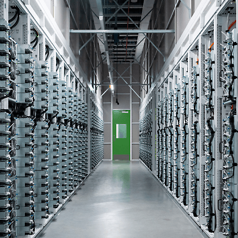
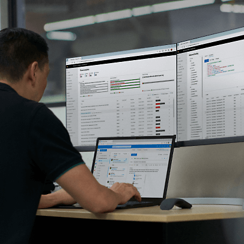
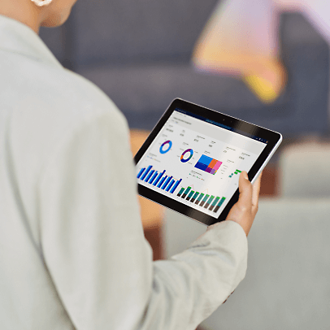

## 已说明边缘云计算

边缘计算允许远程位置中的设备通过设备或本地服务器处理网络"边缘"的数据。当需要在中央数据中心处理数据时，仅传输最重要的数据以最大程度地减少延迟。

## 为什么企业使用边缘计算？

企业使用边缘计算以缩短远程设备的响应时间，并从设备数据中获取更丰富、更及时的见解。边缘计算使实时计算在通常不可行的位置成为可能，并减少了支持边缘设备的网络和数据中心的瓶颈。

如果不进行边缘计算，边缘设备生成的大量数据会覆盖当今的大部分商业网络，从而阻碍受影响网络上的所有操作。IT 成本可能会飞速增长。不满意的客户可能会将业务转移到其他地方。有价值的机械可能会损坏，或者生产力降低。但最重要的是，在依赖智能传感器以保证员工安全的行业中，员工安全可能会受到损害。

## 边缘计算的工作原理是什么？

为了使智能应用和 IoT 传感器能够使用实时功能，边缘计算解决了三个相互关联的挑战：

- 将设备从远程位置连接到网络。

  

- 由于网络或计算限制，数据处理速度缓慢。

  

- 导致网络带宽问题的边缘设备。

5G 无线等网络技术的改进使在全球商业规模上解决这些挑战成为可能。5G 网络可以近乎实时地处理进出设备和数据中心的大量数据。（甚至还有无线网络 [使用加密货币](https://go.microsoft.com/fwlink/?linkid=2240106) 鼓励用户将覆盖范围扩展到难以访问的区域。）

但是，无线技术的发展只是实现大规模边缘计算工作的解决方案的一部分。选择通过网络在数据流中包含和排除哪些数据对于减少延迟和提供实时结果也至关重要。

边缘计算示例：

远程仓库中的安全相机使用 AI 识别可疑活动，并且仅将该特定数据发送到主数据中心进行即时处理。因此，相机只发送相关的视频片段，而不是不断传输其所有镜头以每天 24 小时给网络带来负担。这样可以释放公司的网络带宽和计算处理资源以实现其他用途。

## 边缘计算用例和示例

更多边缘云计算用例：

- 距离公司主数据中心 1,000 英里的零售商店使用无线销售点设备即时处理付款。

  

- 海洋中部的石油平台使用 IoT 传感器和 AI 在设备故障恶化之前进行快速检测。

  

- 偏远农场中的灌溉系统检测土壤湿度水平以实时调整其用水量。

## 为什么边缘计算很重要？

从工作区安全性到安全性和生产力，边缘计算拥有巨大优势：

## 公有云

**更高效的操作**。边缘计算在收集数据的本地站点或附近快速处理大量数据，从而帮助企业优化日常操作。这比将所有收集的数据发送到集中式云或多个时区之外的主数据中心更有效，后者会导致过多的网络延迟和性能问题。

## 私有云

**更短的响应时间**。边缘计算绕过集中式云和数据中心位置，使公司能够更快速、可靠、实时或近实时地处理数据。考虑在尝试将信息从数千个传感器、相机或其他智能设备一次性发送到中央办公室时可能会出现数据延迟、网络瓶颈和数据质量降低。相反，边缘计算使位于或靠近网络边缘的设备能够立即向关键人员和设备发出机械故障、安全威胁和其他严重事件的警报，以便可以迅速采取行动。

## 混合云

**更高的员工** **生产力**。边缘计算使企业能够更快地交付员工尽可能高效完成工作职责所需的数据。在利用自动化和预测性维护的智能工作场所中，边缘计算使员工所需的设备保持平稳运行，不会出现中断或易预防的错误。

## 公有云

**改进了工作区安全**。在设备故障或工作条件更改可能导致伤害或更严重情况的工作环境中，IoT 传感器和边缘计算可帮助保护人员安全。例如，在海上石油平台、石油管道和其他远程工业用例中，在设备现场或附近分析的预测性维护和实时数据有助于提高员工的安全性并最大程度地减少环境影响。

## 私有云

**偏远位置中的功能**。借助边缘计算，可以更轻松地利用在 Internet 连接时断时续或网络带宽受限的偏远地点收集的数据—例如，在白令海的渔船上或意大利乡村的葡萄园中。传感器可以持续监视水或土壤质量等操作数据，并在需要时采取行动。Internet 连接可用后，相关数据可以传输到中央数据中心进行处理和分析。

## 混合云

**增强了安全性**。对于企业而言，将数千个连接 Internet 的传感器和设备添加到网络带来的安全风险是真正令人担忧的问题。边缘计算允许企业在本地处理并脱机存储数据，从而帮助缓解此风险。这可以减少通过网络传输的数据，并帮助企业不易受到安全威胁。

## 公有云

**数据主权**。在收集、处理、存储和以其他方式使用客户数据时，组织必须遵守收集或存储该数据的国家或地区的数据隐私规定—例如欧盟一般数据保护条例 (GDPR)。跨国界将数据移到云或主要数据中心可能会使遵守数据主权法规变得困难，但借助边缘计算，企业可以在收集数据的位置附近处理和存储数据，从而确保他们遵守本地数据主权准则。

## 私有云

**降低了 IT 成本**。借助边缘计算，企业可以在本地（而不是在云中）处理数据以优化 IT 支出。除了最大程度地降低公司的云处理和存储成本之外，边缘计算还可在收集不必要的数据的位置或附近清除不必要的数据以降低传输成本。

## 混合云

## 边缘计算硬件和网络

在边缘计算中，大部分处理能力在物理上位于或靠近数据收集位置。边缘计算硬件通常由以下物理组件组成：

## 公有云

**边缘设备** 包括智能相机、温度计、机器人、无人机、振动传感器和其他 IoT 设备。虽然一些设备具有内置的计算、内存和存储功能，但并非所有设备都具有。

## 私有云

**处理器** 是支持边缘计算系统的 CPU、GPU 和关联内存。例如，边缘计算系统拥有的 CPU 能力越大，它执行任务的速度就越快，可支持的工作负载就越多。

## 混合云

**群集/服务器** 是在边缘位置（例如工厂车间或商业渔场）处理数据的服务器组。边缘群集/服务器通常负责运行企业应用、企业工作负载和组织的共享服务。

## 公有云

**网关** 是执行基本网络功能的边缘群集/服务器，例如启用无线连接、提供防火墙保护以及处理和传输边缘设备数据。

## 私有云

**路由器** 是连接网络的边缘设备。例如，边缘路由器可用于将企业的 LAN 与 WAN 或 Internet 连接。

## 混合云

**交换机**（也称为访问节点）连接多个设备以创建网络。

## 公有云

**节点** 是万能术语，用于描述支持边缘计算的边缘设备、服务器和网关。

## 私有云

## 混合云

## 边缘计算硬件有哪些特征？

边缘计算硬件需持久且可依赖。通常，此设备必须能够承受极端的天气、环境和机械条件。具体来说，它通常必须是：

## 公有云

**无风扇且无通风口**。由于可靠性至关重要（尤其是在设备故障可能会停止生产和危及员工安全的行业中），因此边缘硬件必须远离灰尘、污垢、湿度和其他可能对其造成损害的物质。

## 私有云

**耐热**。边缘硬件通常置于寒冷、闷热和潮湿气候下的室外。有时，它甚至置于水下。在许多情况下，必须能够承受零以下和接近沸腾的温度。

## 混合云

**不受突然动作的影响**。硬件需要能够承受机械或自然元素的振动和冲击。必须在无风扇、电缆和其他易松动或断开的内部部件的情况下构建这些组件。

## 公有云

**小型化设计**。对于边缘计算机来说，紧凑是关键要素。它们通常需要适应狭窄的位置。示例包括置于墙壁、架子和天花板上的智能相机，以及装在装运箱中的智能温度计。

## 私有云

**配备充足的存储空间。**从边缘设备收集大量数据的边缘计算机可能需要大量数据存储。它们还必须能够快速访问和传输大量数据。

## 混合云

**与新设备和旧设备兼容**。边缘计算机（尤其是那些在生产或出厂设置中运行的计算机）通常具有各种 I/O 端口，包括 USB、COM、以太网和常规用途端口。这使它们能够连接到新的和旧的生产设备、机械、设备、传感器和警报。

## 公有云

**使用多个连接选项构建**。边缘计算机通常支持无线和有线连接。这样，如果在农场或海上船舶等偏远商业站点无法选择无线连接到 Internet，计算机仍然可以连接到 Internet 以传输数据。

## 私有云

**能够支持多种类型的电源输入**。边缘计算机通常支持各种电源输入，以适应它们在远程位置可能会遇到的各种电源输入。它们还需要浪涌、过压和电源保护功能，以帮助防止电气损坏。

## 混合云

**防止网络攻击**。边缘设备通常不能像本地和云对等设备一样由网络管理员严格管理，往往更容易受到不良参与者的影响。为了帮助保护它们免受恶意软件和其他网络攻击的侵害，边缘设备必须配备防火墙和基于网络的入侵检测系统等安全工具。

## 公有云

**防篡改**。由于边缘计算设备通常用于无法一致监视它们的偏远位置，因此构建这些设备必须确保安全，防止盗窃、破坏和未经授权的物理访问。

## 私有云

## 混合云

## 云计算与边缘计算与雾计算

边缘计算和雾计算是中介计算技术，可帮助将远程位置的 IoT 设备收集的数据移到公司的云中。让我们探讨边缘计算与雾计算和云计算的区别，以及这三者如何协同工作：

**云计算** 使公司能够在通过 Internet 托管的远程服务器上存储、处理和以其他方式使用其数据。 [Microsoft Azure](https://azure.microsoft.com/zh-cn/) 等商业云计算提供商提供数字计算平台和服务集合，公司可以使用这些平台和集合以减少或消除其物理 IT 基础结构和相关成本。云计算还使组织能够向其人员提供安全的远程工作功能，更轻松地缩放其数据和应用，并利用 IoT。

**边缘计算** 允许捕获、处理和分析组织网络最远范围的数据："边缘。"这使组织和各行业能够实时处理紧急数据，有时甚至无需与主数据中心通信，通常只需将最相关的数据发送到主数据中心以加快处理。这使得云网络等主要计算资源免于被无关数据淹没，从而降低整个网络的延迟。它还降低了网络成本。

考虑在海洋中部运作的钻油平台。跟踪钻取深度、表面压力和流体流速等信息的传感器有助于使平台上的机械保持平稳运行，并帮助保护员工和环境的安全。为了执行此操作（无需不必要地降低网络速度），传感器仅通过网络发送有关关键维护需求、设备故障和员工安全详细信息的数据，这样就可以近实时地识别和响应问题。

**雾计算** 允许在云与边缘之间的计算层中临时存储和分析数据，从而了解因边缘设备计算限制而无法处理边缘数据的情况。

从雾中，相关数据可以发送到云服务器，以便进行长期存储和未来的分析和使用。通过不将所有边缘设备数据发送到中央数据中心进行处理，雾计算使公司能够减少其云服务器上的一些负载，这有助于优化 IT 效率。

例如，考虑一家建筑管理公司，该公司使用智能设备在其所有建筑中自动执行温度控制、通风、照明、洒水以及火灾和安全警报。该公司没有让这些传感器不断地将数据传输到其主数据中心，而是在每个建筑的控制室中放置一个服务器以管理即时问题，并且仅在网络流量和计算资源具有过多容量时将聚合数据发送到主数据中心。这种雾计算层使该公司能够最大程度地提高 IT 效率，而不会降低性能。

必须注意，边缘计算不依赖于雾计算。雾计算只是额外的选项，可帮助公司在某些边缘计算场景中提高速度、性能和效率。

## 边缘计算用例和示例

IoT 设备和边缘计算正在快速改变全球各行各业处理数据的方式。以下是[商业中的边缘计算](https://azure.microsoft.com/zh-cn/solutions/iot/#industries)一些最值得注意的用例：

**适用于分支机构的边缘计算**。智能设备和传感器减少了运作公司次要办公室所需的资源数。考虑连接 Internet 的 HVAC 控件、检测复印机什么时候需要维修的传感器和安全相机。通过仅向公司的主要数据中心发送最基本的设备警报，边缘计算有助于防止服务器拥塞和延隔时间，同时大大增加对设施问题的响应时间。

**适用于制造的边缘计算**。工厂车间上的传感器可用于监视设备的日常维护问题和故障，以及保护员工安全。此外，工厂和仓库中的智能设备可以提高生产力、降低生产成本并提供质量控制。将数据和分析保留在工厂车间，而不是将其发送到集中式数据中心有助于避免高昂成本和潜在的危险延迟。

**适用于能源的边缘计算**。电力和公用事业公司使用 IoT 传感器和边缘计算以提高效率、实现电源网格自动化、简化维护，并弥补远程位置网络连接的不足。公用设施塔、风电场、石油钻井平台和其他远程能源可以配备能够承受恶劣天气和其他环境挑战的 IoT 设备。这些设备可以在能源站点或附近处理数据，并且只能将最相关的数据发送到主数据中心。在石油和天然气行业，IoT 传感器和边缘计算提供必要的实时安全警报，通知关键人员必要的维修和可能导致爆炸或其他灾难的危险设备故障。

**适用于农业的边缘计算**。边缘计算有助于提高农业效率和收益。耐气候的 IoT 传感器和无人机可以帮助农场管理员监视设备温度和性能；分析土壤、光和其他环境数据；优化农作物使用的水量和养分；更高效地安排收获时间。边缘计算使使用 IoT 技术更具成本效益，即使在网络连接受限的远程位置也是如此。

**适用于零售的边缘计算**。大型零售商通常会在其各个商店中收集大量数据。通过使用边缘计算，零售商可以提取更丰富的业务见解并实时做出反应。例如，零售商可以收集有关客流量的数据，跟踪销售点编号，监视其所有商店的促销活动是否成功，使用此本地数据更有效地管理库存，并做出更快、更明智的业务决策。

**适用于医疗保健的边缘计算**。边缘计算在医疗保健行业的用途非常广泛。随疫苗一同运送的温度传感器可帮助确保它们在整个供应链中保持完整性。家用医疗设备（例如，智能 CPAP 计算机和心率监测器）可以收集患者数据并将相关信息发送给患者的医生和医疗保健网络。医院可以使用 IoT 技术更好地为患者提供服务，从而跟踪患者的生命体征，并更准确地跟踪设备（例如，轮椅和轮床）位置。

**适用于自动驾驶汽车的边缘计算**。自动驾驶汽车、出租车、货车和卡车几乎没有犯错的余地。边缘计算使它们能够实时、即时、正确地响应交通信号、道路状况、障碍物、行人和其他车辆。

## 边缘计算服务

随着边缘云计算向广泛采用发展，支持其使用的相关服务的类型也不断增加。当今的边缘计算服务远不止设备和网络，还包括适用于以下场景的解决方案：

- 在 IoT 设备上运行 AI、分析和其他业务功能。

  

- 大规模合并边缘数据并消除数据孤岛。

  

- 远程部署、管理和帮助保护边缘工作负载。

  

- 优化运行边缘解决方案的成本。

  

- 使设备能够更快地响应本地更改。

  

- 确保设备在延长脱机时间后可靠运行。

最新的解决方案包括有助于将边缘计算与数据库、操作系统、网络安全、区块链账本和基础结构管理等常见技术结合使用的服务（仅举几例）。