> 导读： 边缘这个词在物联网的世界里被赋予了新的定义，特指在设备端的附近，所以根据字面定义，边缘计算即在设备端附近产生的计算。2019年5G 概念爆发以后，边缘计算的概念也被迅速推广普及，在写作本文的这段时间里，凡和边缘计算沾边的上市公司股价均多日涨停，关于边缘计算的文章阅读量暴增几倍。到底是怎样的魔力，让大家突然间关注边缘计算，而这个概念下的产品又有怎样的功能和应用场景，谁又在这个万亿级别的市场中已经掌握先机？本文就以上问题给读者一个通俗易懂的解释。特别提醒，阅读时间较长，建议收藏，涉及专业词汇会引发头昏不适，但均有解释。

**如果喜欢本文，请伸出小手点个赞，或者加个关注➕**

## **一 “边缘计算”究竟是何方神圣**

边缘计算出现的时间并不长，这一概念有许多人进行过概括，范围界定和阐述各有不同，甚至有些是重复和矛盾的，就作者个人而言，比较推崇OpenStack（是一个由NASA和Rackspace合作研发并发起的，以Apache许可证授权的自由软件和开放源代码项目）社区的定义概念：

“*边缘计算是为应用开发者和服务提供商在网络的边缘侧提供云服务和IT环境服务；目标是在靠近数据输入或用户的地方提供计算、存储和网络带宽”。*

通俗地说：边缘计算本质上是一种服务，就类似于云计算、大数据服务，但这种服务非常靠近用户；为什么要这么近？目的是为了让用户感觉到刷什么内容都特别快。

边缘计算着重要解决的问题，是传统云计算（或者说是中央计算）模式下存在的高延迟、网络不稳定和低带宽问题。举一个现实的例子，几乎所有人都遇到过手机APP 出现“无法访问错误”的情况 ，这样的一些错误就和网络状况、云服务器带宽限制有关系。由于资源条件的限制，云计算服务不可避免收到高延迟、和网络不稳定带来的影响，但是通过将部分或者全部处理程序迁移至靠近用户或数据收集点，边缘计算能够大大减少在云中心模式站点下给应用程序所带来的影响。

边缘计算,和雾计算同一时间出现，事实上两个概念之间有重叠的地方。这两个词是从2011年开始出现，如今已经成为了巨头的投资热点。先看看世界上的科技巨头们选择的方向吧：

- *Arm、Cisco、Dell、Intel、Microsoft、普林斯顿大学共同投资创办的雾计算研究项目OpenFog；*
- *Orange (法国电信) 与 Inria(法国国立计算机及自动化研究院)共同主导的雾计算与大规模分布式云研究项目Discovery；*
- *华为的“全面云化”战略， EC-IOT， 2016年成立边缘计算产业联盟；*
- *Intel 的“Cloud Computing at the Edge”项目；*
- *NTT 的“Edge Computing”项目， AT&T 的 “Cloud 2.0”项目；*
- *亚马逊AWS 发布的GreenGrass 项目（边缘计算代号）；*
- *微软Azure 发IOT Edge 项目，重点发展边缘计算项目；*
- *谷歌发布的IOT Core 项目；*
- *阿里云发布的LinkEdge项目。*

从2016到现在，巨头们已经在边缘计算的路上展开了激烈的角逐, 赛道已经非常的拥挤。

下图1 是一个边缘计算网络的概念图,它是连接设备和云端的重要中间环节。

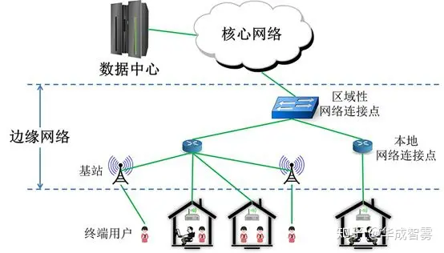

图1 边缘计算基本网络架构 （图片来自bing 图片搜索）

边缘计算起源于广域网内搭建虚拟网络的需求，运营商们需要一个简单的、类似于云计算的管理平台，于是微缩板的云计算管理平台开始进入了市场，从这一点来看，边缘计算其实是脱胎于云计算的。随着这一微型平台的不断演化，尤其是得益于虚拟化技术（指通过虚拟化技术将一台计算机虚拟为多台逻辑计算机。在一台计算机上同时运行多个逻辑计算机，每个逻辑计算机可运行不同的操作系统，并且应用程序都可以在相互独立的空间内运行而互不影响，从而显著提高计算机的工作效率。）的不断发展，人们发现这一平台有着管理成千上万边缘节点的能力，且能满足多样化的场景需求，经过不同厂商对这一平台不断改良，并加入丰富的功能，使得边缘计算开始进入了发展的快车道。

## **二 为什么需要边缘计算**

云计算和边缘计算通常会被用来做比较，上文也提到，边缘计算其实脱胎于云计算，那么，既然有了云计算，为何还要有边缘计算？

大家都熟悉云计算，它有着许多的特点：有着庞大的计算能力，海量存储能力，通过不同的软件工具，可以构建多种应用，我们在使用的许多APP ，本质上都是依赖各种各样的云计算技术，比如视频直播平台，电子商务平台。边缘计算脱胎于云计算，靠近设备侧，具备快速反应能力，但不能应付大量计算及存储的场合。这两者之间的关系，可以用我们身体的神经系统来解释。

云计算能够处理大量信息，并可以存储短长期的数据，这一点非常类似于我们的大脑。大脑是中枢神经中最大和最复杂的结构，也是最高部位，是调节机体功能的器官，也是意识、精神、语言、学习、记忆和智能等高级神经活动的物质基础。人类大脑的灰质层，富含着数以亿计的神经细胞，构成了智能的基础。而具有灰质层的并不只有大脑，人类的脊髓也含有灰质层，并具有简单中枢神经系统，能够负责来自四肢和躯干的反射动作，及传送脑与外周之间的神经信息。我们在初中的生物中都学习到了膝跳反应，这就是脊髓反应能力的证据。边缘计算对于云计算，就好比脊髓对于大脑，边缘计算反应速度快，无需云计算支持，但低智能程度较低，不能够适应复杂信息的处理。

图2 脊髓示意图

图3 大脑（图片来自bing 图片搜索）

每个人都有受过伤的经历，无论是被刺到还是被烫到，我们的身体都能够快速反应。就以烫伤为例，我们的神经系统大概的流程图如下所示：

图4 神经信号传导

在脊髓发出指令的同时，还会向大脑传递痛感的信号，让人能感觉到痛。大家看看整个过程，这钟避开风险的行动是在产生意识之前，而且速度非常快，避免了你身体的伤害。经过了亿万年的演化，现在人类的身体机构已经非常完善了，既然结构这样设计一定有他的道理。大家看看这组数据：“就人类而言，在联结脊髓到肌肉的神经细胞中，外层覆盖有髓鞘质层、直径大的神经元的信号传递速度为每秒70-120米，与之相反的脑神经元的信号传递速度为每秒0.5-2米。其间差距实在太大。”如果我们让大脑来处理避开烫伤这样的决策，并产生动作，那么我们的手最有可能出现的状况是：

图5 烧焦的手

所以，脊髓取代大脑做处某些快速的决策，完全是为了满足身体的某些特定功能，有不可替代的作用。如果认可存在即合理的解释，我们完全可以心安理得地接受：有云计算的时候，仍然需要边缘计算这一论断。当然 经过严密的逻辑分析，这个结论仍然成立。

未来物联网的发展会有两个趋势：海量连接及由此产生的海量数据。 具体连接和数据有多大? 根据Garter（全球最具权威的IT研究与顾问咨询公司，成立于1979年，总部设在美国康涅狄克州斯坦福）预测，2019年使用的联网物件将多达142亿个，到2021年总数将达到250亿个，它们会生成大量的数据。手机也是联网物件，每个月能够产生的流量大家自己能够估算出来，大体会在100G 的范围内。但是，物联网中的联网体，可不只有手机，比如说下面这两个物体：

图 6 波音飞机 （图片来自新浪）

图7 风力发电机

波音787为例，其每一个飞行来回可产生TB级的数据，美国每个月收集360万次飞行记录；监视所有飞机中的25000个引擎，每个引擎一天产生588GB的数据。这样一个级别的数据，如果都上传到云计算的服务器中，无论对于算力和带宽，都提出了苛刻的要求。风力发电机装有测量风速、螺距、油温等多种传感器，每隔几毫秒测一次，用于检测叶片、变速箱、变频器等的磨损程度，一个具有500个风机的风场一年会产生2PB的数据。

如此PB 级别的数据，如果实时上传到云计算中心并产生决策，无论从算力和带宽的角度，都提出了苛刻的要求，更不要说由于延迟而产生的即时响应问题。面对这样的场景，边缘计算就体现出它的优势了，由于部署在设备侧附近，可以通过算法即时反馈决策，并可以过滤绝大部分的数据，有效降低云端的负荷，使得海量连接和海量数据处理成为可能。所以，边缘计算将作为云计算的补充，在未来共同存在于物联网的体系架构中。

说了这么多，总结一下这个边缘计算的优点：

- 低延迟：计算能力部署在设备侧附近，设备请求实时响应；
- 低带宽运行：将工作迁移至更接近于用户或是数据采集终端的能力能够降低站点带宽限制所带来的影响。尤其是当边缘节点服务减少了向中枢发送大量数据处理的请求时。
- 隐私保护：数据本地采集，本地分析，本地处理，有效减少了数据暴露在公共网络的机会，保护了数据隐私。

## 三 “边缘计算”的应用场景

既然边缘计算是云计算的重要补充，那么边缘计算的应用场景又有哪些呢？ 边缘计算模式的基础特性就是将计算能力更接近于用户，即站点分布范围广且边缘节点由广域网络连接。

1. 供零售/金融/远程连接领域使用的“开箱即用云”：提供了一系列可定制边缘计算环境，这类边缘计算主要提供给企业使用，并服务于特定产业应用。它从根本上与分布式结构相结合来达到以下效果：降低硬件消耗，多站标准化部署，灵活更替部署在边缘侧的应用（不受硬件影响，同一应用在所有节点上一致运行），提升弱网络条件下的运行稳定性。如果联网的条件有限制，通过将联网方式设定为有限网络连接时，可以提供内容缓存或提供计算、存储服务以及网络服务，比如新零售边缘计算环境。
2. 移动连接：在5G网络大规模普及前，移动网络仍保持着受限和不稳定的特性，因此移动/无线网络也可以看作是云边缘计算的常见环境要素。许多应用或多或少都依赖于移动网络，例如应用于远程修复的增强现实、远程医疗、采集公共设施（水力，煤气，电力，设施管理）数据的物联网设备、库存、供应链以及运输解决方案、智慧城市、智慧道路和远程安全保障应用。这些应用都受益于边缘计算就近端处理的能力。
3. 通用用户驻地设备（uCPE）:特点是网络连接有限，工作量较为稳定但需确保可用性高，同时，它也需要一种方法来支持跨上百至上千节点的数据应用混合安置，而拓展现有uCPE部署也将成为一项新要求。而这点非常适用于网络功能虚拟化（NFV Network Function Virtualization）应用，尤其当不同站点可能需要不同系列的服务链应用，或是区域内一系列不同的应用需要统一协作时。由于本地资源的利用以及必须满足在间断的网络连接下进行存储和进行数据处理，我们可需要支持网状或层次式的结构。自我修复以及与远程节点管理相结合的自我管理都是必须条件。
4. 卫星通信（SATCOM）：该场景以大量可用的终端设备分布于最偏远和恶劣的环境为特征。将这些分散的平台用于提供托管服务极为合理的，尤其是当考虑到极高的延时，有限的带宽以及跨卫星通讯的费用。具体事例可能包括船舶（从渔船到油轮），飞机，石油钻井，采矿作业或军事基础设施。

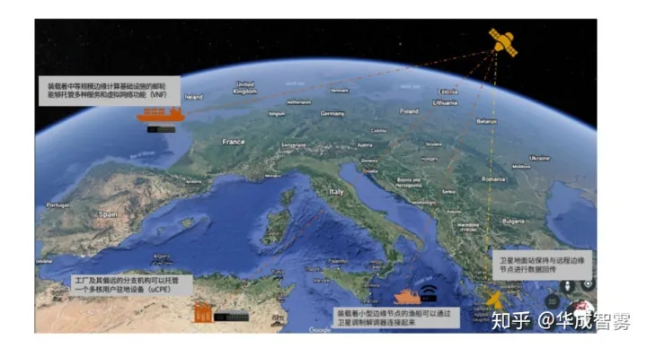

图8 卫星通讯

## 四 “边缘计算”的头号玩家（联盟、公司、参与者）

先来看看进入这一领域的都有哪几类公司？

### 边缘计算一类玩家：云计算巨头

边缘计算对云计算有一定冲击，但它与云计算也有很强的协同。国内外云服务商为了守住原本该有的市场空间，纷纷提前布局边缘计算避免被吞噬。物联网时代，更多的终端或传感器接入物联网，节点规模远远大于互联网，每个物联网节点都会产生大量的实时数据，这意味着云服务商要在边缘端布局计算，投入规模和时间周期都是巨大的挑战。当然，云服务商也不甘心被人来动自己的奶酪，国外有微软、亚马逊、谷歌，国内有阿里、华为还有百度都在积极部署边缘计算。

这些公司边缘计算技术路线虽然各不相同，但总体遵循一个规律：把边缘和云紧密结合，充分发挥边缘的低延迟，安全等特性同时，结合云的大数据分析能力。

最早发布自己的边缘计算技术的是亚马逊 AWS，框架是Greengrass,允许用户数据在本地流转，通过设计函数提取数据上传云端。

随着而来，微软推出了Azure IOT edge 。 微软在今年彻底瓦解了Windows 团队以后，投资50亿美元进军物联网市场，而主要领域则是边缘计算：微软在Build 2018开发者大会上正式宣布Azure IoT Edge开源，微软表示未来可以让开发者能够修改、调试Azure IoT Edge,同时拥有更多对于Edge 应用的控制。

2017年发布了全新的边缘计算服务Cloud IoT Core，协助企业连接及管理物联网装置，以及快速处理物联网装置所采集的数据。

阿里云在2018年 3月份推出了自己的边缘计算框架称为linkEdge，可被用于AI实践，在发布时已经有16家芯片公司、52家设备商、184款模组和网关支持阿里云物联网操作系统和边缘计算产品 。

2016年，华为发起了边缘计算产业联盟，到目前为止，已经有超过100家会员单位，其中不乏重量级的ARM，INTEL。华为自有EC-IOT平台 ，提供云管端边一体化的边缘计算开发模式。

百度在2018年伊始，百度云天工发布“智能边缘”，并开启邀请制测试。百度云天工将云端的数据管理与计算功能以软件的方式放在设备端上，将智能计算能力带向离数据源更近的地方，与云端计算良好协同，让设备变得更加智能。

### 边缘计算第二类玩家：传统设备巨头

由于 IOT 的迅速崛起， Intel 开始发力边缘计算市场，推出了若干平台。 在边缘端， Intel 能够提供不同规模的计算能力套件 ，或者叫做计算容器 。 Intel 的野心并不止于作为硬件平台商， 他想要建立自己的生态， 目前已经联合Wind River 推出了便利操作的边缘计算系统。

Dell , 早在2016年就高调宣布进军物联网市场，而且作为Linux Foundation 基金会下的边缘计算项目发起人，其地位不容低估。 Edgex Foundry ,是linux 基金会下的开源项目，致力于发展出具备即插即用功能的边缘计算平台， Dell 已经率先推出了基于Edgex foundry 的边缘网关， 目前并未在中国发售。

思科在2017年年中将边缘计算实现与微软Azure云平台之间互联，确保为企业提供从边缘到云端的整体性服务。

ARM， ARM 平台目前 有 CortexA, CortexR. CortexM, Mechine Learning , SecurCore几个平台， 目前，大量的智能手机（ios, android)， 商业广告机， 快递柜等，都是由ARM 支持。 由于边缘计算技术的兴起，特别是在设备侧的人脸识别， 语音识别能力兴起， ARM 的高阶芯片开始面向市场，可以有利地支持AI的发展。

随着大量的视频监控IP化，视频监控类企业也日益成为IOT企业 。 监控设备具备物理采集的功能--图像， 结合强大的边缘设备分析能力，可以提供人脸识别，交通监控等作用，成了智能城市的重要一环，主要以海康、大华为代表。

### 边缘计算三类玩家：CDN巨头

CDN（即内容分发网络）的核心价值是将数字内容智能分发到离用户更近的节点，进而提升整体分发效率，降低网络延时、节省带宽资源，其与生俱来的边缘节点属性，低延时和低带宽，令其在边缘计算市场具备先发优势，CDN本身就是边缘计算的雏形。

Akamai作为全球CDN领头羊早在2003年就与IBM合作边缘计算，今年6月Akamai与IBM在其WebSphere上提供基于边缘Edge的服务。

网宿科技也已将边缘计算当成核心战略，2016年开始建设边缘计算网络，2017年逐步推出边缘计算微服务，并将逐步开放边缘IaaS和PaaS服务。

CloudFlare公司在2017年就推出了CloudFlare Workers，以微服务的形式开放边缘计算服务，支持用户在边缘端编程，这标志着它已经初步搭建好了边缘计算的平台。

Nuu：bit宣布可以与微软的Azure宇宙数据库进行整合，同时微软的Azure系统也可以把Nuu：bit的数据整合在平台上，这也是一个极大的突破。

Limelight在今年上半年在其CDN网络上推出了增强版的EdgePrism OS软件，允许用户在边缘端进行本地内容输入和交付。

### 边缘计算四类玩家：运营商

在竞争激烈的市场中，为了获得高性能低延迟的服务，移动运营商纷纷开始部署移动边缘计算（MEC）。

中国移动已在10省20多个地市现网开展多种MEC应用试点。2018年1月，中国移动浙江公司宣布联合华为公司率先布局MEC技术，进一步推动网络实现超低时延、更佳体验，打造未来人工智能网络。

中国电信与CDN企业合作，想要通过MEC边缘CDN的部署，作为现有集中CDN的延展，同时为多网络用户服务。

AT&T表示边缘计算是支持新技术的关键部分，包括物联网、软件定义网络、区块链、人工智能和5G。AT&T正在AR/VR型应用、自动驾驶和智能城市项目的支持方面使用边缘计算。

德国电信（Deutsche Telekom）在提高自动驾驶汽车的连接性、数字化转型以及推进5G更好的网络性能方面使用边缘计算。

### 边缘计算五类玩家：核心研究机构

如今边缘计算的市场越来越大，不仅是众多的知名企业开始部署边缘计算，很多研究机构包括国内外的一些大学等都开始投入边缘计算这个大市场的怀抱。

中国信通院是边缘计算产业联盟ECC的发起成员之一，中国信通院与联盟多个成员共同对于边缘计算应用场景、技术架构、主要技术能力等方面展开了深入研究。在2018年1月召开的ITU-T SG20（国际电信联盟物联网和智慧城市研究组）WP1全会上，中国信通院与中国联通联合主导的《IoT requirements for Edge computing》国际标准项目成功立项。

卡内基梅隆大学在2018年1月领导了一项新的项目-CONIX，该项目获得了2750万美元的资金，在接下来的五年中，CONIX将创建位于边缘设备和云之间的网络计算架构，为边缘计算的兴起做准备。2月德国电信与Crown Castle合作在美国设立了边缘计算实验室，匹兹堡卡内基梅隆大学是该项目的中心站点。

### 边缘计算六类玩家：产业联盟

边缘计算产业联盟ECC(中国)在2016首届边缘计算产业峰会上宣布正式成立，该联盟由华为、中国科学院沈阳自动化研究所、中国信息通信研究院、英特尔公司、ARM 和软通动力共同发起成立，联盟成员总数共 62 家，这表明了边缘计算生态发展正式进入关键落地阶段。

**Edgecross联盟**(日本)于2017年年底成立，由6家公司创始，包括三菱电机、研华、欧姆龙、日本电气、日本IBM和日本甲骨文。边缘融合联盟Edgecross定义的边缘计算领域平台有两个目标，一个是实现生产现场小范围的物联网IoT系统，第二个是为生产数据匹配IoT化的数据标签。

**Avnu联盟**是一个利用开放标准创建低延迟、时间同步、高度可靠的联网设备的互操作性生态系统的社区。2017年12月5日，Avnu与边缘计算产业联盟签署了合作协议，目的是为了推动工业网络和边缘计算的共同利益。

**ETSI（欧洲电信标准化协会）**主动标准化MEC。运营商可以向授权的第三方开放其无线接入网络（RAN）边缘，使他们能够灵活快速地为移动用户、企业和垂直网段部署创新的应用和服务。MEC是移动基站演进和IT与电信网络融合的自然发展的结果。

2019年1月24日，Linux基金会在旧金山宣布成立针对边缘计算的LF Edge基金会。新的LF Edge基金会旨在为边缘计算的各种应用类型制定统一的软件堆栈、术语定义及开发框架，并促进边缘计算领域在底层形成架构上的统一，从而推动整个行业的快速发展。

## 五 “边缘计算”的发展挑战（邬贺铨的十问）

中国工程院院士邬贺铨是推进边缘计算技术与产业繁荣发展倡议的专家之一，对边缘计算有着更加深入的思考。在近期的2018边缘计算技术峰会上，他表示，边缘计算技术应该是一个体系，但目前包括他本人都对这个体系了解只是边缘，根本没有进入到核心，很多东西不太清楚，所以提出十问。

图9 邬贺铨 院士

NO1：5G MEC（移动边缘计算）应该下沉到什么位置？边缘计算放在DU？还是CU？还是放在核心网？显然靠近底下反应越快，数量越多，放在什么位置是值得研究的。

NO2：计算能力是一级设置还是多级设置？在采用MEC的前提下，还要不要同时设置云计算？在云计算和MEC之间是否需要设置雾计算？一个云计算节点联接的移动边缘计算（或雾计算）节点的合理数量是多少？

NO3：计算能力如何在云计算与边缘计算间优化配置？计算能力的分割是固定的还是可动态调整的？MEC需要向云计算节点上报过滤后的数据。云计算节点需要向MEC下发指令，除此之外两者间的通信还应有什么任务？

NO4：MEC间通过云计算节点互通还是直接通信？同样是边缘计算节点，它们之间要不要互通，或者说必须间接互通？

NO5：边缘计算需要有IaaS/PaaS/SaaS等服务能力吗？假如通过边缘计算增强人脸识别能力，边缘计算至少具备PaaS的功能，还需要可能具有一些视频转码的功能就是SaaS，有可能需要DaaS（数据即服务）的功能，边缘计算是不是都这么全？到底需要有几层，值得研究。

NO6：边缘计算需要同时具备接入、转发和控制云能力吗？如果说边缘计算是放在CU，它要集中管理好多DU，是否也应该具有控制云的能力？

NO7：MEC应该与网络切片结合吗？网络切片是5G最基本的一个特征，边缘计算要不要结合？

NO8：位于C-RAN的MEC需要按业务来配置吗？不同的边缘计算对应不同的应用，有对应移动大数据，有对应大连接的，还有对应社会与互联网数据的。在这种情况下，边缘计算是按业务来配置的，将来的边缘计算也是这样吗？

NO9：MEC是独立设置还是应与其他功能集成？基站的边缘计算首先进行大数据的收集采集，同时实现加密，在对大数据进行消化后，它回送网络数据链应该是减少的，也就意味着对数据过滤，为了过滤，它可能需要缓存，所以，边缘计算会跟缓存数据采集，数据分析，过滤，计算能力集中在一起，边缘计算绝不是单一的计算能力。

NO10：MEC的功能需要软件定义吗？MEC可仿照NFV实现软件定义，允许跨过多厂家的MEC平台有效与无缝集成来自厂商、服务提供商和第三方的应用，MEC的功能会开放吗？如果开放就要有接入权限管理。

邬贺铨还说，他对MEC的思考还不止这些，但他希望能看到答案。目前，对于边缘计算的发展思路，仍然没有到完全清晰的时刻，仍然等待各大企业对于边缘计算技术的进一步研究。

===============划时代的分界线=============

## 六 从边缘计算 到 边缘智能

设想未来任意一种电器，利用极低功耗的嵌入式系统，能够对使用者进行人脸识别，并且能够听懂使用者的语言指令，智能实现相应的功能，那生活将无比美妙。这样的未来已经到来，由于tinyML 技术的迅速发展，设想的场景已经能够变成现实。一个售价为10美元（约合人民币70+人民币）的硬件模块，可以嵌入电视、风扇、遥控器、无人机、摄像头等设备中，轻松实现智能功能。电视可以根据主人的手势实现遥控、风扇可以判断主人的位置对准送风、摄像头可以自动识别房间里的人员数量…...

这就是前谷歌TF Lite Micro 创始人皮特的初创公司Useful Sensors正在努力实现的场景。

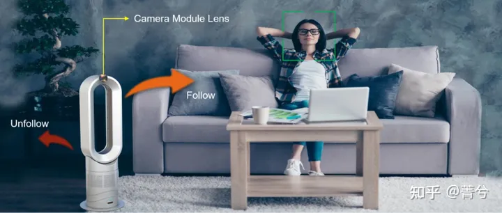

图片来自Useful sensor 的官网

从2022年开始，皮特团队秘密研发这款名为Person Sensor的智能模块，尺寸为20 x 20毫米，正面有一个摄像头，背面是微控制器。这个只有硬币大小的模块可以检测附近的人脸信息，反馈人数、相对位置，并进行面部辨识。

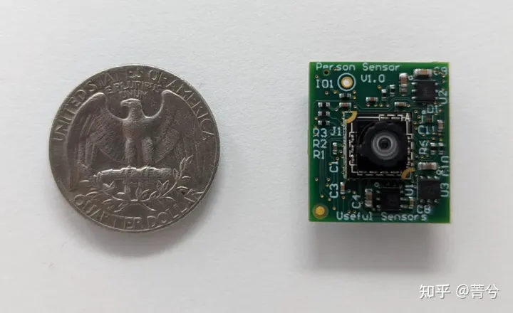

图片来自Useful sensor 的官网

皮特认为有智慧的传感器才是真正有用的传感器，智能分析越靠近传感器，就越能降低功耗，而且这种功耗的节约是指数量级的，轻松实现10倍改善。**以Useful sensor 为代表的TinyML 技术迅猛发展，正式开启了一个黄金时代--边缘智能时代的全面到来。**

### 机器学习（ML）越来越“边缘”

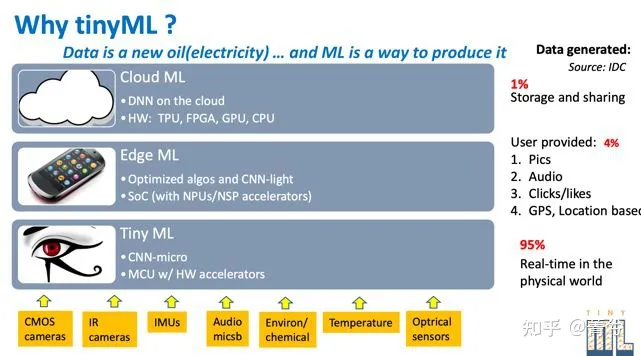

无论何时何地，数据都需要即时可用，这一趋势越来越明显。全球各行各业都在经历由这种需求推动的“数字化转型”。根据IDC的分析，到2025年，全球创建的数据中，超过四分之一的数据在本质上都是实时数据，而物联网实时数据将占这部分数据的95%以上。

大量涌现的数据催生出了一系列全新的技术，机器学习、自然语言处理和人工智能，它们将数据分析从不常见的、追溯式的实践，转变成为战略决策和行动的前摄式推动因素。这些技术可以大大提高各种行业、环境和应用数据分析的频率、灵活性和即时性。同样根据IDC的预测，到 2025 年，属于数据分析的全球数据总量将增长至原来的50倍，达到 5.2ZB；而机器学习所“触及”的分析数据总量将增长至原来的100倍，达到1.4ZB。

目前存在的机器学习，从处理的时空地点划分为3种形态，云端ML、边缘ML和TinyML。**TinyML正是针对占比超过95%以上的物联网实时数据处理场景。**

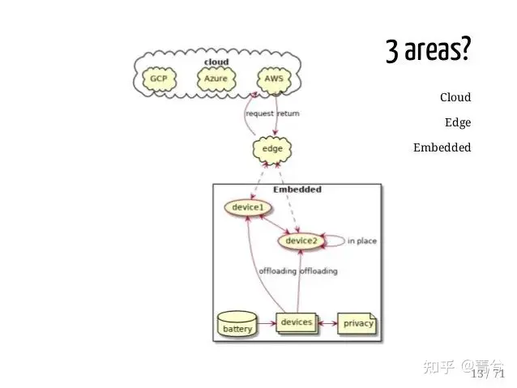

因此，目前针对不同类型的计算平台，在不同时间创建和使用的数据量，机器学习被较为清晰的划分为3种类型，发挥着各自差异化的作用：

**云端ML：**是指机器学习在企业内部或云端特定计算数据中心的应用。这些云服务器涵盖所有类型，包括公共云、私有云和混合云。此外，它还包括运营控制中心，例如管理电网或电话网络的那些运营控制中心。

**边缘ML**：是指机器学习在不处于核心数据中心的，企业级计算机/设备中的应用。边缘设备包括服务器机房，现场服务器，以及位于各个地区以加快响应速度为目的的小型数据中心。

云端和边缘端的ML 已经通过3年多的科普，广为大众所接受。今天我们看到的人脸门禁、摄像头行为识别、智能音箱...... 绝大部分场景都属于这两类。 以 TensorFlow & TF lite 等开源深度学习框架为基础的大量应用，推动了智能在云端和边缘端应用。然而，更加具有广大前景的应用，应该属于下面这一类：

**TinyML：**是指超低功耗的机器学习在物联网各种终端微控制器中的应用。**TinyML通常功耗为毫瓦（mW）级别甚至更低，因此可以支持各种不同的电池驱动的设备，和需要始终在线的应用。**这些设备包括智能摄像头、远程监控设备、可穿戴设备、音频采集硬件以及各种传感器等等……根据行业研究报告2010-2018 年全球物联网设备连接数高速增长，由 2010 年的 20 亿个增长至 2018 年的 91亿个，复合增长率达 20.9%，预计 2025 年全球物联网设备（包括蜂窝及非蜂窝）联网数量将达到 252 亿个。这个数量级下，真正有落地价值的智能创新应用，将开辟巨大的蓝海。

### 为什么需要TinyML

TinyML 是机器学习和嵌入式 IoT 设备的交叉领域，是一门新兴的工程学科同时具有极大的应用前景和商业价值。

TinyML 的主要受益者，是边缘计算和节能计算领域。TinyML 源自物联网 IoT 的概念。物联网的传统做法，是将数据从本地设备发送到云端处理。一些人对这一方式在隐私、延迟、存储和能源效率等方面存在疑虑。

- 能源效率。无论通过有线还是无线方式，数据传输都非常耗能，比使用乘积累加运算单元（multiply-accumulate units，MAU）的本机计算高出约一个数量级。最节能的做法，是研发具备本地数据处理能力的物联网系统。相对于“以计算为中心”的云模型，“以数据为中心”的计算思想已得到了人工智能先驱者的一些先期探讨，并已在当前得到了应用。
- 隐私。数据传输中存在侵犯隐私的隐患。数据可能被恶意行为者拦截，并且存储在云等单个位置中时，数据固有的安全性也会降低。通过将数据大部保留在设备上，可最大程度地减少通信需求，进而提高安全性和隐私性。
- 存储。许多物联网设备所获取的大部分数据是毫无用处的。想象一下，一台安防摄像机每天 24 小时不间断地记录着建筑物的入口情况。在一天的大部分时间中，该摄像机并没有发挥任何作用，因为并没有什么异常情况发生。采用仅在必要时激活的更智能的系统，可降低对存储容量的需求，进而降低需传输到云端的数据量。
- 延迟。标准的物联网设备，例如 Amazon Alexa，需将数据传输到云来处理，然后由算法的输出给出响应。从这个意义上讲，设备只是云模型的一个便捷网关，类似于和 Amazon 服务器之间的信鸽。设备本身并非智能的，响应速度完全取决于互联网性能。如果网速很慢，那么 Amazon Alexa 的响应也会变慢。自带自动语音识别功能的智能 IoT 设备，由于降低甚至是完全消除了对外部通信的依赖，因此降低了延迟。

上述问题推动着边缘计算的发展，也是边缘计算能够存在的理论基础。在云计算日益发达，带宽限制日益提升，5G 日趋完善的大背景下，边缘计算仍然发展如火如荼，因为能效、隐私、经济性、延迟等因素是云计算无法解决的难题，这个世界总能给不同的技术路线留出一扇窗，我尝试通俗解释TinyML 为啥有存在的合理性.

假如小栗子家有个小朋友，需要一台家用摄像头来照看他的日常，所有的人都会打开某宝找到摄像头链接直接下个单，送到家后APP 上一顿操作就能正常使用了。现在能够24小时看到小朋友的生活状况，美中不足的是大部分时间是不需要盯着，只有吵闹的时候是需要关注。这个时候设备厂家根据大数据推荐了AI 识别功能，只要开通云端智能检测就能实现按需监控。

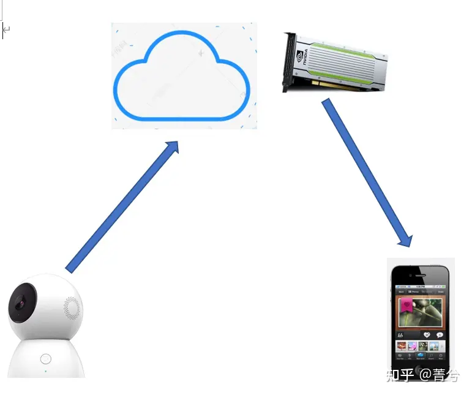

这样的功能推荐肯定有成本，毕竟图形显卡加速功能不是每个普通的ECS 都有的，云服务商还指望着这些人工智能模块多赚点钱。我们换一个思路，下面这样的摄像头加入了TinyML 模块，前面说了成本大概70元RMB，但他能够在摄像头上识别模式，并直接给手机打招呼，对于用户而言这是最直接的经济性提升。除此外，数据全部上传云端，一直都存在较高的隐私泄露风险，如果仅仅关键信息上传，隐私泄露风险就低了许多，边缘计算TinyML的优势就在这里。

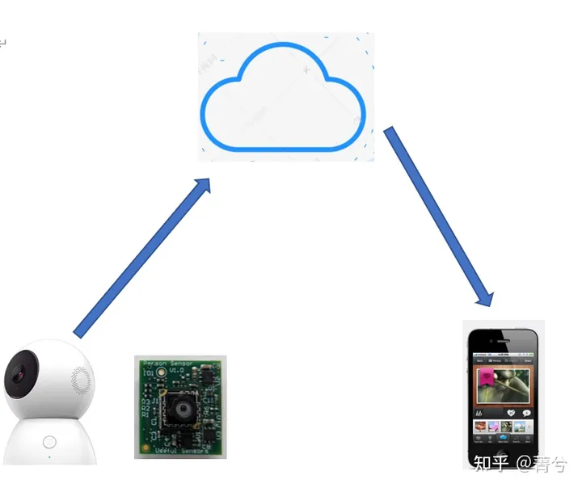

### TinyML 的原理

TinyML 既然能实现神经网络的功能，但消耗却远远低于云端AI 资源消耗，这是怎么实现的？ 如何能让马儿不吃草，还能让马儿跑的快？这里涉及到神经网络的压缩技巧，技术分析如何实现压缩并不是本文的主旨，毕竟我的使命是科普，我只擅长用周星驰的语调来解释最深奥的技术问题。

**知识蒸馏**

一讲到蒸馏，你也许只能想到白酒。什么是蒸馏？简单说是提纯的过程。知识蒸馏，顾名思义就是把知识也提纯了，酒的蒸馏是去掉不必要的水分和酒糟，知识蒸馏去掉的又是什么？

GPT-3 是OPEN-AI 提供文字描述的神经网络，这是一种具有1,750亿个参数的自然语言深度学习模型，比以前的版本GPT-2高100倍。该模型经过了将近0.5万亿个单词的预训练，并且在不进行微调的情况下，可以在多个NLP基准上达到最先进的性能。带来的问题是神经网络的运行一次的资源消耗也异常庞大，有没有什么取巧的方法？如果我们使用来自大而笨重的模型的预测来训练一个更小的，所谓的“学生”模型来逼近大模型会怎么样？

这本质上就是知识的蒸馏，这是由Geoffrey Hinton、Oriol Vinyals和Jeff Dean在论文Distilling the Knowledge in a Neural Network中介绍的。大致说来，过程如下。

1. 训练一个很好的大模型。这被称为**教师模型**。
2. 利用你所拥有的所有数据，计算出教师模型的预测。带有这些预测的全部数据集被称为*知识*。
3. 利用先前获得的知识来训练较小的网络，称为**学生模型**。

这个教师模型请允许我用诸葛亮来作为形象大使：他上通天文下通地理，还能带兵打仗，是个全能无敌的人才。

但现在我只需要这个全能无敌人才能够提供连弩的生产技能，其他的奇门遁甲技能点暂时不需要，所以我可以选择一个机灵的小皮匠到教师那学习，从连弩的原材料选择、参数设定、尺寸管控入手（这些都是输入数据），通过学习能够制作出和教师一样的连弩（输出预测），当然这些技巧就称之为知识。通过学习，小皮匠掌握了这些知识，但他完全不必要成为诸葛老师这样牛逼的人物，他只管做好他的连弩就好，这个小皮匠就是我们的学生模型。

制作学生模型，目的就是要使用规模更小的神经网络来逼近较大网络，以便产生同样的预测数据。

**剪枝**

神经网络剪枝首先会从大型网络中筛选出不重要的神经元以及权重，之后将它们从网络中删除，在此同时尽可能的保留网络的性能。简单来说，神经网络就像是一棵树，保存主干就不影响主要推理性能。

剪枝技术按照细粒度的不同可分为结构性剪枝以及非结构性剪枝：

结构性剪枝剪除的基本单元为神经元(卷积中为filter)，由于是对神经元直接进行剪枝，结构性剪枝后的模型能够在现有硬件条件下实现明显的推理加速以及存储优势。但其缺点是剪枝的颗粒度较大，往往会对压缩后模型的精度产生较大的影响。

非结构剪枝剪除的基本单元为单个权重，其经过剪枝后的模型精度损失更小，但最终会产生稀疏的权重矩阵，需要下层硬件以及计算库有良好的支持才能实现推理加速与存储优势。

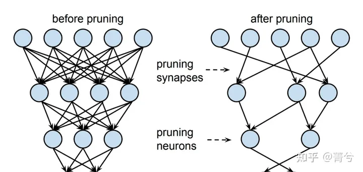

剪枝的示意图

## 七 边缘计算领域技术创新公司及落地场景

### **东土科技**

北京东土科技股份有限公司的主要业务为研发、生产、销售工业级网络产品，包括民用工业互联网网络产品和军用网络产品。公司产品分为两类：工业互联网设备及配套软件，大数据及网络服务。公司工业互联网设备产品主要包括工业以太网交换机等工业互联网网络产品，工业边缘通用控制器、智能交通边缘服务器、电力服务器等工业互联网边缘控制计算产品。公司软件产品主要包括Intewell工业互联网操作系统、MaVIEW（Management of Virtualized Industrial Engineering Workbench）工业控制编程平台等工业软件产品，多媒体指控系统和嵌入式系统基础软件平台。2021年4月，公司工业基础逻辑编程套件（MaView）在中国自动化学会主办的“2021中国自动化产业年会暨第十六届中国自动化产业世纪行活动”中荣获“年度最具竞争力创新产品”。

公司致力于工业互联网核心硬件及软件技术的研发、生产与销售，立足自主可控、安全可信， 在工业制造、能源电网、交通、石油化工、冶金、防务、城市基础设施等领域，实现工业互联网 的自有核心技术的行业应用，打造互联网化的新型工业生态链。公司产品分为四类：工业级网络 通信产品、工业级边缘控制服务器、操作系统及工业软件、大数据网络服务及工业互联网+解决方 案。

工业级边缘控制服务器主要为应用于各种工业场景的边缘通用控制器、智能交通服务器、电 力服务器产品。 边缘通用控制器基于边缘计算提供数据采集、存储、模型分析等大数据处理，以软件定义控 制代替传统控制方式，大幅节省设备投入，支持多标准协议兼容，提供远程控制实现数据采集， 提升工业场景整体运行效率，可下沉到工业控制现场，将传统的控制系统方案解耦，通过软件定 义的方式实现控制功能，可以便捷地接入现场智能终端，目前已在工业、城市及防务等不同领域 构建软件定义控制和功能的网络化解决方案。 智能交通服务器作为车路协同环境下城市交通管控的核心产品，可实现交通信息综合处理、 安全网络互联、交通信息服务、智能交通控制、自动化运维服务于一体的综合城市交通管理体系， 提升整个城市交通网络的运行效率。HOURSIS 智能交通服务器将高性能边缘计算能力、工业级网络 与基于人工智能的交通感知、控制技术相融合，实现了智能交通网络感知和城市大脑人工智能算 法的协同统一。雅典娜边缘计算服务器能提供实时、高效的精准图像视频数据检索与分析服务， 构建拥有丰富 AI 算法的路口数据中心。 电力服务器是公司服务器产品系列中针对电力行业应用解决方案的产品。目前针对 110kV 及 以下等级的中等规模智能变电站的第一代电力服务器产品，以及与之配套的网络分析仪、通信网 关、时钟、智能操作单元等设备，形成了完整的应用解决方案。

智慧工地：在行业拓展方面，公司继续与广联达深度合作，双方联合推出“AI 蜂鸟盒子”，“AI 蜂鸟盒子”通过边缘计算、5G、软件定义控制等先进技术可以提升工地智能化水平，目前该产品 已在全国数百个工地现场实现应用。未来公司将与广联达继续在物料一体机、工地验收宝等产品 方面进行联合开发及推广，大力提升建造行业的智能化水平.

风叶检测：借助国家“碳达峰、碳 中和”愿景的提出，风力发电迎来新的发展机遇，公司根据风电客户需求，基于边缘控制服务器 推出风电一体化辅控系统，帮助客户实现风机传动链、叶片和塔筒状态一体化监测和在线计算， 并辅助风机安全控制；目前该项目已进入小批量签订阶段，后续将依据项目需求情况陆续交付产 品。

机械远程控制：公司着手为建筑工地打造一套实时智能化调度与控制现场机械设备的控制系统； 首款自动驾驶的智能塔吊已通过模型场景的仿真测试，下半年将在真塔展开测试。

智能泡沫检测：公司基于深度 学习“目标检测实现浮选液面泡沫目标识别及定位模型”，研发出一套智能泡沫检测系统，该系 统主要运行在公司 NewPre AI 边缘通用控制器之上，目前泡沫浮选分析系统已成功应用于宜昌化 工松滋肥业选矿厂。

桥梁监测：在桥梁监测方面，公司与合作伙伴联合推出解决方案，通过构建挠度监测、 振动监测、位移监测等多个场景，应用边缘控制服务器为桥梁装上智慧大脑。

工业视觉检测：在智能制造领域， 公司与知名装备集成商合作，将边缘控制产品和解决方案成功应用于手机中框检测设备，在提升 产线智能化和集成化的同时，提高检测效率和精度；借助一体化融合控制技术，公司将智能化视 觉检测与运动控制相结合，边缘控制产品的融合型技术方案在半导体检测设备、锂电设备、医疗 设备、机床设备、复合机器人等领域都有成功应用。

车载系统：在产品与技术方面，公司继续扩充完善边缘控制服务器系列产品，成功研制出车载高性能 AI 控制服务器 NewpreV330x 和 NewpreV360x 系列产品，并成功应用于工程车和特种车辆控制系统中。

智慧城市：公司 HOURSIS Center Next 信号管控平台二期正在稳步开发，已完成与百度车联网平 台、阿里城市大脑的对接，结合公司 HOURSIS NEXT 第二代交通控制服务器、雅典娜路口数据中心 及边缘 AI 平台，完成行人过街智能引导系统的方案和落地实施，支撑亦庄示范区自动驾驶场景的 运行。

点评：从公司的主页宣传和方案落地情况看，东土是一家定制方案提供商，没有聚焦的赛道，将让其发展非常受限。而技术实力就类似于大量的方案提供商，拨开层层洋葱，其实里面啥也没有，可以关注下公司的落地业务，创业赛道可以借鉴。

### **寒武纪**

中科寒武纪科技股份有限公司主营业务是应用于各类云服务器、边缘计算设备、终端设备中人工智能核心芯片的研发、设计和销售。公司的主要产品包括云端产品线、边缘产品线、处理器IP授权及软件。2020年4月，公司获得全球知名创投研究机构CB Insights颁布的“2020 IC DESIGN China”奖项；2020年6月，公司获得胡润研究院“2020胡润中国芯片设计10强民营企业”荣誉称号；2020年6月，公司上榜《EETimes》评选的“2020年全球100家最值得关注的半导体公司（EETimes Silicon 100）”榜单。2021年3月，公司上榜《EETimes》评选的“AI芯片公司(AI CHIP) TOP 10”榜单。

寒武纪是智能芯片领域全球知名的新兴公司，能提供云边端一体、软硬件协同、训练推理融 合、具备统一生态的系列化智能芯片产品和平台化基础系统软件。产品得到了多个行业客户的认 可。公司不直接从事人工智能最终应用产品的开发和销售，但对各类人工智能算法和应用场景有 着深入的研究和理解，能面向市场需求研发和销售性能优越、能效出色、易于使用的智能芯片及 配套系统软件产品，支撑客户便捷地开展智能算法基础研究、开发各类人工智能应用产品。

边缘计算是近年来兴起的一种新型计算范式，在终端和云端之间的设备上配备适度的计算能 力，一方面可有效弥补终端设备计算能力不足的劣势，另一方面可缓解云计算场景下数据隐私、 带宽与延时等潜在问题。边缘计算范式和人工智能技术的结合将推动智能制造、智能零售、智能 教育、智能家居、智能电网等众多领域的高速发展。

公司的思元 220 智能芯片及加速卡等产品持续出货，实现收入 3,400.97 万元。公司的思元 220 智能芯片及加速卡广泛运用于多家头部企业，历年累计出货量超过百万片。

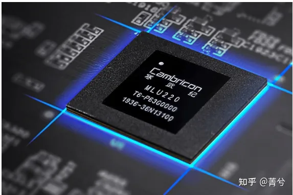

图片来自寒武纪官网

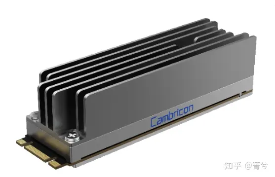

图形加速卡

许多人都见过NVIDIA 的图形加速卡Jetson，小体积实现神经网络加速运算，寒武纪也有类似产品，当然性能上还不能算完全匹配。

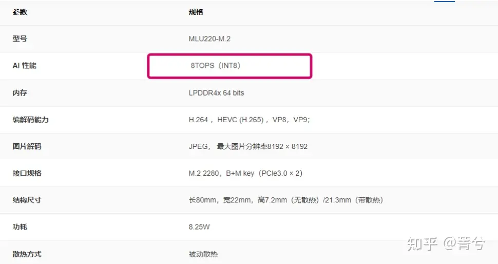

边缘计算图形加速卡已经普遍存在于各种智能机械中， 比如智慧物流小车等，这样的场景也会越来越多，未来图形加速为基础的边缘计算卡会应用越来越广泛。

### **Exo-Space**

致力于打破可以从卫星技术中受益的行业和爱好者的进入壁垒。Exo -Space 提供定制化的AI 模型，并简化应用和部署的难度，使其能够在资源受限的卫星上得以使用，并大大提高空间数据的应用和处理论能力。专利化的FEATHER BOX 可以直接应用于卫星硬件当中。

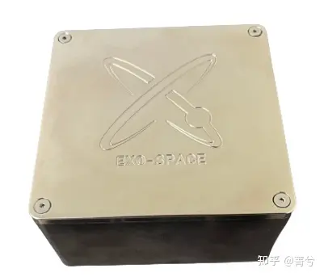

Exo-Space 公司提供的FeatherBox ，开箱即应用AI 技术

无论怎样的科技公司--我说的是国外-- 总喜欢标榜一些愿景和使命，不排除攻城狮们具有情怀，并把情怀倾注到自己的产品当中。比如这家公司的使命：利用我们在人工智能、机器视觉和卫星设计方面的专业知识，提供能够承受太空恶劣环境的边缘软件和硬件包。这些边缘设备将为空间应用提供数据处理服务，并创建前所未有的服务。

又一个要改变世界的公司。

对Exo-Space 的定义是太空边缘计算技术公司, 其服务是提供定制化的人工智能技术，并将定制化的模型打包在标准化的硬件中，以便部署在卫星硬件当中，提升卫星的实时数据处理能力。下图是Exo-Space 的硬件Feather Box, 硬件配置表显示这就是一台小型的工业电脑，图形和人工智能处理能力在树莓派之下（神经网络推理能力会提升）。

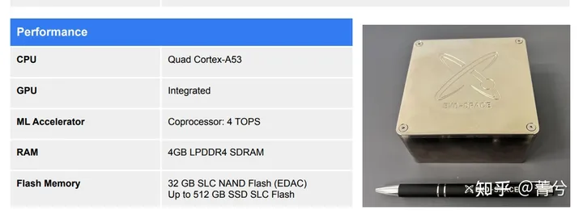

Feather Box 的硬件配置

部署也比较简单，通过数据接口和卫星的传感器可以直接关联，数据通讯非常简单，唯一需要考虑的问题是功耗有点高，卫星的电力供应是否充足。

软件是基于Linux 和 Tensorflow , 既然说是定制化的模型，那么客户在使用时是必须提供基础数据完成模型训练后移植到盒子中。目前基于Tensorflow 的人工智能模式开发已经非常的成熟，并且早已发布了轻量级版本，可以用于计算能力受限的场合。

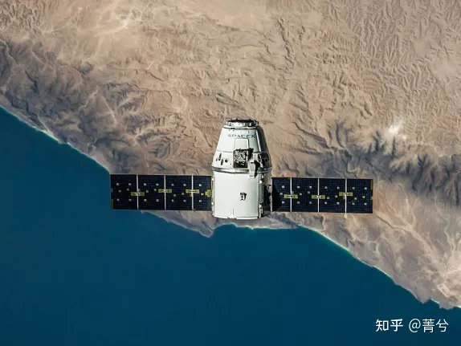

卫星边缘计算系统

无独有偶，亚马逊云服务（AWS）已成功在轨道卫星上部署了一系列计算和机器学习（ML）软件。这一壮举是和太空物流公司D-Orbit和人工智能自动化frim Unibap合作实现的，作为为期十个月的实验的一部分。该项目在低地球轨道 （LEO） 进行，见证了 D-Orbit 在使用 AWS 软件的同时快速分析其 ION 卫星上的大量地球观测 （EO） 图像数据。这是传统的数据下行以便在地面上处理的服务方式所不能比拟的。我们相信向边缘计算的驱动力，并且只有通过基于边缘计算的天基基础设施才能完成，可以在恶劣的太空操作环境中可靠地运行其工作负载和操作。

AWS 全球公共部门副总裁 Max Peterson 补充说：“使用 AWS 软件在轨道卫星上执行实时数据分析，并通过云将分析直接提供给决策者，这是现有空间数据管理方法的明确转变。它还有助于突破我们认为卫星运营可能的界限。“

### **Precision AI**

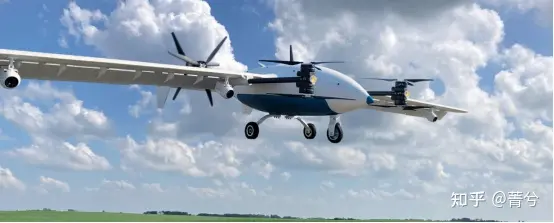

传统的农业通过消耗更多来获得更多，比如使用更大的机器，更多的化石燃料，更多的种子，更多的化肥等等。而今天，这种方法是行不通的，由于天气波动和投入成本上升，可耕地减少，农村劳动力减少，工作时间减少。技术成为应对这些挑战的解决方案。技术创新使农民能够用更少的资源创造更多的资源，事半功倍。Precision AI 的农业解决方案具有全球机遇，他们利用人工智能的高速无人机技术来做出精确的作物生产决策。具体来说，通过独特的无人机和人工智能相结合，判断农作物当前的状况（缺水、缺肥、 虫害）并实时做出决策，极大提高农业效率。Precision AI 是一家披着边缘计算外衣的农用无人机科技公司，他们使用边缘计算的原因在于需要快速且无延迟处理海量数据，以达到精确灌溉、施肥、喷洒的目的。

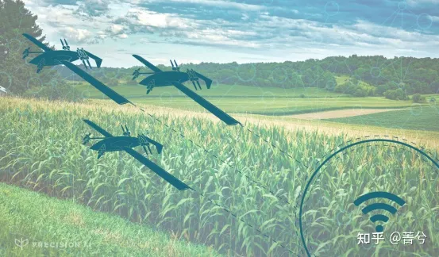

Precision AI无人机通过边缘计算实现了以下优势：

1. 近乎即时的杂草识别

准确识别杂草是一个海量数据处理的工作，所需的图像质量为大片田地拍摄的图像数量相结合，这意味着短时间内处理大量数据。某些字段可以累积超过 32 TB 的数据。32 TB 的数据相当于大约 46 天的不间断音乐、6300 部电影、510 万张图片或 27 亿页 Word 文档。如果通过上传到云端再处理，将需要耗费大量的时间。

那怕耽误喷洒 3-4 天，再也达不到最佳效果。等待就意味着杂草和庄稼已经生长，天气模式可能会发生巨大变化，导致大风或强降雨等次优喷洒条件。通过使用边缘计算，无人机相机可以最高的亚毫米分辨率成像，以准确识别作物和杂草。卸载数据、处理数据并重新上传以进行喷涂不再需要数天时间。边缘计算使我们能够在无人机上实时处理这些数据，以便一次性喷涂，比行业平均水平快 8 倍。

2. 连接受限的现场使用

我们都经历过没有手机服务的情况。没有手机或互联网连接的最常见位置之一是在农村地区的农田中间。通常互联网连接不稳定或不存在。试图依靠连接来有效地实时处理图像，而这些位置从一开始就是不行的。边缘计算消除了远程位置对蜂窝网络服务的需求，并使数据处理更接近设备端。在无人机完成测量后，可以上传更紧凑的数据包。农业喷洒决策是作为系统的一部分做出的。该系统包括决策速度、决策及时性和决策准确性。在农业现场条件下，边缘计算发挥了优于云计算的特性。

### **IMP 边缘智能加速平台 MemryX**

传统计算机框架会将存储和计算分为两个部分，在过去三十年间单芯片处理器核心数经历了快速增长，基本上遵循了摩尔定律，而内存延迟却相对恒定，这便导致了所谓的内存墙。如今大部分的能耗实际上是用于在内存和计算单元之间来回移动。于是，就有了另一种选择：将计算移到内存附近，使计算和内存间的分界线变模糊。

这该怎么做呢？其中的关键思想：直接物理地将计算和内存单元更加紧密地放在一起，从而延缓内存墙。将计算与内存合并消除了数据移动，从而显著提升了能效和性能。In Memory Processing (IMP) 就是这样的处理技术，这种方法将内存阵列转变为大规模的向量计算单元（可能比GPU的向量单元大一到两个数量级），在数百个存储数据的内存阵列上同时进行操作，不在内存和计算单元间移动数据，因而自然地节省相关开销，不仅如此，还可以将大量的向量计算提速，这项特性很好的结合了当今的边缘智能技术并极大促进了其发展。

边缘智能加速器公司MemryX 开发的计算引擎 （MCE） 与创新的内存计算紧密结合。

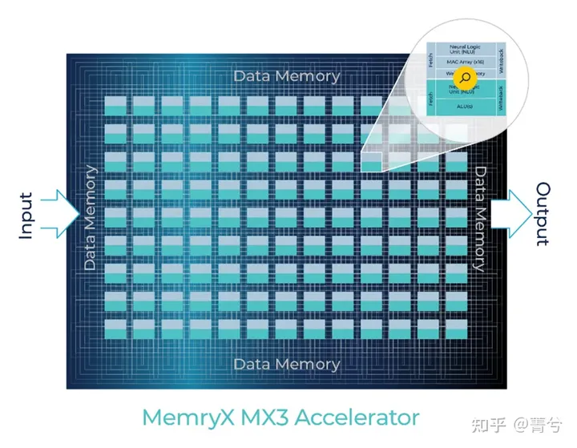

MemryX Inc 由 IEEE 研究员兼密歇根大学电气工程教授 Wei Lu 博士于 2019 年共同创立，自 2005 年以来一直担任密歇根大学电气工程教授。Wei Lu博士是存储设备、神经形态计算和内存计算系统方面极具影响力的专家。计算的未来取决于在庞大而多样化的嵌入式市场中扩展和增加专用人工智能加速器的能力。该团队专注于为边缘 AI 开发具有高度灵活性/可重构性的基本核心架构。

Memry X 的方案使得嵌入式设备进行大规模计算成为可能。AI 模型无法使用 CPU、GPU 和 DSP 中的传统指令集和传统控制流架构高效运行。这些都是以指令为中心的设计，使用传统总线和片上网络 （NoC） 来分配工作负载，并且在运行 AI 模型时通常需要大量的软件工作才能实现甚至适度的芯片利用率。MemryX 使用具有内存计算的专有数据流架构，专为高效编译和映射经过训练的 AI 模型而设计。一键式实现高芯片利用率，可节省开发时间、资源、单位成本，并提供最佳的可升级性。

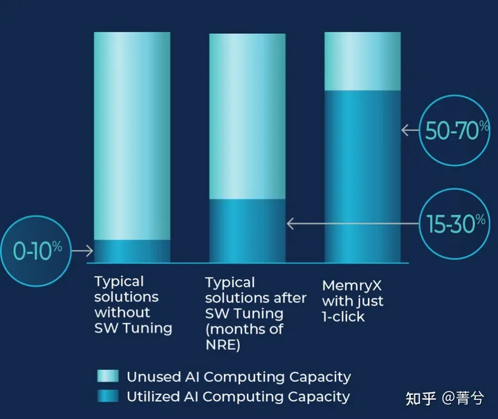

2023年，MemryX 与机器学习开发平台Edge Impulse合作，在MemryX的AI芯片上构建和部署高效的AI模型。MemryX表示，此次合作将加强其芯片的可扩展性和灵活性，使AI开发人员能够进一步推动模型。得益于 MemryX 的内存计算和数据流架构，它们的高性能允许处理繁重的工作负载。

MemryX的产品目前与多个AI软件框架兼容，包括TensorFlow，PyTorch，ONNX和Keras。这些芯片还可以与流行的处理器架构配合使用，例如x86，Arm和RISC-V。MemryX表示，其加速器可以一起使用，以将AI性能扩展到任何所需的水平，同时使用相同的软件堆栈。显然，数百个AI模型，包括Edge Impulse的一些模型，已经在该公司的产品上得到了验证。目前正在对这些产品进行抽样，计划于 2023 年底生产。

### BrainChip

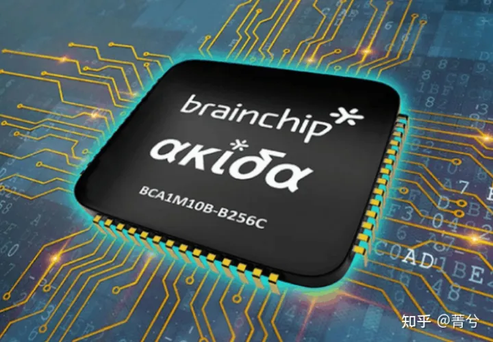

Akida平台 芯片示意图

BrainChip是第一家神经形态AI芯片的商业提供商，宣布推出第二代Akida平台。新平台专为嵌入式边缘 AI 应用而构建，增加了 8 位处理以实现更高的性能以及新的高级功能，其中包括使用视觉转换和时空卷积来加速边缘的性能并提高电源效率。Akida平台的新功能为一系列工业，汽车，智能家居和城市应用提供了关键优势，该平台还适用于医疗保健和消费电子领域的小型设备。新一代的Akida使设计师和开发人员能够完成以前在低功耗边缘设备中无法实现的事情。

BrainChip使用视觉转换器来完成图像识别等视觉处理任务。该公司表示，它们在物体检测和图像分类方面非常有效。Akida平台的更新还包括基于时间事件的神经网络（TENN）时空卷积。该技术简化了视频分析、目标跟踪和音频分类的流数据处理。通过从原始传感器数据中推断和学习，消除对数字信号预处理的需求，我们在提供无云边缘AI体验方面迈出了实质性的一步。

...边缘计算领域的创新公司，待更新...

【待更新...】

编辑于 2023-03-29 21:11・IP 属地浙江