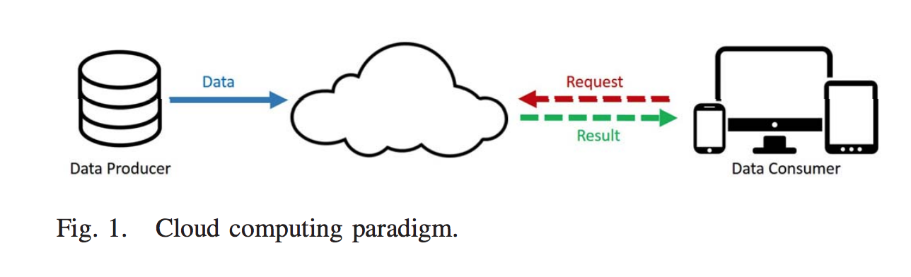
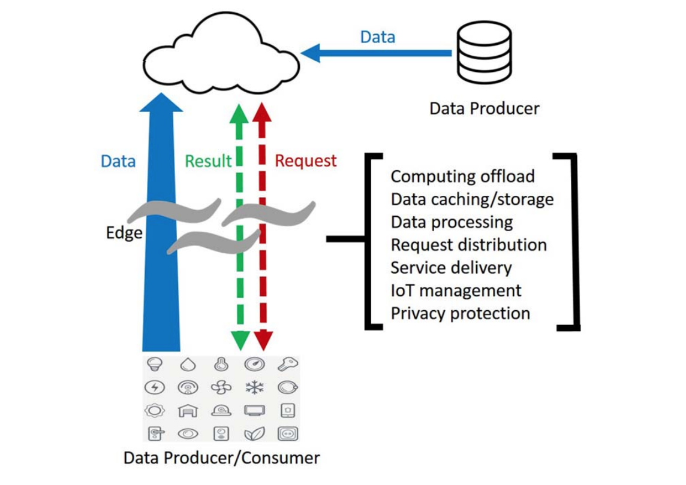

# 边缘计算

边缘运算（英语：Edge computing），又译为边缘计算，是一种分散式运算的架构，将应用程序、数据资料与服务的运算，由网络中心节点，移往网络逻辑上的边缘节点来处理。边缘运算将原本完全由中心节点处理大型服务加以分解，切割成更小与更容易管理的部分，分散到边缘节点去处理。边缘节点更接近于用户终端装置，可以加快资料的处理与传送速度，减少延迟。在这种架构下，资料的分析与知识的产生，更接近于数据资料的来源，因此更适合处理大数据。

来源：[Edge Computing: Vision and Challenges](https://www.semanticscholar.org/paper/Edge-Computing%3A-Vision-and-Challenges-Shi-Cao/0ec668e12ff9f7c5c968bac1b4c441320d190fa6)

简介

**边缘运算**（英语：Edge computing），又译为**边缘计算**，是一种分散式运算的架构，将应用程序、数据资料与服务的运算，由网络中心节点，移往网络逻辑上的边缘节点来处理。边缘运算将原本完全由中心节点处理大型服务加以分解，切割成更小与更容易管理的部分，分散到边缘节点去处理。边缘节点更接近于用户终端装置，可以加快资料的处理与传送速度，减少延迟。在这种架构下，资料的分析与知识的产生，更接近于数据资料的来源，因此更适合处理大数据。

将“边缘”定义为沿着数据源和云数据中心之间路径中的任何计算和网络资源。例如，智能手机是用户与云之间的边缘，智能家庭中的网关是家庭与云之间的边缘，微数据中心（micro data center）和云计算（cloudlet）是移动设备与云之间的边缘。边缘计算的基本原理是计算应该发生在数据源的接近处的处理。从研究者的角度来看，边缘计算与雾计算（fog computing ）是可互换的，但是边缘计算更关注事物（thing）面，而雾计算更关注基础设施（infrastructure ）方面。

数据越来越多地出现在网络的边缘，因此，在网络边缘处，处理数据也会更有效。以前的工作，如微数据中心（micro datacenter ）、cloudlet （微云）和雾计算已被引入社区，因为当数据在网络边缘产生时，云计算并不总是有效的用于数据处理。在很多情况下，边缘计算比云计算对某些计算服务更有效。

为什么我们需要边缘计算：

1）从云服务推动

把所有的计算任务放在云上已经被证明是一种有效的数据处理方法，因为云上的计算能力远远超过了边缘事物的能力。然而，与快速发展的数据处理速度相比，网络带宽却已经跟不上速度。随着边缘数据的增长，数据传输的速度成为云计算模式的瓶颈。例如，波音787 每秒产生大约5千兆字节的数据，但是飞机与地面上的卫星或基站之间的带宽并不足够大，不能进行有效的数据传输。还有，自动汽车，每秒产生一千兆字节的数据，它需要实时处理车辆做出正确的实时的决定。如果需要将所有数据发送到云进行处理，则响应时间过长。目前的网络带宽和可靠性将受到挑战。在这种情况下，需要在边缘处处理数据，以缩短响应时间、更有效的处理和减缓网络压力。

2）从物联网中提出

几乎所有种类的电子设备都将成为物联网的一部分，它们将扮演数据生产者和消费者的角色，如空气质量传感器、LED、路灯，甚至是互联网连接的微波炉。可以推断网络边缘的事物在几年内会发展到数十亿以上。因此，由它们产生的原始数据将是巨大的，使得传统的云计算效率不够高，无法处理所有这些数据。这意味着由IOT产生的大多数数据将永远不会被传输到云，而是会消耗在网络的边缘。

图1 显示了传统的云计算结构。数据生产者生成原始数据并将其传送到云，数据消费者发送请求将数据消耗到云，如蓝色实线所示。红色虚线表示将数据从数据消费者发送到云的请求，而来自云的结果由绿色虚线表示。然而，这种结构对于IoT来说是不够的。首先，边缘处的数据量过大，这将导致巨大的不必要带宽和计算资源的使用。其次，隐私保护需求将成为物联网中的云计算的隐患。最后，IoT中的大多数节点是受限的，无线通信模块通常是非常耗能的，因此将一些计算任务卸载到边缘可以更节能。

3）从数据消费者到生产者

在云计算中，边缘的终端设备通常充当数据消费者，例如，在智能手机上观看YouTube视频。然而，人们也正在从他们的移动设备生产数据。从数据消费者到数据生产者的变化需要更多的功能放置在边缘。例如，现在人们拍照或做视频记录是非常普遍的，然后通过云服务（如YouTube、Facebook、Twitter或Instagram）共享数据。此外如下图所示，每一分钟，在YouTube上，用户上传72小时的新视频内容；脸谱网用户分享近250万条内容；Twitter用户推特近300000次；Instagram用户发布近220000张新照片。然而，图像或视频剪辑的计算可能相当大，并且会占用大量的上传带宽。在这种情况下，视频剪辑应该被降级并在上传到云之前，调整到边缘处，来选择合适分辨率。另一个例子是可穿戴健康设备。由于在网络边缘收集的物理数据通常是私有的，所以在边缘处处理数据可以比将原始数据上传到云更好地保护用户隐私。

设想边缘计算可能对我们的社会产生巨大的影响，就像云计算一样。上图示出了边缘计算中的双向计算流。在边缘计算范式中，事物（thing）不仅是数据消费者，而且作为数据生产者发挥作用。在边缘，事物不仅可以从云请求服务和内容，而且可以执行来自云的计算任务。边缘可以进行计算offloading、数据存储、缓存和处理，以及从云向用户分发请求或传递服务。随着网络中的这些工作，边缘本身需要很好地设计，才能满足服务中的要求，如可靠性、安全性和隐私保护。

【来源：paper, URL：[https://pdfs.semanticscholar.org/0ec6/68e12ff9f7c5c968bac1b4c441320d190fa6.pdf](https://pdfs.semanticscholar.org/0ec6/68e12ff9f7c5c968bac1b4c441320d190fa6.pdf】)】

## 发展历史

智能设备连接到网络最早出现在1982年， Carnegie Mellon University改进的Coke machine成了第一个网络连接的机器，它可以报告自己的库存并且能够检测饮料是否是冰镇的。身边的thing连接到网络的世界正式拉开帷幕。

物联网（Internet of Things）这个词，国内外普遍公认的是MIT Auto-ID中心Ashton教授1999年在研究RFID时最早提出来的。

1996年，Compaq公司在其公司的内部文件中，首次提及“云计算 cloud comouting”这个词汇。

随着这两个关键term的提出，大量的云计算以及物联网的应用也逐渐融入到人们的生活中。但是响应速度缓慢，隐私，宽带限制等问题。Fog computing和边缘计算就是为了更好的结合物联网和云计算。

Fog computing 和Edge Computing 都出现于21世纪初，2012年，Bonomi, F., Milito, R., Zhu, J.,提出雾计算。2015年，《[Edge-centric computing: Vision and challenges](https://dl.acm.org/citation.cfm?id=2831354)》Garcia Lopez, P., Montresor, A., Epema, D., Datta, A.等人提出边缘为中心的计算。

在边缘计算中，目的是把计算放在数据源的附近。与传统的基于云计算相比，这有几个好处。

1. 边缘应用程序服务显著地减少了必须移动的数据量、流量和必须传输的距离，从而降低传输成本、缩短延迟和提高服务质量quality of service (QoS).。
2. 边缘计算消除或至少不强调核心计算肺热环境，消除了主要瓶颈和单点故障的潜在问题。
3. 能够利用与其他云相同的架构和基本底层计算技术(无论是集中式的服务付费云还是同样集中的封闭私有云)，并且可以利用相同的成本曲线。基于共享资源如何在“作为服务”"as a Service"这一短语表示的“按服务付费”云(time -for- for- Service clouds, time - haring)中计费的成本核算模型不应该与集中式云、边缘云以及日益增多的边缘节点的公共架构基础混淆。最终，不管所有的IT系统是如何实现的或在哪里实现的，它们(无论是否分布式)都必须提供可行的服务。然而，云确实共享分布式系统架构和技术，它们形成了三种模式:集中式的云、边缘的云（entralized Clouds, Edge Clouds, and Edge nodes），以及被统称为雾计算 fog computing.的边缘节点。

研究者在《Fog computing: Platform and applications》中建立了一个平台来进行人脸识别应用，通过从云到边缘的移动计算，将响应时间从900减少到169毫秒。《Towards wearable cognitive assistance》使用云计算offloading可穿戴认知辅助的计算任务，结果表明，响应时间的改善到80～200 ms之间，并且通过云计算卸载可以将能耗降低30%～40%。在《CloneCloud: Elastic execution between mobile device and cloud》中结合了分区、迁移和合并，以及移动和云之间的分区的按需实例化，并且它们的原型可以是减小20倍的响应时间。

### 主要事件

| 年份 | 事件                                                         | 相关论文                                                     |
| ---- | ------------------------------------------------------------ | ------------------------------------------------------------ |
| 1993 | Weiser在论文中称述普适计算系统下的问题                       | Weiser, M. (1993). Some computer science issues in ubiquitous computing. Communications of the ACM, 36(7), 75-84. |
| 2010 | Atzori, L., Iera, A.,对IOT进行回顾                           | Atzori, L., Iera, A., & Morabito, G. (2010). The internet of things: A survey. *Computer networks*, *54*(15), 2787-2805. |
| 2011 | Diane J.Cook对普适计算进行介绍                               | Poslad, S. (2011). *Ubiquitous computing: smart devices, environments and interactions*. John Wiley & Sons. |
| 2012 | Bonomi, F., Milito, R., Zhu, J.,提出雾计算                   | Bonomi, F., Milito, R., Zhu, J., & Addepalli, S. (2012, August). Fog computing and its role in the internet of things. In Proceedings of the first edition of the MCC workshop on Mobile cloud computing (pp. 13-16). ACM. |
| 2013 | Gubbi, J., Buyya, R.,对IOT的架构组成以及未来的发展方向进行阐述 | Gubbi, J., Buyya, R., Marusic, S., & Palaniswami, M. (2013). Internet of Things (IoT): A vision, architectural elements, and future directions. Future generation computer systems, 29(7), 1645-1660. |
| 2015 | Garcia Lopez, P., Montresor, A., Epema, D.对边缘计算进行回顾 | Garcia Lopez, P., Montresor, A., Epema, D., Datta, A., Higashino, T., Iamnitchi, A., ... & Riviere, E. (2015). Edge-centric computing: Vision and challenges. ACM SIGCOMM Computer Communication Review, 45(5), 37-42. |
| 2016 | Shi, W., Cao, J., Zhang, Q., Li, Y., & Xu, L.提出边缘计算所面临的挑战 | Shi, W., Cao, J., Zhang, Q., Li, Y., & Xu, L. (2016). Edge computing: Vision and challenges. IEEE Internet of Things Journal, 3(5), 637-646. |

##  

## 发展分析

### 瓶颈

- 可编程性。在边缘计算中，计算是从云offloading的，而边缘节点是最有可能的异构平台。在这种情况下，这些节点的运行时间彼此不同，并且程序员面临巨大的困难来编写可部署在边缘计算范例中的应用程序。
- 命名。在边缘计算中，一个重要的假设是事物的数量非常巨大。在边缘节点的顶部，有很多运行的应用程序，并且每个应用程序都有自己的关于如何提供服务的结构。类似于所有的计算机系统，边缘计算中的命名方案对于编程、寻址、事物识别和数据通信非常重要。然而，一个有效的命名机制的边缘计算范式尚未建立和标准化。边缘从业者通常需要学习各种通信和网络协议，以便与系统中的异构事物进行通信。用于边缘计算的命名方案需要处理事物的移动性、高度动态的网络拓扑、隐私和安全保护，以及针对大量大量不可靠事物的可扩展性。
- 数据抽象：数据抽象已经在无线传感器网络和云计算范式中得到了很好的讨论和研究。然而，在边缘计算中，这个问题变得更具挑战性。随着物联网，将有大量的数据在网络中生成器中，以智能家居环境为例。在智能家居中，几乎所有的东西都会报告数据，更不用说在家里部署的大量东西了。然而，在网络边缘的大多数事物，只周期性地将感测数据报告给网关。例如，温度计可以每分钟报告温度，但这种数据仅可能被真实用户一天只消耗几次。另一个例子可能是家庭中的安全摄像机，它可以保持记录并将视频发送到网关，但是数据将只存储在数据库中一段时间，没有人真正消耗它。

综述论文：【https://pdfs.semanticscholar.org/0ec6/68e12ff9f7c5c968bac1b4c441320d190fa6.pdf】

### 未来发展方向

边缘计算已经逐渐进入人们的生活，统一的命名标准，对于开发者的异构平台问题，数据抽象，服务的管理，隐私和安全，优化指标（任务分配规划的优化）等问题都需要更多的研究去探索它。

【来源：wiki, URL:https://en.wikipedia.org/wiki/Internet_of_things】

Contributor：Ruiying Cai