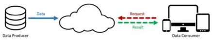
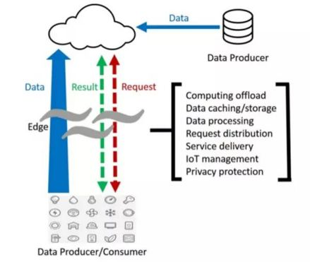
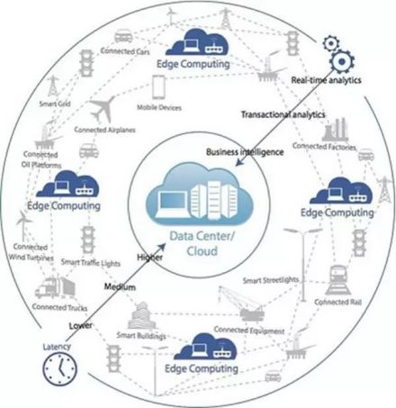
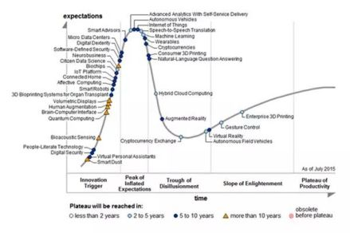
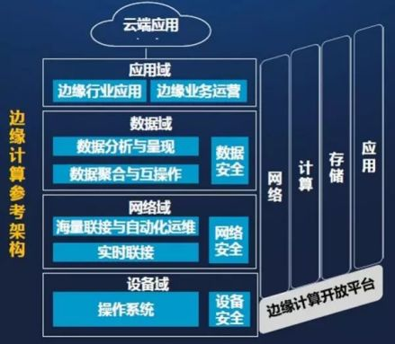
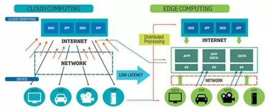
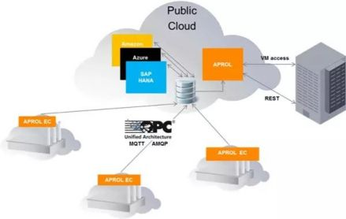

边缘计算，是指在靠近物或数据源头的一侧，采用网络、计算、存储、应用核心能力为一体的开放平台，就近提供最近端服务。其[应用程序](https://baike.baidu.com/item/应用程序/5985445?fromModule=lemma_inlink)在边缘侧发起，产生更快的[网络服务](https://baike.baidu.com/item/网络服务/9498645?fromModule=lemma_inlink)响应，满足行业在实时业务、应用智能、安全与隐私保护等方面的基本需求。边缘计算处于物理实体和工业连接之间，或处于物理实体的顶端。而云端计算，仍然可以访问边缘计算的历史数据。 [1]

## 目录

1. 1[从分布式开始](https://baike.baidu.com/item/边缘计算/9044985#1)
2. 2[vs云计算](https://baike.baidu.com/item/边缘计算/9044985#2)
3. 3[物联网应用](https://baike.baidu.com/item/边缘计算/9044985#3)

1. 4[架构](https://baike.baidu.com/item/边缘计算/9044985#4)
2. 5[计算的本质](https://baike.baidu.com/item/边缘计算/9044985#5)
3. 6[产业](https://baike.baidu.com/item/边缘计算/9044985#6)

1. 7[大融合下分工](https://baike.baidu.com/item/边缘计算/9044985#7)
2. 8[发展前景](https://baike.baidu.com/item/边缘计算/9044985#8)

## 从分布式开始

播报

编辑

边缘计算并非是一个新鲜词。作为一家内容分发网络CDN和云服务的提供商AKAMAI，早在2003年就与IBM合作“边缘计算”。作为世界上最大的分布式计算服务商之一，当时它承担了全球15-30%的网络流量。在其一份内部研究项目中即提出“边缘计算”的目的和解决问题，并通过AKAMAI与IBM在其WebSphere上提供基于边缘Edge的服务。 [1]

对物联网而言，边缘计算技术取得突破，意味着许多控制将通过本地设备实现而无需交由云端，处理过程将在本地边缘计算层完成。这无疑将大大提升处理效率，减轻云端的负荷。由于更加靠近用户，还可为用户提供更快的响应，将需求在边缘端解决。 [2]

## vs云计算

播报

编辑

在国外，以[思科](https://baike.baidu.com/item/思科/0?fromModule=lemma_inlink)为代表的网络公司以雾计算为主。思科已经不再成为工业互联网联盟的创立成员，但却集中精力主导OpenFog开放雾联盟。 [3]

云计算的范式

无论是云、雾还是边缘计算，本身只是实现物联网、智能制造等所需要计算技术的一种方法或者模式。严格讲，雾计算和边缘计算本身并没有本质的区别，都是在接近于现场应用端提供的计算。就其本质而言，都是相对于云计算而言的。

边缘计算的范式

从二者的计算范式可以看出来，边缘侧的数据计算，一下子变得丰富起

来。这里产生了全新的想象空间。

## 物联网应用

播报

编辑

全球智能手机的快速发展，推动了移动终端和“边缘计算”的发展。而万物互联、万物感知的智能社会，则是跟物联网发展相伴而生，边缘计算系统也因此应声而出。

事实上，[物联网](https://baike.baidu.com/item/物联网/7306589?fromModule=lemma_inlink)的概念已经提出有超过15年的历史，然而，物联网却并未成为一个火热的应用。一个概念到真正的应用有一个较长的过程，与之匹配的技术、产品设备的成本、接受程度、试错过程都是漫长的，因此往往不能很快形成大量使用的市场。

边缘计算在整个计算中的位置

根据[Gartner](https://baike.baidu.com/item/Gartner/0?fromModule=lemma_inlink)的技术成熟曲线理论来说，在2015年IoT从概念上而言，已经到达顶峰位置。因此，物联网的大规模应用也开始加速。因此未来5-10年内IoT会进入一个应用爆发期，边缘计算也随之被预期将得到更多的应用。

Gartner技术成熟曲线

## 架构

播报

编辑

在中国，边缘计算联盟ECC正在努力推动三种技术的融合，也就是OICT的融合（运营Operational、信息Information、通讯Communication Technology）。而其计算对象，则主要定义了四个领域，第一个是设备域的问题， [1]出现的纯粹的IoT设备，跟自动化的I/O采集相比较而言，有不同但也有重叠部分。那些可以直接用于在顶层优化，而并不参与控制本身的数据，是可以直接放在边缘侧完成处理；第二个是网络域。在[传输层](https://baike.baidu.com/item/传输层/0?fromModule=lemma_inlink)面，直接的末端IoT数据、与来自自动化产线的数据，其传输方式、机制、协议都会有不同，因此，这里要解决传输的数据标准问题，当然，在OPC UA架构下可以直接的访问底层自动化数据，但是，对于Web数据的交互而言，这里会存在IT与OT之间的协调问题，尽管有一些领先的自动化企业已经提供了针对Web方式数据传输的机制，但是，大部分现场的数据仍然存在这些问题。第三是数据域，数据传输后的数据存储、格式等这些数据域需要解决的问题，也包括数据的查询与数据交互的机制和策略问题都是在这个领域里需要考虑的问题。

最后一个，也是最难的应用域，这个可能是最为难以解决的问题，针对这一领域的应用模型尚未有较多的实际应用。

边缘计算参考架构1.0

边缘计算联盟ECC对于边缘计算的参考架构的定义，包含了设备、网络、数据与应用四域，平台提供者主要提供在网络互联（包括总线）、计算能力、数据存储与应用方面的软硬件基础设施。

而从[产业价值链](https://baike.baidu.com/item/产业价值链/10090071?fromModule=lemma_inlink)整合角度而言，ECC提出了CROSS，即在敏捷联接（Connection）的基础上，实现实时业务（Real-time）、数据优化（Data Optimization）、应用智能（Smart）、安全与隐私保护（Security），为用户在网络边缘侧带来价值和机会，也就是联盟成员要关注的重点。

## 计算的本质

播报

编辑

自动化事实上是一个以“控制”为核心。控制是基于“信号”的，而“计算”则是基于数据进行的，更多意义是指“策略”、“规划”，因此，它更多聚焦于在“调度、优化、路径”。就像对全国的高铁进行调度的系统一样，每增加一个车次减少都会引发[调度系统](https://baike.baidu.com/item/调度系统/1292829?fromModule=lemma_inlink)的调整，它是基于时间和节点的运筹与规划问题。边缘计算在工业领域的应用更多是这类“计算”。

简单地说，传统自动控制基于信号的控制，而边缘计算则可以理解为“基于信息的控制”。

值得注意的是，边缘计算、雾计算虽然说的是低延时，但是其50mS、100mS这种周期对于高精度机床、机器人、高速图文印刷系统的100μS这样的“控制任务”而言，仍然是非常大的延迟的，边缘计算所谓的“实时”，从自动化行业的视角来看——很不幸，依然被归在“非实时”的应用里的。

云计算—边缘计算区分处理数据

## 产业

播报

编辑

边缘计算是在高带宽、时间敏感型、物联网集成这个背景下发展起来的技术，“Edge”这个概念的确较早为包括ABB、B&R、Schneider、KUKA这类自动化/机器人厂商所提及，其本意是涵盖那些“贴近用户与数据源的IT资源”。这是属于从传统自动化厂商向IT厂商延伸的一种设计，2016年4月5日Schneider已经号称可以为边缘计算定义了物理基础设施——尽管，主打的还是其“微数据中心”的概念。而其它自动化厂商提及计算，都是表现出与IT融合的一种趋势，并且同时具有边缘与泛在的概念在其中。

IT与OT事实上也是在相互渗透的，自动化厂商都已经开始在延伸其产品中的IT能力，包括Bosch、SIEMENS、GE这些大的厂商在信息化、数字化软件平台方面，也包括了像贝加莱、罗克韦尔等都在提供基础的IoT集成、Web技术的融合方面的产品与技术。事实上IT技术也开始在其产品中集成总线接口、HMI功能的产品，以及工业现场传输设备网关、交换机等产品。

IoT被视为未来快速成长的一个领域，包括最前沿的已经出现了各种基于Internet的技术，高通已经提出了Internet of Everything—可以称为IoX。因此新一个产业格局呼之欲出，边缘计算联盟ECC的边界定义而言，华为其主旨在提供计算平台，包括基础的网络、云、边缘服务器、传输设备与接口标准等，而Intel、ARM则提供为边缘计算的芯片与处理能力保障，信通院则扮演传输协议与系统实现的集成，而沈阳自动化所、软通动力则扮演实际应用的角色。

但是，边缘计算/雾计算要落地，尤其是在工业中，“应用”才是最为核心的问题，所谓的IT与OT的融合，更强调在OT侧的应用，即运营的系统所要实现的目标。

## 大融合下分工

播报

编辑

在工业领域，边缘应用场景包括能源分析、物流规划、工艺优化分析等。就生产任务分配而言，需根据生产订单为生产进行最优的设备排产排程，这是APS或者广义MES的基本任务单元，需要大量计算。这些计算是靠具体MES厂商的软件平台，还是“边缘计算”平台—基于Web技术构建的分析平台，在未来并不会存在太多差别。从某种意义上说MES系统本身是一种传统的架构，而其核心既可以在专用的软件系统，也可以存在于云、雾或者边缘侧。 [2]

在这样的应用场景，总体而言，在整个智能制造、工业物联网的应用中，各自分工如下。

边缘计算（橙色部分）的连接架构

自动化厂商提供“采集”，包括数据源的作用，这是利用自动化已经在分布式I/O采集、总线互联、以及控制机器所产生的机器生产、状态、质量等原生“信息”。

ICT厂商则提供“传输”，实现工业连接。因为在如何提供数据的传输、存储、计算方面，ICT厂商有其传统优势，包括成本方面，已经云平台的优势。

传统工业企业的业务经验和知识，则为分析软件（独立的或者企业内部）厂商提供“分析”的依据。这些业务过程的理解，仍然是必不可少。产业链的协同，终极目标，仍然是解决“质量、成本、交付”的核心问题。

中国联通集团相关专家表示，2020年是中国5G SA网络商用元年，未来几年5G网络将承载更多的行业需求，带来更多的商业机会。行业应用需要具备差异化、确定性、自主灵活的专属网络，不同的行业业务对带宽、时延、可靠性等的要求不同，这要求5G专网要具备确定性体验、自服务、新业务快速开发上线等网络能力。在云网融合趋势下，边缘计算将助力5G行业应用加速落地实践。 [4]

## 发展前景

播报

编辑

2022年12月2日，边缘计算入选“智瞻2023”论坛发布的将在未来几年对社会、经济、行业发展产生重大影响的十项焦点科技名单 [5]。