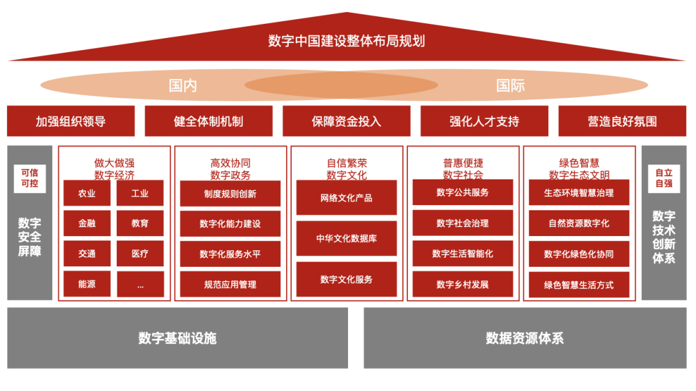
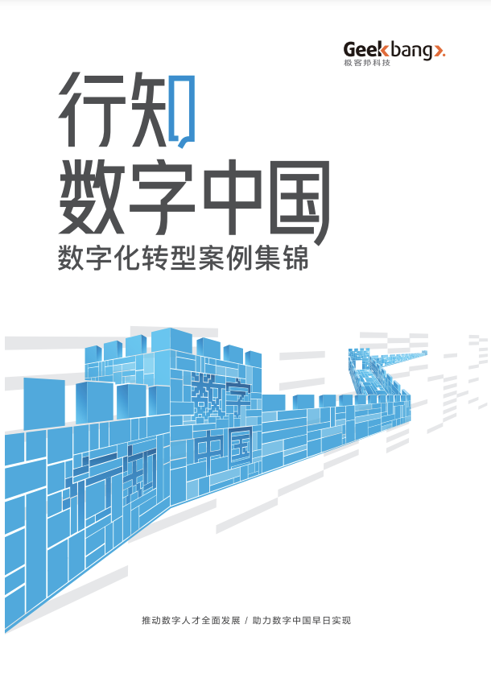

# 数字中国顶层设计来了，一图读懂“2522”框架｜政策解读

原创 InfoQ团队 [InfoQ数字化经纬](javascript:void(0);) *2023-03-02 14:33* *北京*

近日，中共中央、国务院印发了《数字中国建设整体布局规划》（以下简称《规划》），并发出通知，要求各地区各部门结合实际认真贯彻落实。

作为影响中国未来发展的重磅文件，《规划》明确了**两个重要时间节点**：

- 到 **2025 年**，基本形成横向打通、纵向贯通、协调有力的一体化推进格局，数字中国建设取得重要进展；

  

- 到 **2035 年**，数字化发展水平进入世界前列，数字中国建设取得重大成就。

此外，《规划》还提出了数字中国建设的**“2522”整体框架**，即——即夯实数字基础设施和数据资源体系“两大基础”，推进数字技术与经济、政治、文化、社会、生态文明建设“五位一体”深度融合，强化数字技术创新体系和数字安全屏障“两大能力”，优化数字化发展国内国际“两个环境”。

《精益数据方法论》作者和创始人史凯在其文章《[**PPT 学习版《数字中国建设整体布局规划》**](http://mp.weixin.qq.com/s?__biz=MzA4NDMyODMxMg==&mid=2647993409&idx=1&sn=f3297a109b6e6574466431b548aecaae&chksm=87c96656b0beef40868deb5cd6f0663dc33976d8c9a5de2954852ea4633536082d00986cf8d8&scene=21#wechat_redirect)》中对“2522”框架做了如下总结：

来源：凯哥讲故事系列公众号

其中，《规划》指出了数字中国建设的两大基础：

- **第一，打通数字基础设施大动脉。**加快 5G 网络与千兆光网协同建设，深入推进 IPv6 规模部署和应用，推进移动物联网全面发展，大力推进北斗规模应用。系统优化算力基础设施布局，促进东西部算力高效互补和协同联动，引导通用数据中心、超算中心、智能计算中心、边缘数据中心等合理梯次布局。

这意味着，**5G、IPv6、物联网、边缘计算**等领域将迎来巨大的市场机会，**云计算、数据中心**等信息基础设施也将迎来进一步的市场需求增长。

- **第二，畅通数据资源大循环。**构建国家数据管理体制机制，健全各级数据统筹管理机构。推动公共数据汇聚利用，建设公共卫生、科技、教育等重要领域国家数据资源库。释放商业数据价值潜能，加快建立数据产权制度，开展数据资产计价研究，建立数据要素按价值贡献参与分配机制。

可以看到，**数据要素**的价值被反复提及，从**数据资源化、数据资产化到数据资本化**，数据要素价值的充分释放，将促进产业链全要素的生产力提升，助推经济高质量发展，以及产业优化升级。在这个过程中，**数字技术**是挖掘数据价值的关键手段，**数据开放共享**将成为必要前提，**数据交易平台**的构建则是重要机会。

但与此同时，**数据安全保护**的意识和手段也需要不断提高。数据要素的采集、传输、处理、应用等一系列过程，如果缺乏安全屏障，可能对企业经营甚至经济和社会安全造成隐患。因此，数据安全防护是让数据要素更好地服务于数字中国建设的一道重要保障。

对此，《规划》中也指出，要强化数字中国关键能力。

- 一是**构筑自立自强的数字技术创新体系**。健全社会主义市场经济条件下关键核心技术攻关新型举国体制，加强企业主导的产学研深度融合。强化企业科技创新主体地位，发挥科技型骨干企业引领支撑作用。加强知识产权保护，健全知识产权转化收益分配机制。
- 二是**筑牢可信可控的数字安全屏障**。切实维护网络安全，完善网络安全法律法规和政策体系。增强数据安全保障能力，建立数据分类分级保护基础制度，健全网络数据监测预警和应急处置工作体系。

产业融合方面，相较于 2022 年初发布的《“十四五”数字经济发展规划》，此次发布的《规划》涉及范围远远超出经济领域，强调推进数字技术与经济、政治、文化、社会、生态文明建设“五位一体”深度融合。

- **数字经济层面，强调继续做大做强**，推动数字技术和实体经济深度融合，在农业、工业、金融、教育、医疗、交通、能源等重点领域，加快数字技术创新应用；
- **数字政务层面，强调高效协同**，强化数字化能力建设，促进信息系统网络互联互通、数据按需共享、业务高效协同；
- **数字文化层面，强调自信繁荣**，大力发展网络文化，建设国家文化大数据体系，形成中华文化数据库，提升数字文化服务能力；
- **数字社会层面，强调普惠便捷**，促进数字公共服务普惠化，推进数字社会治理精准化，深入实施数字乡村发展行动，普及数字生活智能化；
- **数字生态文明层面，强调绿色智慧**，推动生态环境智慧治理，加快数字化绿色化协同转型，倡导绿色智慧生活方式。

为实现以上战略目标，《规划》还指出，要优化数字化发展环境，**对内建设公平规范的数字治理生态，对外构建开放共赢的数字领域国际合作格局**。此外，在具体落实过程中，要**加强整体谋划、统筹推进，把各项任务落到实处**。

具体体现在：

- **第一，加强组织领导**。坚持和加强党对数字中国建设的全面领导，充分发挥地方党委网络安全和信息化委员会作用，各有关部门按照职责分工，完善政策措施，强化资源整合和力量协同，形成工作合力。
- **第二，健全体制机制**。建立健全数字中国建设统筹协调机制，及时研究解决数字化发展重大问题，推动跨部门协同和上下联动，开展数字中国发展监测评估。
- **第三，保障资金投入**。发挥国家产融合作平台等作用，引导金融资源支持数字化发展。鼓励引导资本规范参与数字中国建设，构建社会资本有效参与的投融资体系。
- **第四，强化人才支撑**。增强领导干部和公务员数字思维、数字认知、数字技能。统筹布局一批数字领域学科专业点，培养创新型、应用型、复合型人才。构建覆盖全民、城乡融合的数字素养与技能发展培育体系。
- **第五，营造良好氛围**。推动高等学校、研究机构、企业等共同参与数字中国建设，建立一批数字中国研究基地。统筹开展数字中国建设综合试点工作，综合集成推进改革试验。办好数字中国建设峰会等重大活动，举办数字领域高规格国内国际系列赛事。

作为数字中国顶层设计，《规划》将推动数字中国建设进一步提速，数字技术将在各行各业加速落地，数字经济与实体经济将持续向深、向广融合，助力我国产业实现高端化、智慧化、绿色化发展。

而极客邦科技本着“推动数字人才全面发展“的使命，在继续追踪前沿技术的同时，也在关注技术在产业的落地与应用，洞察技术如何跨越沟壑走进千行百业，记录和挖掘数字中国的建设历程和精彩故事。

过去一年，InfoQ 通过与行业内具备代表性的企业进行访谈、与多位专家展开交流后，记录了各家企业的数字化实践经验和最新思考，并整理成数字化案例集。其中，共包含 26 篇文章，涵盖工业、零售和科技服务等领域，采访了**包括富士康、施耐德电气、麦当劳中国、雪花啤酒、华晨宝马、顺丰科技**在内的多家企业，希望能给业界的数字化同仁带来一些启发，共同助力数字中国早日实现。