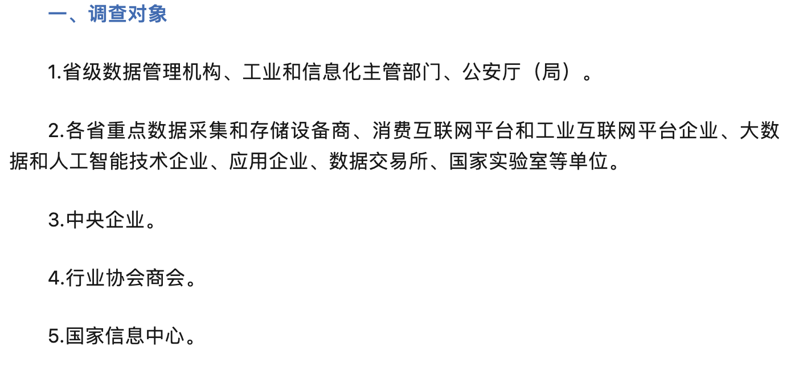

# 数据资源摸底来了！多部门联合开展全国数据资源调查

- 罗燕珊

- 2024-02-21

  北京

- 本文字数：941 字

  阅读完需：约 3 分钟



00:00

[1.0x**](javascript:;)

大小：472.75K时长：02:41

为深入实施[《数字中国建设整体布局规划》](https://mp.weixin.qq.com/s/uHQEpQZnbqs9J3gX_iRitQ)，国家数据局、中央网络安全和信息化委员会办公室、工业和信息化部以及公安部近日联合下发通知，宣布开展全国数据资源情况调查，全面调研**国内数据资源生产存储、流通交易、开发利用、安全**等情况。

通过调查，有关单位将能更准确地掌握数据资源的分布、类型和安全情况，为制定相关政策、进行试点示范等工作提供有力的数据支持，进一步加快数据资源的开发利用。

本轮调查范围广泛，包括省级数据管理机构、工业和信息化主管部门、公安厅（局），以及各省的重点数据采集和存储设备商、消费互联网平台和工业互联网平台企业、大数据和人工智能技术企业、数据交易所、国家实验室等。此外，国家信息中心、中央企业和行业协会商会也在调查之列。

所有参与单位需登录全国数据资源调查管理平台填报相应的调查表，以 **2023 年 12 月 31 日**为标准时点。关键时间节点方面，相关单位需在 **2024 年 2 月 20 日**前反馈工作联系人信息至国家数据局数据资源司，并确保在 **2024 年 2 月 18 日至 3 月 5 日**之间完成调查表的填报。

事实上，为激活数据要素的价值和潜能，上个月国家数据局等 17 部⻔联合印发[《“数据要素×”三年⾏动计划 （2024—2026 年）》](https://mp.weixin.qq.com/s/iQfWqRb85KIGnOlUVhCiKQ)。《行动计划》选取工业制造、现代农业、商贸流通、交通运输、金融服务、科技创新、文化旅游、医疗健康、应急管理、气象服务、城市治理、绿色低碳等 12 个行业和领域，推动发挥数据要素乘数效应，释放数据要素价值。其总体目标提到，到 2026 年底，数据要素应用广度和深度大幅拓展，打造 300 个以上示范性强、显示度高、带动性广的典型应用场景，实现数据产业年均增速超过 20%。

通过摸清国内数据资源的现状，相信也将为行动计划的顺利实施提供坚实的基础和数据支持。

*全国数据资源调查管理平台链接：*https://wenjuan.data-smp.cn/index/login/index.html