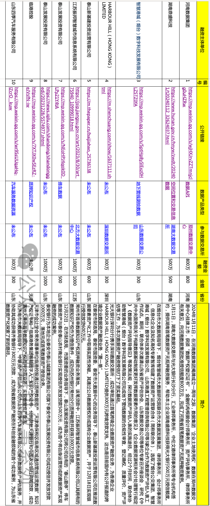

# 数据资源融资 10 大典型案例剖析及五大关键发现

- 史凯

- 高玉娴

- 2024-01-22

  北京

- 本文字数：3647 字

  阅读完需：约 12 分钟

> **导读：**“数据资产价值化的最后一棒必须是能够促进实体经济高质量发展，否则就会成为无止境的击鼓传花，成为关联交易和虚增资产的新的工具。”--精益数据创始人，作者史凯
>
> 
>
> 自《数据二十条》以来，各部位密集的关于数据的重磅文件陆续出台，各地数据交易所，数据集团，数据服务商如雨后春笋般四处开花。拥有产业数据的各类企业也都在大的趋势下学习，摸索新的数据生产要素如何创造价值。
>
> 
>
> 数据资源如何直接产生收益，而不仅是赋能和优化现有业务，从而从产业数字化走向数字产业化呢？
>
> 
>
> 利用数据资源融资是数据价值化的最短路径之一，不涉及数据利用赋能业务的效果评估的复杂度，甚至也不需要真实发生数据交易，所以从 2023 年以来，数据资源融资/数据知识产权质押融资的案例越来越多。
>
> 
>
> 在本文中，凯哥对近期公开披露的数据资产融资进行了研究，筛选了 10 个的有代表性的数据资产融资案例，形成了五大关键发现，供大家参考。

### 2024：数据资产价值元年

2023 年 8 月 1 日，财政部印发《[企业数据资源相关会计处理暂行规定](https://www.infoq.cn/news/4rsaCarUujfmVyxW8wWl)》，明确了 2024 年 1 月 1 日起，企业可以将数据资源以无形资产和存货的形式编制入企业资产负债表。

2023 年的最后一天，国家数据局等 17 部门联合印发《[“数据要素×”三年行动计划（2024—2026年）](https://www.infoq.cn/news/pH6K3Cmm7aWGFGV0qrNV)》，将数据要素 X 的具体落地计划做了进一步的明确和拆解。

2024 年 1 月 11 日，财政部再次发文《[关于加强数据资产管理的指导意见](https://www.infoq.cn/news/7yBbEJp4aAC3dyheJCAl)》，进一步提出稳妥推动数据资产开发利用为核心的十七条指导意见。

这么密集的关于数据的重磅文件陆续出台，各地数据交易所、数据集团、数据服务商如雨后春笋般四处开花。拥有产业数据的各类企业也都在大的趋势下学习，摸索新的数据生产要素如何创造价值。[数据资源如何直接产生收益](https://www.infoq.cn/article/WKPj5NSiSpE28pz5WZ5w)，而不仅是赋能和优化现有业务，从而从产业数字化走向数字产业化呢？

凯哥对近期公开披露的数据资产融资的案例进行了深度研究，筛选了十大数据资源融资的典型案例，形成了五大关键发现，供大家参考。（**所有引用信息皆来自公开发布的新闻内容，不代表作者的观点，仅供参考，不作为投资决策使用**）

### 近期数据资产融资公开案例 TOP 10

下表是凯哥经过周末的公开数据研究，筛选出来的比较有代表性的近期的数据资产融资的十个典型案例，总的融资金额超过 5000 万，每笔数据资产融资超 500 万。

#### 1.河南数据集团数据资产无抵押融资-800 万

- 融资金额：800 万
- 相关链接：https://mp.weixin.qq.com/s/wjHXJrvZZTmnjclg0uHZRw
- 数据产品：企业土地使用权数据/数据 API
- 相关单位：河南数据集团，会计师事务所，郑州数据交易中心
- 价值计量方法：成本法

#### 2.湖南盛鼎科技数据资产无抵押融资-500 万

- 融资金额：500 万
- 相关链接：https://www.hunan.gov.cn/hnyw/zwdt/202401/t20240112_32624037.htmlhttps://www.thepaper.cn/newsDetail_forward_25981070
- 数据产品：已交易项目的空间位置和交易信息数据
- 相关单位：湖南鼎盛科技，湖南大数据交易所，光大银行长沙分行，汇业律师事务所，中伦文德律师事务所
- 价值计量方法：未公开

#### 3.烟台市区地下管线测绘数据资产融资授信-300 万

- 相关链接：https://mp.weixin.qq.com/s/5ptHp8y5lExz0HLZSTZ0fA
- 数据产品：地下管线测绘数据
- 相关单位：烟台市大数据局，烟台智慧城市大数据研究院，大数据发展集团、律师事务所、会计师事务所，智慧港城（烟台）数字科技发展有限公司，光大银行
- 价值计量方法：未公开

#### 4.香港企业 HARBOUR HILL（HONG KONG）LIMITED-跨境企业数据资产融资-300 万

- 融资金额：300 万
- 相关链接：https://m.shenchuang.com/show/1637111.shtml
- 数据产品：未公开
- 相关单位：HARBOUR HILL，深圳数交所，光大银行
- 价值计量方法：未公开

#### 5.泰山新基建投资运营有限公司-银行授信放贷 600 万

- 融资金额：600 万
- 数据产品：公共数据授权形成国企数据资产
- 相关单位：泰安市财政局、泰安市国资委、泰安市大数据中心、泰山新基建投资运营有限公司、泰安泰山农村商业银行
- 价值计量方法：未公开

#### 6.江苏振邦智慧城市信息系统有限公司-数据知识产权质押融资 1000 万贷款

- 融资金额：1000 万
- 相关链接：https://jsip.jiangsu.gov.cn/art/2023/8/30/art_75940_10999018.html
- 数据产品：未公布/数据知识产权质押
- 相关单位：江苏振邦智慧城市信息系统有限公司，苏州银行常州分行
- 计量方法：未公开

#### 7.泰安市泰山发展投资有限公司成功授信并发放贷款 1000 万元

- 融资金额：1000 万
- 相关链接：https://news.iqilu.com/shandong/shandonggedi/20231228/5574977.shtml
- 数据产品：未公布
- 相关单位：泰安银行 ，泰安市泰山发展投资有限公司
- 价值计量方法：未公开

#### 8.泰山发展投资有限公司-“泰山易停”停车数据资产-授信发放贷款 500 万

- 融资金额：500 万
- 相关链接：https://mp.weixin.qq.com/s/NEoHPJ4qok0D_LPy21Y4tA
- 数据产品：“泰山易停”停车数据资产
- 相关单位：市财政局、市国资委、泰山发展投资有限公司，泰山城建集团智慧运营中心，泰山农村商业银行
- 价值计量方法：未公开

#### 9.临港控股通过质押数据资产-知识产权证书，分别获批天津银行和中国农业银行两笔贷款

- 融资金额：未公布
- 相关链接：https://mp.weixin.qq.com/s/7XTJX0wSEzRZ-eJVsfN-iw
- 数据产品：未公布/质押知识产权证书
- 相关单位：天津环投数字科技有限公司，天津银行，中国农业银行，天津市知识产权保护中心，北方大数据交易中心
- 价值计量方法：未公开

#### 10.山东四季汽车服务有限公司-齐鲁银行 300 万数据资源贷款

- 融资金额：300 万
- 相关链接：https://mp.weixin.qq.com/s/wr95sUUqaHq-lZcrO__kuw
- 数据产品：汽车服务数据资源
- 相关单位：济南市大数据局、中联资产评估山东公司，东四季汽车服务有限公司，齐鲁银行
- 计量方法：未公开

### 数据资源融资案例五大关键发现

#### 一、数据资产价值化的最后一棒是促进实体经济高质量发展

什么是数据产品？数据产品分哪些类型？在众多的数据交易所，公共数据平台作为独立的商业产品上架，并且有很多企业已经将数据作为资源、资产、产品进行了融资、增信、交易等行为。

数据取之不尽，用之不竭的新的生产要素，不同于实体生产要素，它有着规模收益倍增的特点，这也就意味着数据的交易、质押、增信也有着无限加工的特点。

一个数据集，稍微修改就可以变成一个新的数据产品，在不同的行业领域就会产生新的业务场景和价值，所以是否也就可以作为新的数据产品进行二次，乃至无穷的 N 次流通和交易。**那么，数据资产价值化的最后一棒是什么？**

数据产品是可以无限交易、流通、共享的，并且可以衍生出无限类型，无限数量、无限规模的新的数据产品。 但是**数据资产价值化的最后一棒必须是能够促进实体经济高质量发展，否则就会成为无止境的击鼓传花，成为关联交易和虚增资产的新的工具。**

所以，数据经济的核心是通过数据要素的共享、流通、开发，一方面加速数字产业化的建设，更重要的是通过数字产业，数字经济来赋能和优化实体经济。这也就是凯哥在行业里所提倡的通过数据驱动、流数融合来打造实体经济的高质量发展。

#### 二、公共服务业是数据资产融资的重要参与方

从以上的数据资源融资案例中可以看出，以停车服务数据、产权交易数据、地下管线测绘数据等为代表的公共服务业数据是数据资产融资的重要参与方。这是因为这类数据的适用范围较广，可利用的业务场景想象空间较大。

所以，以城投公司、基础设施建设运营单位等为代表的**城市建设运营方将是此类数据资产的重要玩家**。

#### 三、数据资产及价值化的形态呈多样形态

从目前的数据资产融资的案例和主要数据交易所的数据产品清单来看，数据资产的形态呈多样化的形态。有的是以数据知识产权的形式，有的是以数据集，有的是以数据应用，有的是文档报告，还有以软件产品解决方案作为数据应用在交易所作为数据产品登记。

这些形态不同、呈现各异的数据资产，数据产品价值化的形式也不尽相同，有的是通过抵押数据知识产权的形式，有的是通过交易所，登记数据产品，进行增信来作物抵押融资授信。

目前，**数据资产、数据产品的形态、价值化的方式还处于不断创新、探索模式的阶段**。

#### 四、数据资产融资有待形成正反馈闭环

从目前公开的数据资产融资的案例信息来看，数据资产经过梳理、评估，能够打通增信融资的通路。但是，企业拿到了授信融资，或者通过数据知识产权的抵押获得了贷款后，这些资金是否应用到了数据产品的推广、应用的领域，是否在这些数据资源的基础上进行了进一步的加工、优化、从而能够扩大再生产，形成正反馈，这些还有待深入探索和佐证。

**数据资产入表、融资、增信只是数字经济的第一步，而不是终局。**

#### 五、数据资产融资对金融机构风控提出了新课题

当凯哥在看着一笔笔公开的数据资产融资的案例的新闻报道的时候，一方面从“第一笔”，“创新”等字样中，能够感受到以数据要素为核心的数据经济的蓬勃发展，企业的迫切需求，作为一个数据行业的资深从业者，感觉特别的激动人心。

但是，同时，凯哥也深深地感受到这些新的数据交易形态，数据经济给相关金融机构的风控管理带来的挑战和新的课题。

### 新领域，新探索，未来已来

数据要素价值化，是一个跨领域、多学科的新课题，凯哥最近一方面深度学习研究各部委相关的政策法规和文件，另一方面也在学习金融、合规、财务等领域的相关知识，同时也在与实体产业的企业客户进行深度交流和探索实践。

2024-01-22 15:455363

**[数据湖仓](https://www.infoq.cn/topic/1192)[数字化转型](https://www.infoq.cn/topic/1160)